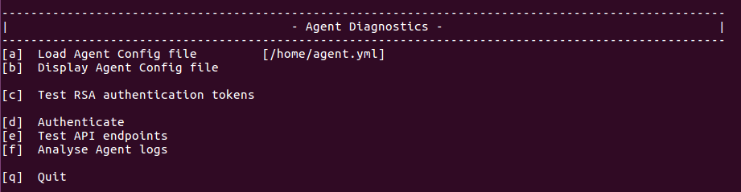
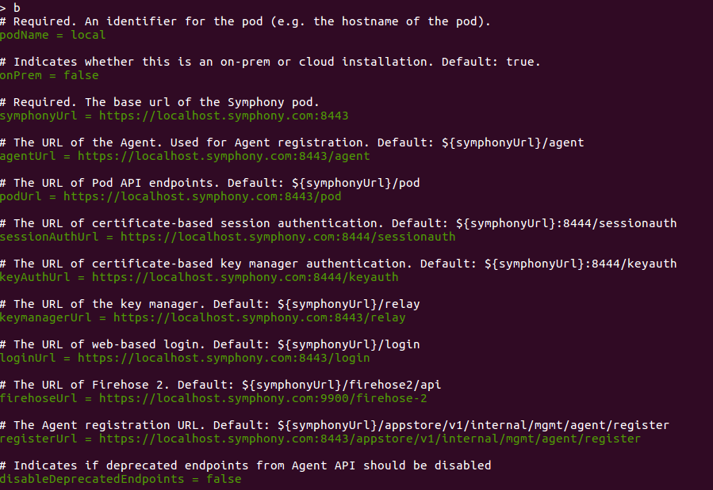

# Agent Diagnostic Tool

Agent Diagnostic Tool is a standalone jar `java -jar util/diagnostics.jar` distributed with the Agent that reads the Agent configuration and allows the user to perform a number of routine setup checks, like:

* Authenticate using certificates or RSA keys (configured in the Agent config or supplied by the user);
* Call Agent, Pod, and KM healthchecks and parse the responses;
* It makes crucial Pod and Agent API calls: read session info, fetch a list of user's streams, create and read messages, create and read the datafeed;
* It lets you parse the JW tokens used for RSA authentication, in order to debug RSA auth errors (expired tokens, mismatched usernames etc.)
* Contains a parser for Agent logs to display statistics of the number of calls, calls per second, most frequently used, most active users and apps, as well as an option to export call statistics as CSV data.

The following images show examples of the Agent Diagnostics set menus:

## Option \[a] - Load the Agent config file:

## Option \[b] - Display the Agent config file:

## Option \[c] - Test RSA Authentication tokens:

![Agent Diagnostics - option \[c\]](../../.gitbook/assets/bf43589-c.png)

![Agent Diagnostics - option \[c\] -> \[c\]](../../.gitbook/assets/fc8c5e1-c-c.png)

![Agent Diagnostics - option \[c\] -> \[d\]](../../.gitbook/assets/6bb1507-c-d.png)

![Agent Diagnostics - option \[c\] -> \[e\]](../../.gitbook/assets/8ad96d8-c-e-1.png)

![Agent Diagnostics - option \[c\] -> \[e\]](../../.gitbook/assets/71667bc-c-e-2.png)

![Agent Diagnostics - option \[c\] -> \[e\]](../../.gitbook/assets/5f7c6bb-c-e-3.png)

## Option \[d] - Authenticate:

![Agent Diagnostics - option \[d\]](../../.gitbook/assets/81ed4eb-d.png)

![Agent Diagnostics - option \[d\] -> \[c\]](../../.gitbook/assets/bbc8b69-d-c.png)

![Agent Diagnostics - option \[d\] ->\[f\]](../../.gitbook/assets/687247b-d-f.png)

![Agent Diagnostics - option \[d\] -> \[g\]](../../.gitbook/assets/7fee25a-d-g.png)

\
Option \[e] - Test API endpoints:
---------------------------------

![Agent Diagnostics - option \[e\]](../../.gitbook/assets/4f08bf0-e.png)

![Agent Diagnostics - option \[e\] -> \[a\]](../../.gitbook/assets/a2afb66-e-a.png)

![Agent Diagnostics - option \[e\] -> \[a\]](../../.gitbook/assets/a9f9aa3-e-a-2.png)

![Agent Diagnostics - option \[e\] -> \[c\]](../../.gitbook/assets/6479e40-e-c.png)

![Agent Diagnostics - option \[e\] -> \[d\]](../../.gitbook/assets/0576361-e-d.png)

![Agent Diagnostics - option \[e\] -> \[e\]](../../.gitbook/assets/4a052e2-e-e.png)

\
Option \[f] - Analyse Agent Logs
--------------------------------

![Agent Diagnostics - option \[f\]](../../.gitbook/assets/c99a7bb-f.png)

![Agent Diagnostics - option \[f\] -> \[b\]](../../.gitbook/assets/2111ae4-f-b.png)
