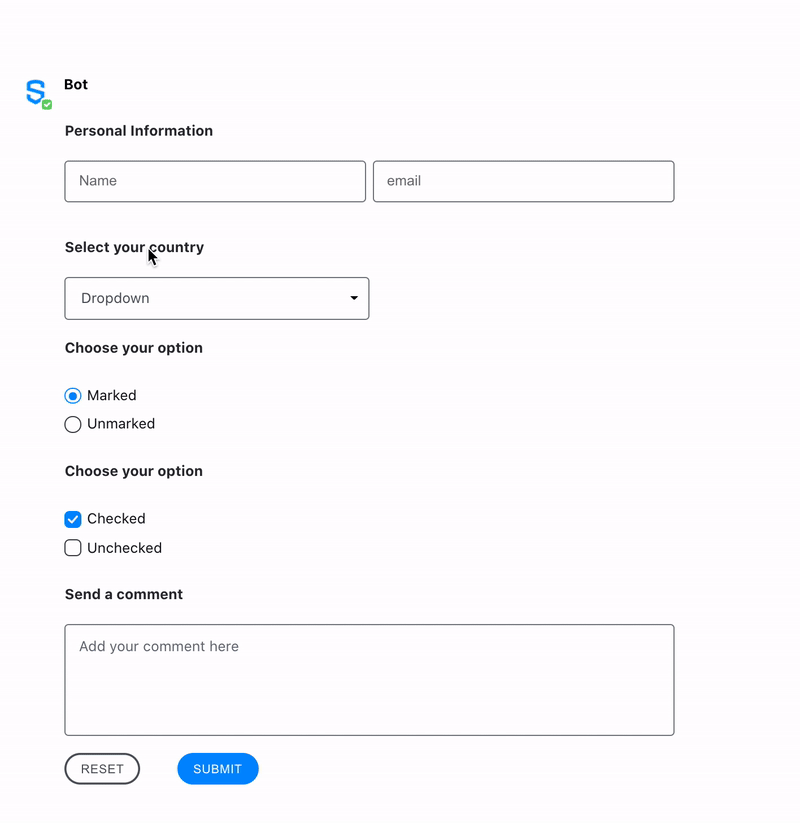

# Elements Interactive Forms

Symphony Elements Forms enable bots to send messages that contain interactive forms with pre-designed text fields, dropdown menus, person selectors, buttons and more. This allows bots to interact with users in a very easy and guided way.

By reusing our pre-designed standard UX component libraries, Elements provide developers with out-of-the-box tools to easily create interactive bot messages that look and feel like they belong in Symphony. To use the Elements, you just need to call the [Create Message](https://developers.symphony.com/restapi/main/messages/create-message-v4) endpoint with your bot, using the MessageML format.

Here after, you will find a brief introduction of how to send Elements, then an update of the message flow for Elements, and finally the form specifications.

## Sending Elements

To start using Symphony Elements, you first need to create a form element using the **`<form>` MessageML tag. The form element can be considered the "frame" of a message**, containing elements that will be sent by the bot and subsequently read by the datafeed.

You can see below an example of how a user can interact with a form that was sent by a bot, as well as the messageML structure of the message that was sent by the bot, and the payload that is generated and therefore delivered to the bot via the datafeed, containing the information completed and submitted by the user. Please use the tabs to navigate between these 3 documents.







```html
<messageML> 
    <form id="form_id"> 
        <h4>Personal Information</h4>
        <text-field name="name" required="true" placeholder="Name" />
        <text-field name="email" required="true" placeholder="email" />

        <h4>Select your country</h4>
        <select name="country">
            <option value="opt1">Australia</option>
            <option value="opt2">Brazil</option>
            <option value="opt3">China</option>
            <option value="opt4">Denmark</option>
            <option value="opt5">Ecuador</option>
            <option value="opt6">France</option>
            <option value="opt7">Germany</option>
            <option value="opt8">Italy</option>
            <option value="opt9">Japan</option>
        </select>

        <h4>Choose your option</h4>            
        <radio name="example_radio" value="option_01" checked="true">Marked</radio>
        <radio name="example_radio" value="option_02">Unmarked</radio>

        <h4>Choose your option</h4> 
        <checkbox name="checkbox_1" value="value01" checked="true">Checked</checkbox>
        <checkbox name="checkbox_2" value="value02">Unchecked</checkbox>

        <h4>Send a comment</h4> 
        <textarea name="comment" placeholder="Add your comment here" required="true" />

        <button type="reset">Reset</button>
        <button name="submit_button" type="action">Submit</button>

    </form>
</messageML>
```



```json
[
    {
        "id": "Y6OwLV",
        "messageId": "N0DEie_ig1_1MwfGQq0df3___oNnFeTobQ",
        "timestamp": 1634653051671,
        "type": "SYMPHONYELEMENTSACTION",
        "initiator": {
            "user": {
                "userId": 11338713661667,
                "firstName": "Thibault",
                "lastName": "Chays",
                "displayName": "Internal User",
                "email": "thibault.chays@symphony.com",
                "username": "thibault.chays"
            }
        },
        "payload": {
            "symphonyElementsAction": {
                "stream": {
                    "streamId": "usnBKBkH_BVrGOiVpaupEH___okFfE7QdA",
                    "streamType": "IM"
                },
                "formMessageId": "L87DKjjrGhjH3_WN8_rqYn___oNnJZ9AbQ",
                "formId": "form_id",
                "formValues": {
                    "action": "submit_button",
                    "name": "John",
                    "email": "john@email.com",
                    "country": "opt1",
                    "example_radio": "option_01",
                    "checkbox_1": "value01",
                    "checkbox_2": "value02",
                    "comment": "test"
                }
            }
        }
    }
]
```




## Known Limitations

* Once the user has submitted the form, it becomes disabled. However, if the conversation is reloaded, the form resets and the user is able to send a new reply. If your workflow requires a single reply per user, please implement this control on the Bot side.


**To begin leveraging Symphony Elements in your bot workflows continue onto our Available Elements that you can find in the subpages.**

## **Message** Flow (for Forms)

Every message exists as part of a flow, in a continuum of events that results in user interaction.

Here is that flow in colorful diagram form, for you to know more about each stage of the message:

.svg>)

1. **A Bot sends a message with Symphony Elements in a form**
2. **The message/from is visible to users.  Users interact with the elements**
3. **Once submitted, the data is submitted to the bot**
4. **Bots can access the data, by reading the datafeed.**&#x20;

## **Form** specification

### MessageML Tag

Forms are represented by the **\<form>** tag, as you can see in the examples above.

### Attributes

<table data-header-hidden><thead><tr><th width="184">Attribute</th><th width="92">Type</th><th width="110">Required?</th><th>Description</th></tr></thead><tbody><tr><td><strong>Attribute</strong></td><td><strong>Type</strong></td><td><strong>Required?</strong></td><td><strong>Description</strong></td></tr><tr><td><code>id</code></td><td>String</td><td>Yes</td><td>Identifies the form.</td></tr><tr><td><code>multi-submit</code></td><td>String</td><td>No</td><td>Specifies that the form can be submitted several times by the user and the reset behavior. See the possible values and behaviors in <strong>Rules and Limitations</strong> below.</td></tr></tbody></table>

### Rules and Limitations

* The form element can be considered the "frame" of a message, containing elements that will be sent by the bot and subsequently read by the datafeed.
* To be considered valid, the form tag must contain at least one action type "Button" as a child. For more information, refer to [Buttons](buttons/).
* All of the data within a form element will be sent to a bot via the datafeed when a user clicks one of the action buttons in that form. The `name` attribute of the button will be the value of the `action` field within the datafeed payload.  That way the bot manager can know which button triggered the submission of that form. Starting with Agent 23.11, the auto-submit feature allows to submit the form with a TextField, or with a DropDown Menu.
* If there is more than one element in the form having the same `name` attribute, the value is converted to an array. Every index of the array is related to a specific element value. The index order is not guaranteed, so the developer needs to iterate through this array and collect the values.
* When a form is submitted and `multi-submit` attribute is not specified, all the elements within it will be disabled, not being possible to edit or resend the same form. However, if the page is refreshed, the user can fill out the form again and submit it as a new form.
* The attribute `multi-submit` allows the us to submit the form several times even without needing to refresh the page. It can take 2 different string values:
  * `reset` which resets the form to the default value when enabling it again for the user,
  * `no-reset` which keeps the values that were submitted by the user when enabling it again for the user.
* When designing forms, it is important to consider the message size limit. For more information refer to[ Message size limits.](../../#message-size-limits)

### Examples

The following example shows three forms being used as follows:

* The first form (_default_) shows how Symphony users interact with a form, and how the Elements are disabled once the form is submitted.
* The second form (_multi-submit-reset_) shows how to create a form that can be **submitted several times** and which **resets** all its Elements to their default value once the user submits it. You note the Elements are first disabled while loading, then the button shows the user the form has been submitted, before the form is enabled back to its default value for the user to submit it again.
* The third form (_multi-submit-no-reset_) shows how to create a form that can be **submitted several times** and which **keeps** last submitted values once the user submits it. You note the Elements are first disabled while loading, then the button shows the user the form has been submitted, before the form is enabled back to its last submitted value for the user to submit it again.




```markup
<messageML>
  <form id="default">
    <text-field name="test"> This form becomes disabled once submitted</text-field>
    <button name="default">Submit</button>
  </form>
  <hr/>
  <form id="multi-submit-reset" multi-submit="reset">
    <text-field name="test" label="Resets values to default"> This form can be submitted more than once</text-field>
    <button name="multi-submit-reset">Submit</button>
  </form>
  <hr/>
  <form id="multi-submit-no-reset" multi-submit="no-reset">
    <text-field name="test" label="Keeps last submitted values"> This form  can be submitted more than once</text-field>
    <button name="multi-submit-no-reset">Submit</button>
  </form>
</messageML>
```



### Versions and Compatibility


<table data-header-hidden><thead><tr><th>Main features introduced</th><th width="180">Agent needed to parse message sent by the bot</th><th width="129">Client 2.0 release</th><th width="115">Client 1.5 release</th><th>Backward client-compatibility behavior (e.g. external rooms)</th></tr></thead><tbody><tr><td>Main features introduced</td><td>Agent needed to parse message sent by the bot</td><td>Client 2.0 release</td><td><em>Client 1.5 release</em></td><td>Backward client-compatibility behavior (e.g. external rooms)</td></tr><tr><td>Initial release</td><td>2.55.9</td><td>Since first version</td><td><em>1.55</em></td><td>Not working</td></tr><tr><td>Multi-submit attribute</td><td>20.13</td><td>21.8</td><td>-</td><td>-</td></tr></tbody></table>


