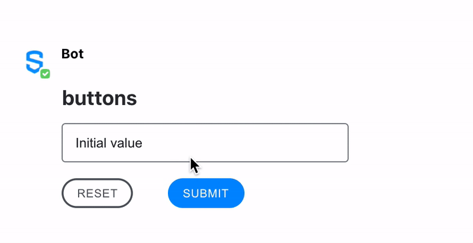

# Buttons

Buttons are the Symphony elements responsible for submitting a form to the bot. As a result, all Symphony form elements are required to have at least one button where \`type=`action`\`. When an end-user clicks this button, the form and the value of each of the elements inside will be submitted to the bot via the datafeed and presented as a JSON payload.

In addition, some forms can contain reset buttons. These buttons are used to reset a form back to its original state.

Buttons support six different styles: `primary`, `primary-link`, `secondary`, `tertiary`, `destructive` and `destructive-link`. Each of those has different colors to suit different actions (to convey meaning). Use the `class` attribute to specify the style.

* Primary: use the Primary button when there is a clear primary action on a message. You can use it for the submit button, for example.
* Secondary: use the Secondary button when there are multiple actions of the same importance or some actions with less importance than a single primary action.
* Destructive: use the Destructive button when an action results in the removal of an item or if it can result in a potentially serious negative consequence.
* Primary-link, Tertiary and Destructive-link: These styles are variations respectively of the Primary, Secondary and Destructive buttons but without borders. They are low prominence options that can be used alongside a Primary or as standalone buttons with the ability to read more information.

<figure><figcaption></figcaption></figure>

<figure><figcaption></figcaption></figure>

## Attributes

<table data-header-hidden><thead><tr><th width="110">Attribute</th><th width="84">Type</th><th width="126">Required?</th><th>Description</th></tr></thead><tbody><tr><td>Attribute</td><td>Type</td><td>Required?</td><td>Description</td></tr><tr><td><code>name</code></td><td>String</td><td>Yes</td><td>Identifies the clicked button.</td></tr><tr><td><code>type</code></td><td>String</td><td>No<br><br>If <code>type</code> is not specified, the default value will be <code>type=”action”</code></td><td>Indicates whether the button is an <code>action</code> button or a <code>reset</code> button. When clicked, the action button sends the form information to the datafeed. On the other hand, the reset button resets the form-data to its initial values.<br><br>Accepted values: <code>action</code> and <code>reset</code>.</td></tr><tr><td><code>class</code></td><td>String</td><td>No</td><td>Toggle between new palette of colors: <code>primary</code>, <code>secondary</code>, <code>destructive</code>, <code>primary-link</code>, <code>tertiary</code> and <code>destructive-link</code>.  </td></tr><tr><td><code>icon</code></td><td>String</td><td>No</td><td>Adds an icon before the button name. Only icons from our <a href="icon-set-for-buttons.md">UI Toolkit list</a> are supported. Each icon is identified by its name.</td></tr></tbody></table>

## Rules and Limitations

* If `class` is not defined, the action button assumes the `primary` class by default. Action buttons should be used for affirmation or confirmation actions.
* Reset buttons have the `secondary` class set by default. Reset buttons should be used when the content of the fields need to return to their original state.

## Examples

The following example shows the use of the **Reset** and the **Submit** button when sending a text inserted in a [Text Field](../text-field.md).





```markup
<messageML>
  <form id="form_id">
    <text-field name="text-field" placeholder="Add your comment here" required="true">Initial value</text-field>
    <button type="reset">Reset</button>
    <button name="submit_button" type="action">Submit</button>    
  </form>
</messageML>
```



```markup
<button name="send-primary" type="action" class="primary">Primary Button</button>
<button name="send-secondary" type="action" class="secondary">Secondary Button</button>
<button name="send-tertiary" type="action" class="tertiary">Tertiary Button</button>
<button name="send-destructive" type="action" class="destructive">Destructive Button</button>
```



```javascript
{
        "id": "UW2p27",
        "messageId": "4KrVjUU4gnGziWnlqMmD2n___oxo916XbQ",
        "timestamp": 1595966792040,
        "type": "SYMPHONYELEMENTSACTION",
        "initiator": {
            "user": {
                "userId": 7078106482890,
                "firstName": "User",
                "lastName": "Bot",
                "displayName": "User",
                "email": "user_bot@symphony.com",
                "username": "user_bot"
            }
        },
        "payload": {
            "symphonyElementsAction": {
                "stream": {
                    "streamId": "iMft6PLA4lHrEA9icKJobX___oyCKdVVdA",
                    "streamType": "ROOM"
                },
                "formMessageId": "zGeog3OqoYqVI2lwcX2o1X___oxo-A_ubQ",
                "formId": "form_id",
                "formValues": {
                    "action": "submit_button",
                    "init": "hello, my name is John Smith"
                }
            }
        }
    },
```



## Versions and Compatibility

<table data-header-hidden><thead><tr><th width="268">Main features introduced</th><th width="151">Agent needed to parse message sent by the bot</th><th width="111">Client 2.0 release</th><th>Backward client-compatibility behavior (e.g. external rooms)</th></tr></thead><tbody><tr><td>Main features introduced</td><td>Agent needed to parse message sent by the bot</td><td>Client 2.0 release</td><td><em>Backward client-compatibility behavior (e.g. external rooms)</em></td></tr><tr><td>Initial release</td><td>2.55.9</td><td>Since first version</td><td><em>Not working</em></td></tr><tr><td>Reset features behaviour is to show back the initial value of the form</td><td>2.55.9</td><td>Since first version</td><td><em>Working as previous behavior: clear fields</em></td></tr><tr><td>New styles:<br>• New designs for the buttons<br>• Styles <code>primary destructive</code> and <code>secondary destructive</code> are deprecated<br>• Styles <code>tertiary</code> and <code>destructive</code> are introduced</td><td>20.6</td><td>Since first version</td><td><em>New styles are displayed as the previous ones, <code>tertiary</code> and <code>destructive</code> are displayed as the default blue <code>primary</code> style</em></td></tr><tr><td>New styles: <code>primary-link</code> and <code>destructive-link</code><br>Support for icons.</td><td>23.11</td><td>23.12</td><td><em>Not working</em></td></tr></tbody></table>
