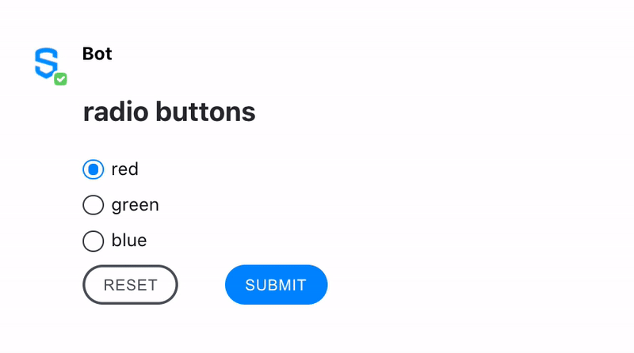

# Radio Button

Radio buttons are shown as small circles, which are filled or highlighted when selected. Only one radio button in a given group can be selected at the same time.

Frequently, a set of radio buttons represents a single question which the user can answer by selecting a possible answer.

Note: If you want the user to be able to select more than one option, use the [Checkbox](checkbox.md) element.


## Attributes

<table data-header-hidden><thead><tr><th width="134">Attribute</th><th width="103">Type</th><th width="119">Required?</th><th>Description</th></tr></thead><tbody><tr><td>Attribute</td><td>Type</td><td>Required?</td><td>Description</td></tr><tr><td><code>name</code></td><td>String</td><td>Yes</td><td>Identifies the radio button.</td></tr><tr><td><code>value</code></td><td>String</td><td>No</td><td>The <code>value</code> is the string that will be sent to the server. If the value is not specified, the string <strong>on</strong> will be sent by default.</td></tr><tr><td><code>checked</code></td><td>Boolean</td><td>No</td><td>If <code>true</code>, it specifies that the <code>&#x3C;radio></code> element should be pre-selected (checked) when the page loads. Accepted values: <code>true</code> and <code>false</code>.</td></tr></tbody></table>

## Rules and Limitations

* The text node of the MessageML will be converted to the `<label>` tag. This will preserve the formatting tags `<i>` and `<b>`, if present.
* Radio buttons are presented in radio groups (a collection of radio buttons describing a set of related options). Only one radio button in a group can be selected at the same time. Note: The radio group must share the same name (the value of the `name` attribute) to be treated as a group. Once the radio group is created, selecting any radio button in that group automatically deselects any other selected radio button in the same group.
* A form can have a maximum of 50 radio buttons. Note: The limit in previous versions was set to 20, so this limit may still apply when sending messages to customers with an earlier version of Symphony (before 20.10).
* Once the user has selected a radio option, it can be deselected only by clicking on another radio option. The only way to deselect all the radio options is by clicking the **reset** button.

## Examples

The following example shows radio buttons being used. It shows how developers can use the **checked** parameter with the value01 preselected when the form is sent. It also shows how users can select another radio button and how it automatically unselect any other value checked, as the 3 radio buttons have the same name and therefore are part of the same group "groupId".





```markup
<messageML>
  <form id="form_id">
    <h2>radio buttons</h2>
      <radio name="groupId" value="value01" checked="true">red</radio>
      <radio name="groupId" value="value02">green</radio>
      <radio name="groupId" value="value03">blue</radio>
      <button type="reset">Reset</button>
      <button name="radio" value="action">Submit</button>
  </form>
</messageML>
```



```javascript
[
    {
        "id": "chxhFk",
        "messageId": "BwcQN6Y7RcKxwpWDfcjL2n___pQD2WPebQ",
        "timestamp": 1563303517217,
        "type": "SYMPHONYELEMENTSACTION",
        "initiator": {
            "user": {
                "userId": 7078106482890,
                "firstName": "User",
                "lastName": "Bot",
                "displayName": "User",
                "email": "user_bot@symphony.com",
                "username": "user_bot"
            }
        },

        "payload": {
            "symphonyElementsAction": {
                "stream": {
                  "streamId": "0YeiA-neZa1PrdHy1L82jX___pQjntU-dA",
                  "streamType": "ROOM"
                },
                "formMessageId": "qXF5jpNbJtlulAmjKjn0Pn///pQD2mc/dA==5935",
                "formId": "form_id",
                "formValues": {
                    "action": "radio",
                    "groupId": "value03"
                }
            }
        }
    }
]
```



## Versions and Compatibility

<table data-header-hidden><thead><tr><th>Main features introduced</th><th>Agent needed to parse message sent by the bot</th><th width="150">Client 2.0 release</th><th>Backward client-compatibility behavior (e.g. external rooms)</th></tr></thead><tbody><tr><td>Main features introduced</td><td>Agent needed to parse message sent by the bot</td><td>Client 2.0 release</td><td><em>Backward client-compatibility behavior (e.g. external rooms)</em></td></tr><tr><td>Initial release</td><td>2.55.9</td><td>Since first version</td><td><em>Not working</em></td></tr></tbody></table>
