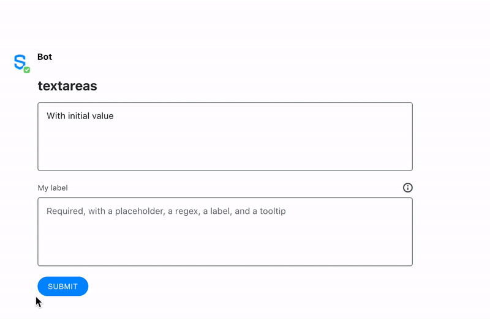

# Text Area

The `textarea` element is a field for multi-line text input, allowing users to edit multiple lines of plain text. Text areas are useful to collect or edit runs of text like messages, opinions, reviews, articles, etc.


## Attributes

<table data-header-hidden><thead><tr><th width="168">Attribute</th><th width="127">Type</th><th width="157">Required?</th><th>Description</th></tr></thead><tbody><tr><td>Attribute</td><td>Type</td><td>Required?</td><td>Description</td></tr><tr><td><code>name</code></td><td>String</td><td>Yes</td><td>Identifies the text area.</td></tr><tr><td><code>placeholder</code></td><td>String</td><td>No</td><td>Specifies a short hint that describes the expected value of the text area.</td></tr><tr><td><code>required</code></td><td>Boolean</td><td>No</td><td>If <code>true</code>, it specifies that the text area must be filled out before submitting the form. Accepted values; <code>true</code> and <code>false</code>.</td></tr><tr><td><code>pattern</code></td><td>String</td><td>No</td><td>Regex String to match for input validation</td></tr><tr><td><code>pattern-error-message</code></td><td>String</td><td>No</td><td>Error message returned to user if <code>pattern</code> parameter matches user input</td></tr><tr><td><code>title</code></td><td>It accepts a simple text and <code>\n</code> for line breaks</td><td>No</td><td>The description that will be displayed when clicking the tooltip icon located on top of the Masked Text Field Element. Max length: 256 characters. Available from Symphony v20.8 and above.</td></tr><tr><td><code>label</code></td><td>String</td><td>Not required but it is recommended if <code>title</code> is defined</td><td>Definition of the label that will be displayed on top of the Masked Text Field Element. Available from Symphony v20.8 and above.</td></tr><tr><td><code>rows</code></td><td>Number</td><td>No</td><td>Specify the number of rows (height) of the text area that will be displayed by default.</td></tr><tr><td><code>cols</code></td><td>Number</td><td>No</td><td>Specify the number of columns (width) of the text area that will be displayed by default.</td></tr></tbody></table>

## Using Input Validation

With Symphony v20.6, bot developers can use Regex to validate `text fields` and `text areas` using the `pattern` and `pattern-error-message` attributes.\
For more information and examples, refer to Regular [Expressions - Regex](regular-expressions-regex.md).

## Rules and Limitations

* The text field must be a self-closing tag or have no children.
* You can add a **default text** in your text area by including it between the `<textarea></textarea>` tags. Note that unlike the `placeholder` text, the **default text** will be sent with the form if not edited by the user. Refer to Examples for more information.

## Examples

The following example shows two textareas being used as follows:

* The first textarea (_id1_) shows how to display a **default text** ("With initial value"). Note that the default text would have been sent to the payload if it had not been deleted before submitting the form.
* The second text-field (_req_) shows how a **placeholder text** ("Required, with a placeholder, a regex, a label, and a tooltip") is displayed in the UI. Please note the placeholder text is not sent in the payload if no text has been entered in the field by the enduser. It shows as well the behaviour of a **required** textarea in a form, which cannot be submitted in case it is not filled; an error is displayed under the textarea in case the user submits the form with this empty field. The textarea presents how a **label text** ("My Label") as well as a **title text** ("My Tooltip/n With a second line") are displayed in the UI. Finally, it shows how users can interact with a regex **pattern** which does not allow the form to be submitted if the input does not follow the pattern required by the bot developer.





```markup
<messageML>
  <form id="form_id">
    <h2>textareas</h2>
      <textarea name="id1" >With initial value</textarea>
      <textarea name="req" required="true" label="My label" title="My title\nWith second line" pattern="^[a-zA-Z]{3,3}$" pattern-error-message="My error message - must contain exactly 3 letters" placeholder="Required, with a placeholder, a regex, a label, and a tooltip"></textarea>
      <button name="textarea">Submit</button>
  </form>
</messageML>
```



```javascript
[
    {
        "id": "wPptaz",
        "messageId": "LI4WgwZSDcstpKjyeKvCH3___pQEQvHfbQ",
        "timestamp": 1563296599584,
        "type": "SYMPHONYELEMENTSACTION",
        "initiator": {
            "user": {
                "userId": 7078106482890,
                "firstName": "User",
                "lastName": "Bot",
                "displayName": "User",
                "email": "userbot@symphony.com",
                "username": "user_bot"
            }
        },
        "payload": {
            "symphonyElementsAction": {
                "actionStream": {
                    "streamId": "0YeiA-neZa1PrdHy1L82jX___pQjntU-dA"
                },
                "formStream": {
                    "streamId": "YuK1c2y2yuie6+UfQnjSPX///pQEn69idA=="
                },
                "formMessageId": "1P6z5kI6OzkxTKEoKOgWZ3///pQERpkYdA==5338",
                "formId": "form_id",
                "formValues": {
                    "action": "textarea",
                    "id1": "",
                    "req": "abc"
                }
            }
        }
    }
]
```



## Versions and Compatibility

<table data-header-hidden><thead><tr><th>Main features introduced</th><th>Agent needed to parse message sent by the bot</th><th width="150">Client 2.0 release</th><th>Backward client-compatibility behavior (e.g. external rooms)</th></tr></thead><tbody><tr><td>Main features introduced</td><td>Agent needed to parse message sent by the bot</td><td>Client 2.0 release</td><td><em>Backward client-compatibility behavior (e.g. external rooms)</em></td></tr><tr><td>Initial release</td><td>2.55.9</td><td>Since first version</td><td><em>Not working</em></td></tr><tr><td>Regex</td><td>20.6</td><td>Since first version</td><td><em>Regex validation not enforced but field can be submitted</em></td></tr><tr><td>Label</td><td>20.7</td><td>Since first version</td><td><em>Label displayed and form can still be submitted</em></td></tr><tr><td>Tooltip (title)</td><td>20.7</td><td>Since first version</td><td><em>Tooltip not displayed but form can still be submitted</em></td></tr><tr><td>row and col</td><td>23.11</td><td>24.1</td><td><em>Not supported.</em></td></tr></tbody></table>
