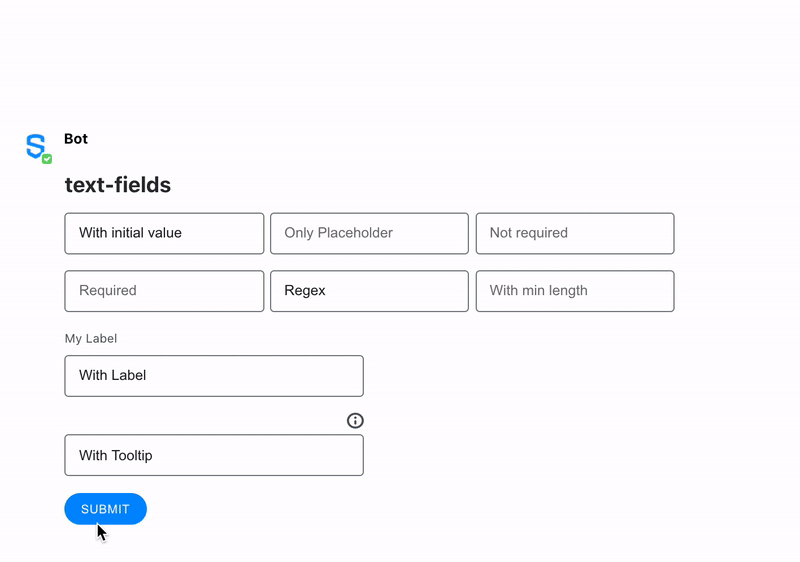

# Text Field

Symphony provides two types of elements for text input fields: [Text fields](text-field.md) are for a single-line input; and [Text area](text-area.md) is for multi-line input.


## Attributes

<table data-header-hidden><thead><tr><th width="142">Attribute</th><th width="98">Type</th><th width="188">Required?</th><th>Description</th></tr></thead><tbody><tr><td>Attribute</td><td>Type</td><td>Required?</td><td>Description</td></tr><tr><td><code>name</code></td><td>String</td><td>Required</td><td>Identifies the text field.</td></tr><tr><td><code>placeholder</code></td><td>String</td><td>Optional</td><td>Specifies a short hint that describes the expected value of the input field.</td></tr><tr><td><code>required</code></td><td>Boolean</td><td>Optional</td><td>If <code>true</code>, it specifies that the input field must be filled out before submitting the form. </td></tr><tr><td><code>masked</code></td><td>Boolean</td><td>Optional</td><td>If <code>true</code>, it creates a masked text field with hide/show options when its value is "true". For more information, refer to <a href="masked-text-field.md">Masked Text Field</a>.</td></tr><tr><td><code>maxlength</code></td><td>Integer</td><td>Optional</td><td>The <code>maxlength</code> attribute allows you to specify a maximum number of characters that the user can input.</td></tr><tr><td><code>minlength</code></td><td>Integer</td><td>Optional</td><td>The <code>minlength</code> attribute allows you to specify a minimum number of characters that the user can input.</td></tr><tr><td><code>pattern</code></td><td>String</td><td>Optional</td><td>Regex String to match for input validation. For more information, refer to <a href="regular-expressions-regex.md">Regular Expressions - Regex</a>.</td></tr><tr><td><code>pattern-error-message</code></td><td>String</td><td>Optional but if <code>pattern</code> is defined, the <code>pattern-error-message</code> attribute is mandatory.</td><td>Error message returned to user if <code>pattern</code> parameter matches user input</td></tr><tr><td><code>title</code></td><td>It accepts a simple text and <code>\n</code> for line breaks</td><td>Optional</td><td>The description that will be displayed when clicking the tooltip icon located on top of the Text Field Element. Max length: 256 characters. Available from Symphony v20.8 and above.</td></tr><tr><td><code>label</code></td><td>String</td><td>Not required but it is recommended if <code>title</code> is defined</td><td>Definition of the label that will be displayed on top of the Text Field Element. Available from Symphony v20.8 and above.</td></tr><tr><td><code>auto-submit</code></td><td>Boolean</td><td><p>Optional. </p><p>Default false.</p></td><td>When enabled, typing &#x3C;<code>enter</code>> key in the field will submit the form. </td></tr><tr><td><code>formnovalidate</code></td><td>Boolean</td><td>Optional.<br>Default false.</td><td>Only valid when <code>auto-submit</code> is true.<br>When set to true, this submit field bypasses the form validation (required fields and regular expressions), meaning that the user can submit this field even if the form validation is in error.</td></tr></tbody></table>

## Using Input Validation

With Symphony v20.6, bot developers can use Regex to validate `text fields` and `text areas` using the `pattern` and `pattern-error-message` attributes.\
For more information and examples, refer to [Regular Expressions - Regex](regular-expressions-regex.md).

## Rules and Limitations

* The text field has a max number of 128 characters. For larger texts, use [Text Area](text-area.md).
* The text field cannot have children tags but it can have a default text (initial value) between the `<text-field></text-field>` tags. See Examples below for more details.
* Text fields are grouped at a max of 4 per row, depending on the screen size. For more information, refer to [Alignment of input texts](broken-reference).
* You can add a **default text** in your text field by including it between the `<text-field></text-field>` tags. Note that unlike the `placeholder` text, the **default text** will be sent with the form if not edited by the user.
* Input Validation - Pattern: the max length for all attributes is set to 256.

## Examples

The following examples show text fields being used as follows:

* The first text-field (_init_) shows how to display a **default text** ("With initial value"). Note that the default text would have been sent to the payload if it had not been deleted before submitting the form.
* The second text-field (_placeholder_) shows how a **placeholder text** ("Only Placeholder") is displayed in the UI. Please note the placeholder text is not sent in the payload if no text has been entered in the field by the enduser.
* The third text-field (_noreq_) shows how a user can interact with a **non-required** field. Even if the field is empty (only a placeholder text is present but does not count as a value), it does not prevent the enduser from submitting the form.
* The fourth text-field (_req_) shows the behaviour of the unique **required** field of the form, which cannot be submitted in case it is not filled; an error is displayed under the field in case the user submits the form with this empty field.
* The fifth text-field (_regex_) shows the behaviour of the field when a regex **pattern** is entered. You can note that the pattern-error-message is displayed under the field if the input does not follow the pattern required by the bot developer.
* The sixth text-field (_min_) shows how to force users to enter an input with a minimum number of characters, and how an error message is displayed under the field if the input does not respect the **minlength** required.
* The seventh text-field (_label_) shows how a **label text** ("My Label") is displayed.
* The eighth text-field (_tooltip_) shows how a **title text** ("My Tooltip/n With a second line") is inserted in the UI under the (i) icon, and how the text entered in the title parameter is displayed when the enduser clicks on the icon.





```markup
<messageML>
  <form id="form_id">
    <h2>text-fields</h2>
      <text-field name="init">With initial value</text-field>
      <text-field name="placeholder" placeholder="Only Placeholder"></text-field>
      <text-field name="noreq" placeholder="Not required"></text-field>
      <text-field name="req" required="true" placeholder="Required"></text-field>
      <text-field name="regex" pattern="^[a-zA-Z]{3,3}$" pattern-error-message="My error message - must contain exactly 3 letters">Regex</text-field>
      <text-field name="min" placeholder="With min length" minlength="3"></text-field>
      <text-field name="label" label="My Label">With Label</text-field>
      <text-field name="tooltip" title="My Tooltip\n With a second line">With Tooltip</text-field>
      <button name="text-field">Submit</button>
  </form>
</messageML>
```



```javascript
[
    {
        "id": "q6eUgG",
        "messageId": "NowSKCnJJBdPOXQyoPQg8X___pQDVWaBbQ",
        "timestamp": 1563312167294,
        "type": "SYMPHONYELEMENTSACTION",
        "initiator": {
            "user": {
                "userId": 7078106482890,
                "firstName": "User",
                "lastName": "Bot",
                "displayName": "User",
                "email": "user_bot@symphony.com",
                "username": "user_bot"
            }
        },
        "payload": {
            "symphonyElementsAction": {
                "actionStream": {
                    "streamId": "0YeiA-neZa1PrdHy1L82jX___pQjntU-dA"
                },
                "formStream": {
                    "streamId": "YuK1c2y2yuie6+UfQnjSPX///pQEn69idA=="
                },
                "formMessageId": "5iSJ+faXx/23Jkehx3lpSn///pQDVedXdA==5587",
                "formId": "form_id",
                "formValues": {
                    "action": "text-field",
                    "init": "",
                    "placeholder": "",
                    "noreq": "",
                    "req": "test",
                    "regex": "Reg",
                    "min6": "abc",
                    "label": "With Label",
                    "tooltip": "With Tooltip"
                }
            }
        }
    }
]
```



## Alignment of text-fields

Please note that several text-fields are aligned next to another. Note also that this behaviour is reactive to the screen size, the number of text-fields on the same line decreasing until one per row, as the screen gets smaller (see in the example below).

 (1) (1).gif>)

## Versions and Compatibility

<table><thead><tr><th>Main features introduced</th><th>Agent needed to parse message sent by the bot</th><th width="150">Client 2.0 release</th><th>Mobile</th></tr></thead><tbody><tr><td>Initial release</td><td>2.55.9</td><td>Since first version</td><td>Since first version</td></tr><tr><td>Regex</td><td>20.6</td><td>Since first version</td><td>Since first version</td></tr><tr><td>Label</td><td>20.7</td><td>Since first version</td><td>Since first version</td></tr><tr><td>Tooltip (title)</td><td>20.7</td><td>Since first version</td><td>Since first version</td></tr><tr><td>auto-submit</td><td>23.11</td><td>23.12</td><td><strong>Not supported yet.</strong></td></tr><tr><td>formnovalidate</td><td>25.6</td><td>25.9</td><td><strong>Not supported yet.</strong></td></tr></tbody></table>
