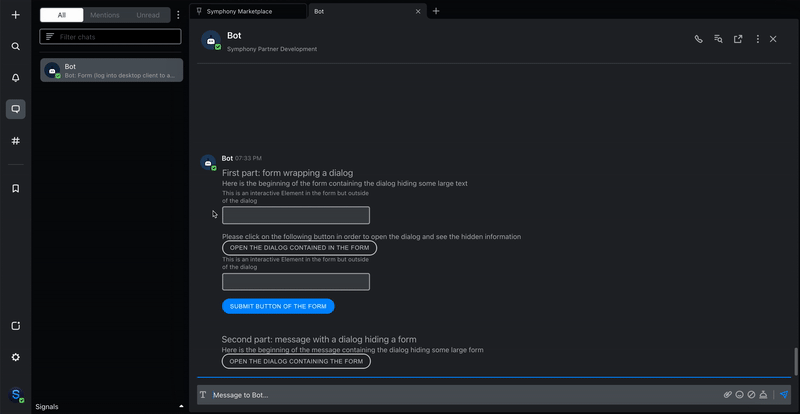

# Dialog

Chat bots can embed dialog buttons in chat messages. When the dialog button is clicked, a dialog opens and displays the content that has been predefined.\
This can be useful to make long messages much more concise, or progressively disclose a form only if it is relevant to the user for example.

## MessageML tags

The Dialog component is structured in two sections:

* `<ui-action action='open-dialog'>` tag. This tag defines where and how the [button](../symphony-elements-1/buttons/) will be displayed, and it references the dialog that will open using the `target-id` attribute;
* `<dialog>` tag that defines the content of the dialog that will be displayed when the button is clicked.

### UI-action with open-dialog

The `<ui-action>` tag wraps a single `<button>` children tag. The button tag supports the usual styles (primary, secondary, tertiary). Examples are available at the bottom of this page.

The `<ui-action>` tag supports the following attributes:

<table data-header-hidden><thead><tr><th width="127.72145556927774">Attribute</th><th width="97.81621621621622">Type</th><th width="109">Required?</th><th>Description</th></tr></thead><tbody><tr><td>Attribute</td><td>Type</td><td>Required?</td><td>Description</td></tr><tr><td><strong><code>action</code></strong></td><td>String</td><td>Yes</td><td>For Dialogs, always set to <code>action='open-dialog'.</code> </td></tr><tr><td><strong><code>target-id</code></strong></td><td>String</td><td>Yes</td><td><p>Id of the dialog that must be opened when user will trigger this ui-action.</p><p>See the <em><code>id</code></em> attribute in the &#x3C;dialog> tag.</p></td></tr></tbody></table>

### Dialog tag

Each `<dialog>` is split in three areas (children tags):

* `<title>` - mandatory: specifies the title of the dialog and is always displayed at the top of it in a fixed and non scrollable position.
* `<body>` - mandatory: specifies the content of the dialog that is displayed in the middle of it and can be scrollable when the content is too big to be contained in the view height.
* `<footer>` - optional: specifies the footer of the dialog and is always displayed at the bottom in a fixed and non scrollable position.

The `<dialog>` tag supports the following attributes

<table data-header-hidden><thead><tr><th width="118.61538461538461">Attribute</th><th width="94">Type</th><th width="109">Required?</th><th>Description</th></tr></thead><tbody><tr><td>Attribute</td><td>Type</td><td>Required?</td><td>Description</td></tr><tr><td><strong><code>id</code></strong></td><td>String</td><td>Yes</td><td>Id of the dialog that will be triggered thanks to the ui-action it is associated to. See <em><code>target-id</code> attribute in &#x3C;ui-action> tag.</em></td></tr><tr><td><strong><code>width</code></strong></td><td>String</td><td><p>No.</p><p>Default to medium</p></td><td><p>Specifies the width of the dialog.<br></p><p><em>NB: values can be: small, medium, large, or full-width.</em></p></td></tr></tbody></table>

## Examples

The following gif shows an example that contains two dialogs:

1. The first dialog is embedded **in a form**. You will notice that the button used to trigger the dialog is positioned where the `<ui-action>` tag is coded.

* As soon as the associated `<dialog>` is at its same nesting level, it can be placed anywhere before or after the ui-action.
* You can also notice that users can interact with the form as well as submit it.
* However, the dialog only contains text as it cannot contain any interactive Form Elements. Please note that a cancel button can be included in the dialog as it is not considered as an interactive Form Element: you can use it to offer another option for the user to close the dialog.
* Please note the scrolling behaviour of the body whereas both title and footer are placed in a fixed position.

2. The second dialog **embeds a form** instead.

* After having started to fill-in the form, if the user closes the dialog and opens it back, the values of the fields will not reset to their original values, as long as the user does not refresh the page.
* Also, when submitting a form that is in a dialog, the dialog will automatically close after a certain delay. If the user opens back the dialog without refreshing the page, then the values of the form and its state are persisted.





```markup
<messageML>
  <form id="wrapping_dialog">
    <h4>First part: form wrapping a dialog</h4>
    <p>Here is the beginning of the form containing the dialog hiding some large text</p>
    <text-field name="input1" label="This is an interactive Element in the form but outside of the dialog" />
    <p>Please click on the following button in order to open the dialog and see the hidden information</p>
    <ui-action action="open-dialog" target-id="dialog_in_form">
      <button class="secondary">Open the dialog contained in the form</button>
    </ui-action>
    <text-field name="input2" label="This is an interactive Element in the form but outside of the dialog" />
    <button name="wrapping_dialog">Submit Button of the Form</button>
    <dialog id="dialog_in_form">
      <title>
        This is a title
      </title>
      <body>
Lorem ipsum dolor sit amet, consectetur adipiscing elit. Nullam congue viverra interdum. Integer quam odio, gravida ultricies pharetra ac, tempor eget leo. Duis vitae arcu sed turpis faucibus feugiat a at ipsum. Nulla facilisi. Phasellus egestas, leo et malesuada porttitor, felis turpis viverra tortor, quis suscipit orci nibh at augue. Curabitur erat libero, accumsan vitae ipsum eleifend, tincidunt bibendum purus. Curabitur ultricies lorem tincidunt rutrum viverra. Sed mattis dui at suscipit auctor. In rutrum neque urna, vitae lacinia turpis blandit eget. Nullam eu dignissim purus. Sed ut ante lorem. Duis quis mi nec enim imperdiet consectetur. Phasellus aliquet accumsan ipsum non ullamcorper.<br/><br/>
Praesent convallis odio tortor, sit amet vulputate nulla tincidunt vitae. Donec ultrices eros suscipit mauris condimentum iaculis. Ut posuere finibus quam a consequat. Vestibulum ante ipsum primis in faucibus orci luctus et ultrices posuere cubilia curae; Nam aliquet dapibus vehicula. Nunc vel lectus congue, finibus felis ut, laoreet est. Maecenas eleifend gravida metus, nec viverra mi egestas eu. Pellentesque scelerisque mattis nibh, eu condimentum nulla finibus ut.<br/><br/>
Ut dignissim varius libero ac volutpat. Sed hendrerit nec libero ut ullamcorper. Nunc et risus sed purus luctus faucibus nec eu est. Praesent id justo ante. Sed sed enim velit. Ut ac mauris magna. Fusce bibendum ullamcorper diam quis semper. Aenean mattis auctor ultricies. Mauris dui enim, vehicula sit amet finibus non, consectetur eu ante. Fusce at mi a ipsum gravida rhoncus.<br/><br/>
Lorem ipsum dolor sit amet, consectetur adipiscing elit. Nullam congue viverra interdum. Integer quam odio, gravida ultricies pharetra ac, tempor eget leo. Duis vitae arcu sed turpis faucibus feugiat a at ipsum. Nulla facilisi. Phasellus egestas, leo et malesuada porttitor, felis turpis viverra tortor, quis suscipit orci nibh at augue. Curabitur erat libero, accumsan vitae ipsum eleifend, tincidunt bibendum purus. Curabitur ultricies lorem tincidunt rutrum viverra. Sed mattis dui at suscipit auctor. In rutrum neque urna, vitae lacinia turpis blandit eget. Nullam eu dignissim purus. Sed ut ante lorem. Duis quis mi nec enim imperdiet consectetur. Phasellus aliquet accumsan ipsum non ullamcorper.<br/><br/>
Praesent convallis odio tortor, sit amet vulputate nulla tincidunt vitae. Donec ultrices eros suscipit mauris condimentum iaculis. Ut posuere finibus quam a consequat. Vestibulum ante ipsum primis in faucibus orci luctus et ultrices posuere cubilia curae; Nam aliquet dapibus vehicula. Nunc vel lectus congue, finibus felis ut, laoreet est. Maecenas eleifend gravida metus, nec viverra mi egestas eu. Pellentesque scelerisque mattis nibh, eu condimentum nulla finibus ut.<br/><br/>
Ut dignissim varius libero ac volutpat. Sed hendrerit nec libero ut ullamcorper. Nunc et risus sed purus luctus faucibus nec eu est. Praesent id justo ante. Sed sed enim velit. Ut ac mauris magna. Fusce bibendum ullamcorper diam quis semper. Aenean mattis auctor ultricies. Mauris dui enim, vehicula sit amet finibus non, consectetur eu ante. Fusce at mi a ipsum gravida rhoncus.
      </body>
      <footer>
        This is a footer
        <button name="cancel1" type="cancel">Close</button>
      </footer>
    </dialog>
  </form>
  <br/>
  <br/>
  <h4>Second part: message with a dialog hiding a form</h4>
  <p>Here is the beginning of the message containing the dialog hiding some large form</p>
  <dialog id="dialog_containing_form" width="large">
    <form id="wrapped_in_dialog">
      <title>
        This is a title
      </title>
      <body>
        <text-field name="input3" label="This is an interactive Element in the form which is contained in the dialog" />
        <textarea name="textarea" label="Other interactive Element in the dialog" />
Lorem ipsum dolor sit amet, consectetur adipiscing elit. Nullam congue viverra interdum. Integer quam odio, gravida ultricies pharetra ac, tempor eget leo. Duis vitae arcu sed turpis faucibus feugiat a at ipsum. Nulla facilisi. Phasellus egestas, leo et malesuada porttitor, felis turpis viverra tortor, quis suscipit orci nibh at augue. Curabitur erat libero, accumsan vitae ipsum eleifend, tincidunt bibendum purus. Curabitur ultricies lorem tincidunt rutrum viverra. Sed mattis dui at suscipit auctor. In rutrum neque urna, vitae lacinia turpis blandit eget. Nullam eu dignissim purus. Sed ut ante lorem. Duis quis mi nec enim imperdiet consectetur. Phasellus aliquet accumsan ipsum non ullamcorper.<br/><br/>
Praesent convallis odio tortor, sit amet vulputate nulla tincidunt vitae. Donec ultrices eros suscipit mauris condimentum iaculis. Ut posuere finibus quam a consequat. Vestibulum ante ipsum primis in faucibus orci luctus et ultrices posuere cubilia curae; Nam aliquet dapibus vehicula. Nunc vel lectus congue, finibus felis ut, laoreet est. Maecenas eleifend gravida metus, nec viverra mi egestas eu. Pellentesque scelerisque mattis nibh, eu condimentum nulla finibus ut.<br/><br/>
Ut dignissim varius libero ac volutpat. Sed hendrerit nec libero ut ullamcorper. Nunc et risus sed purus luctus faucibus nec eu est. Praesent id justo ante. Sed sed enim velit. Ut ac mauris magna. Fusce bibendum ullamcorper diam quis semper. Aenean mattis auctor ultricies. Mauris dui enim, vehicula sit amet finibus non, consectetur eu ante. Fusce at mi a ipsum gravida rhoncus.<br/><br/>
Lorem ipsum dolor sit amet, consectetur adipiscing elit. Nullam congue viverra interdum. Integer quam odio, gravida ultricies pharetra ac, tempor eget leo. Duis vitae arcu sed turpis faucibus feugiat a at ipsum. Nulla facilisi. Phasellus egestas, leo et malesuada porttitor, felis turpis viverra tortor, quis suscipit orci nibh at augue. Curabitur erat libero, accumsan vitae ipsum eleifend, tincidunt bibendum purus. Curabitur ultricies lorem tincidunt rutrum viverra. Sed mattis dui at suscipit auctor. In rutrum neque urna, vitae lacinia turpis blandit eget. Nullam eu dignissim purus. Sed ut ante lorem. Duis quis mi nec enim imperdiet consectetur. Phasellus aliquet accumsan ipsum non ullamcorper.<br/><br/>
Praesent convallis odio tortor, sit amet vulputate nulla tincidunt vitae. Donec ultrices eros suscipit mauris condimentum iaculis. Ut posuere finibus quam a consequat. Vestibulum ante ipsum primis in faucibus orci luctus et ultrices posuere cubilia curae; Nam aliquet dapibus vehicula. Nunc vel lectus congue, finibus felis ut, laoreet est. Maecenas eleifend gravida metus, nec viverra mi egestas eu. Pellentesque scelerisque mattis nibh, eu condimentum nulla finibus ut.<br/><br/>
Ut dignissim varius libero ac volutpat. Sed hendrerit nec libero ut ullamcorper. Nunc et risus sed purus luctus faucibus nec eu est. Praesent id justo ante. Sed sed enim velit. Ut ac mauris magna. Fusce bibendum ullamcorper diam quis semper. Aenean mattis auctor ultricies. Mauris dui enim, vehicula sit amet finibus non, consectetur eu ante. Fusce at mi a ipsum gravida rhoncus.
      </body>
      <footer>
        <button name="cancel2" type="cancel">Close</button>
        <button name="wrapping_dialog">Submit Button of the Form</button>
      </footer>
    </form>
  </dialog>
  <ui-action action="open-dialog" target-id="dialog_containing_form">
    <button class="secondary">Open the dialog containing the form</button>
  </ui-action>
</messageML>
```



### Simpler examples

Below are simpler examples with and without the use of forms.



```markup
<messageML>
    <ui-action trigger="click" action="open-dialog" target-id="dialogId">
        <button>Simple dialog</button>
    </ui-action>
    <dialog id="dialogId">
        <form id="formId">
            <title>A Simple dialog</title>
            <body>
                This is a simple dialog.
            </body>
            <footer>
                <button type="cancel" name="cancel-button">Close</button>
            </footer>
        </form>
    </dialog>
</messageML>
```



```markup
<messageML>
    <ui-action trigger="click" action="open-dialog" target-id="dialogId">
        <button>Open the Dialog</button>
    </ui-action>
    <dialog id="dialogId">
        <form id="formId">
            <title>My Form in a Dialog</title>
            <body>
                <text-field name="input" />
            </body>
            <footer>
                <button type="action" name="send-form">Submit</button>
                <button type="reset">Reset</button>
                <button type="cancel" name="cancel-form">Close</button>
            </footer>
        </form>
    </dialog>
</messageML>
```



```markup
<messageML>
    <form id="formId">
        <text-field name="input" />
        <ui-action trigger="click" action="open-dialog" target-id="dialogId">
            <button>Open the Dialog</button>
        </ui-action>
        <dialog id="dialogId" width="small">
            <title>A Dialog</title>
            <body>
                <expandable-card state="expanded">
                    <header>Dialog can include any other messageML component except Interactive Elements Forms</header>
                    <body>This does not contain any interactive element</body>
                </expandable-card>
            </body>
            <footer>
                Some text in the footer
                <button type="cancel" name="cancel-form">Close</button>
            </footer>
        </dialog>
        <h3>Actions</h3>
        <button name="send-answers" type="action">Submit</button>
        <button type="reset">Reset Data</button>
    </form>
</messageML>
```



## Rules and Limitations

* The **max length** of any ui-action or dialog attribute is 256.
* Please note that the attribute `type` of the button is not supported when wrapped by a `<ui-action>` tag.
* The dialog and ui-action tags must be both present in the same message, at the same nesting level, and they must share the same and unique **id** / **target-id**. _Please note it is possible to have several dialogs in the same message as soon as each dialog has a different id._
* The dialog feature is supported in **popped-out mode**. The dialog will open in the popped-out window.
* The dialog functionality supports [**Interactive Elements Forms**](../symphony-elements-1/) in the following way:
  * Dialogs can be contained inside forms. However, if contained in a form, the dialog cannot contain any interactive Element (such as button, text-area, etc.)
  * Dialogs can contain a form. The `<form>` tag should wrap the entire content of the dialog, including the `<title>` ,`<body>` and `<footer>` tags, as you can see in the examples below. _This is useful when you want the submit button not to be hidden and always appear in the footer of the dialog whereas the rest of the form content is contained in the scrollable body area._
  * Please also note that users can close the dialog thanks to the cross (x) displayed at the top-right corner of it, as well as with a new type of [button](../symphony-elements-1/buttons/) that has been created for that purpose: \<button type="cancel">. You can also specify the class attribute of the button which is by default set to "tertiary" for this new button.
* A dialog cannot be embedded in another dialog.


#### Best Practice for using dialogs

Even if this possible, please avoid embedding more than one form in a single dialog.


## Versions and Compatibility <a href="#versions-and-compatibility" id="versions-and-compatibility"></a>

<table data-header-hidden><thead><tr><th>Main features introduced</th><th>Agent needed to parse message sent by the bot</th><th width="150">Client 2.0 release</th><th width="150">Client 1.5 release</th><th>Backward client-compatibility behavior (e.g. external rooms)</th></tr></thead><tbody><tr><td>Main features introduced</td><td>Agent needed to parse message sent by the bot</td><td>Client 2.0 release</td><td><em>Client 1.5 release</em></td><td><em>Backward client-compatibility behavior (e.g. external rooms)</em></td></tr><tr><td>Initial release</td><td>20.12.2</td><td>21.10</td><td><em>Not working</em></td><td><em>Not working - entire message is not rendered</em></td></tr></tbody></table>
