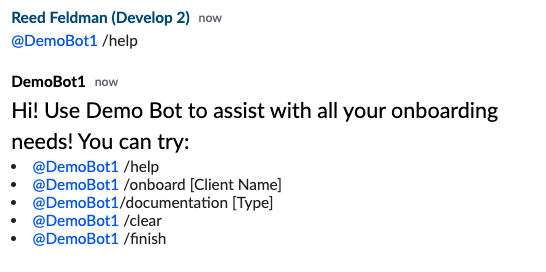

# Bots Best Practices

Symphony has a number of best practices to ensure smooth bot development and a positive user experience.

## Getting Your Bots Attention

It is common that Symphony chatrooms contain more than one Bot constantly listening to events. In order to preserve name space and ensure that there isn't overlap between bot workflows, we recommend that bots only respond to events that begin with an @mention:

By '@mentioning' your bot, it ensures that only the intended bot responds.

## Commands

It is best practice to have bots listen for commands beginning with a '/'. This naming convention makes it clear to other users that you are trying to get a bot's attention. Additionally, it makes it clear to your bot that a user is instructing it to do something and kick off its intended workflow.

It is also best practice to enforce command line style arguments for commands that require additional input or data:

## Help Menu

It important that users understand exactly what your bot is capable of and what commands your bot understands. It is best practice for your bot to list its commands inside a help menu:

## Datafeed

It is considered best practice that bot's only create and read from one datafeed. If your bot goes down, it should re-authenticate, create a new datafeed, and begin reading from this one.

Creating and reading from multiple datafeeds concurrently can result in your bot processing duplicate messages and subsequently sending duplicate or out of order messages back to the user.

## Message Rate

For large rooms, it is recommended that bots do not send messages at a rate of 2 messages/sec or every 500ms.

If bots are bulk adding users to rooms, it is recommended that bots add users at a rate of 1 user every 3 seconds.

## Stateful Elements

The following example shows you how to create cascading elements to simulate a stateful Symphony message:

\(insert example\)

## Duplicate Messages

In some rare cases, Bots may receive duplicate messages from Symphony. In order to prevent duplicate processing, developers can implement logic to keep track of previous messages. It is recommended that bots store a list of unique messageIDs up to 15 minutes in the past. Upon each new message, bots should do a quick validation that new message is not received in the past and continue to process the message.

