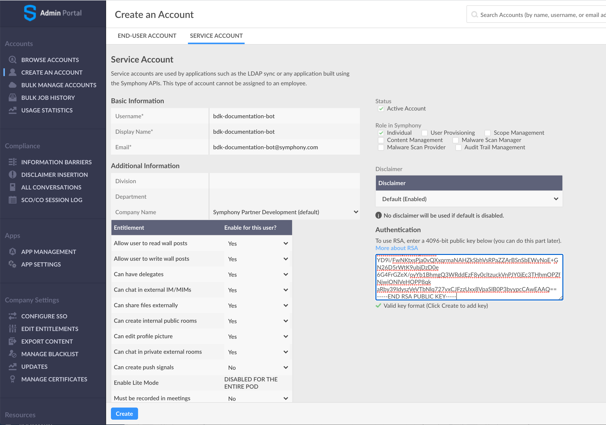

# Configure your Bot for BDK 2.0

## 1. Generate your Bot 

### Building your Project using the Symphony Bot Generator


This section requires `npm` \([Node Package Manager](https://www.npmjs.com/)\) to be installed on your local machine as a prerequisite.


For all Symphony BDK applications, you should start with the [Symphony Bot Generator](../../developer-tools/developer-tools/symphony-bot-generator.md). The Symphony Generator offers a fast way to bootstrap your Symphony BDK project in several languages, including Java:

```text
$ npm i -g generator-symphony
$ mkdir botProject && cd botProject
$ yo symphony 2.0
```

This will prompt you with a number of questions about your bot and Pod configuration.  Type in your bot's metadata, use arrows to scroll, and press enter to move on to the next prompt:


### Spring Boot Integration

The BDK 2.0 and Symphony Bot Generator provides an available Spring Boot Integration out of the box.  To bootstrap your bot as a Spring Boot project, select the 'Spring Boot' option when prompted to 'select your framework' when going through the generator's options.    


```text
$ yo symphony 2.0
 __   __     ___                 _                 
 \ \ / /__  / __|_  _ _ __  _ __| |_  ___ _ _ _  _ 
  \ V / _ \ \__ \ || | '  \| '_ \ ' \/ _ \ ' \ || |
   |_|\___/ |___/\_, |_|_|_| .__/_||_\___/_||_\_, |
                 |__/      |_|                |__/ 
	https://developers.symphony.com

Welcome to Symphony Generator v1.4.3
Application files will be generated in folder: /Users/reed.feldman/bdk-documentation-bot
______________________________________________________________________________________________________
? Enter your pod host develop2.symphony.com
? Enter your bot username bdk-documentation-bot
? Select your programing language Java (beta)
? Select your build system Maven
? Select your framework Java (no framework)
? Enter your project groupId com.symphony
? Enter your project artifactId bot-application
? Enter your base package com.symphony.java
Generating RSA keys...
...
-----BEGIN RSA PUBLIC KEY-----
MIICCgKCAgEAlToybEs8ovplnlYCrmVp9l81GAUC+JxK2RIjMleQS2giH/9EHuwlmskgp40Z
QcFXQvaXdryo8ftPoZS32KdcvB7kbC0eX1nltPRHic+e/fQAu4N1A0hTQGd8kGQ3CUabNOeN
VsahEj7P2OrIfsN4+5kOEV5JHIA1kSsB/csLETAyDuMPoGqEE7Nm8MMlO/74WezG7R8EmIlH
HnOlz9qtaZH4SOCrMTj7mY0zy3HtYztnBcAPuclbaHoQWkh05EdSE2j4SjlZpNe9aD9gSjLQ
3dYmTfrQZMC8Dqlfm2yDG5jr78jUY9sXPAM8UThjl2i4YrnH6kH5kj1tujn4RaF++tzU1uVJ
W30HEi6hzVsnbUfvv1qEo5v8AZYc91TN6tLMuClGz4h7RmejX3yRBYV90csaqhyvJQlBLR/r
RAo6mv+7PaAK5rPvZVbH1ogW1UBQnYaGfCu4OxAWTXNnUO9g6yuVr3LVxsLlpEkltNj9Hn60
YD9i/FwNKtxsPja0vQXxqrmaNAHZkSbhVsRPaZZArBSnSbEWyNoE+GN26D5rWtK9ubjDzD0e
6G4FrGZeX/oyYb1BhmgQ3WRddEzF8y0cltzuckVnPJY0jEc3THhmOPZfNjwiONlVeHOPP8qk
aRby39IdyszVeVTbNlq727vxCJFzzUxx8VpaSlB0P3byypcCAwEAAQ==
-----END RSA PUBLIC KEY-----
```

### Building your project _from scratch_

This section will help you to understand how to create your bot application from scratch.

#### Maven-based project

If you want to use [Maven](https://maven.apache.org/) as build system, you have to configure your root `pom.xml` as such:

```markup
<?xml version="1.0" encoding="UTF-8"?>
<project xmlns="http://maven.apache.org/POM/4.0.0"
         xmlns:xsi="http://www.w3.org/2001/XMLSchema-instance"
         xsi:schemaLocation="http://maven.apache.org/POM/4.0.0 http://maven.apache.org/xsd/maven-4.0.0.xsd">
    <modelVersion>4.0.0</modelVersion>

    <groupId>com.example</groupId>
    <artifactId>symphony-bdk</artifactId>
    <version>0.0.1-SNAPSHOT</version>
    <name>symphony-bdk</name>
    <description>Demo project for Symphony BDK</description>

    <dependencyManagement>
        <dependencies>
            <dependency>
                <groupId>com.symphony.platformsolutions</groupId>
                <artifactId>symphony-bdk-bom</artifactId>
                <version>1.3.2.BETA</version>
                <type>pom</type>
                <scope>import</scope>
            </dependency>
        </dependencies>
    </dependencyManagement>

    <dependencies>
        <!-- Core dependencies -->
        <dependency>
            <groupId>com.symphony.platformsolutions</groupId>
            <artifactId>symphony-bdk-core</artifactId>
        </dependency>
        <dependency>
            <groupId>com.symphony.platformsolutions</groupId>
            <artifactId>symphony-bdk-http-jersey2</artifactId> <!-- or symphony-bdk-http-webclient -->
            <scope>runtime</scope>
        </dependency>
        <dependency>
            <groupId>com.symphony.platformsolutions</groupId>
            <artifactId>symphony-bdk-template-freemarker</artifactId>  <!-- or symphony-bdk-http-handlebars -->
            <scope>runtime</scope>
        </dependency>
        <!-- Logger Configuration -->
        <dependency>
            <groupId>org.slf4j</groupId>
            <artifactId>slf4j-api</artifactId>
        </dependency>
        <dependency>
            <groupId>ch.qos.logback</groupId>
            <artifactId>logback-classic</artifactId>
            <scope>runtime</scope>
        </dependency>
    </dependencies>
</project>
```

#### Gradle-based project

If you want to use [Gradle](https://gradle.org/) as build system, you have to configure your root `build.gradle` as such:

```javascript
plugins {
    id 'java-library'
}

group = 'com.example'
version = '0.0.1-SNAPSHOT'

repositories {
    mavenCentral()
}

dependencies {

    // import a BOM
    implementation platform('com.symphony.platformsolutions:symphony-bdk-bom:1.3.2.BETA')

    // define dependencies without versions
    implementation 'com.symphony.platformsolutions:symphony-bdk-core'
    runtimeOnly 'com.symphony.platformsolutions:symphony-bdk-http-jersey2' //  or symphony-bdk-http-webclient
    runtimeOnly 'com.symphony.platformsolutions:symphony-bdk-template-freemarker' // or symphony-bdk-http-handlebars

    // logger configuration
    implementation 'org.slf4j:slf4j-api'
    runtimeOnly 'ch.qos.logback:logback-classic'
}
```

## 2.  Configure your Bot

Once you have your generated bot scaffold, the next step is to configure your bot user.

Ensure that your pod admin has created a corresponding service account on the admin portal of your Symphony Pod. Additionally, you must upload the generated RSA public key for the service account created.

Copy the entire contents of this RSA public key including the dashes on either side, and hand it to your pod admin and request for it to be saved against the respective service account you will be using.


Note: The bot username and bot email address entered to the Symphony Bot Generator must match exactly the Basic Information shown in the Pod above.




#### Create configuration file

Before implementing any code, you need to navigate to your `src/main/resources/config.yaml` configuration file, and adjust it according to your Symphony environment.  The following configuration file is generated by default:



```text
host: develop2.symphony.com

bot:
  username: bdk-documentation-bot
  privateKeyPath: /bdk-documentation-bot/src/main/resources/rsa/privatekey.pem
```




 Depending on your Symphony environment you may need to make update and add additional values to your `config.yaml` file.

### Click [here](https://github.com/SymphonyPlatformSolutions/symphony-api-client-java/blob/master/docs/configuration.md) for more detailed documentation about BDK configuration


## 3.  Build your Bot

Now that you have configured your Bot project using the BDK 2.0 and Symphony Bot Generator, checkout one of our dedicated BDK 2.0 tutorials:



