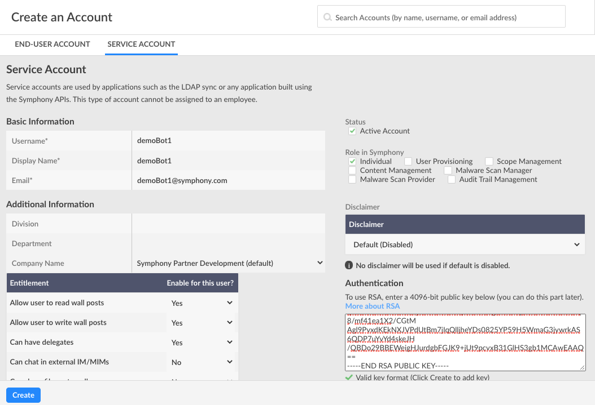

# Configure your Bot

The following is a language-agnostic Bot configuration guide for building Bots using Symphony SDKs and the Symphony Bot Generator.


For example purposes, we will be generating a Java chatbot, however the configuration steps provided can be applied to any of our supported SDKs.


The Symphony Bot Generator is a Yeoman-based code generator that generates a project scaffold for the Symphony SDKs. You can use the Symphony Bot Generator for the following:

* RSA Key/Certificate creation
* Bot configuration
* Generate project structure
* Build of example projects

### Prerequisites

#### Install Symphony Bot Generator:

```text
$ $ npm install -g yo generator-symphony

```

### 1.  Generate Your Bot

To activate the Symphony Bot Generator:

```text
$ yo symphony
```

This will prompt you with a number of questions about your Symphony environment and Bot metadata. Type in your Bot's basic information metadata, and press enter to move onto the next prompt.  If questions give you multiple options, use the keyboard arrows to scroll.  

```text
/------------------------------------------/
/        SYMPHONY GENERATOR  1.1.1         /
/    by platformsolutions@symphony.com     /
/ (c) 2020 Symphony Communication Services /
/------------------------------------------/
? What do you want to create bot
? What is the name of your project demoBot1
? What is your POD subdomain develop2
? What is your preferred programming language Java
? What is the BOT username demoBot1
? What is the BOT email address demoBot1@symphony.com
? What is your preferred encryption technology RSA - Generate New Keys
? Which template do you want to start with Request/Reply
* Generating bot Java code from Request/Reply template...
Looking for latest version of Java client library..
Latest version of Java client library is 1.1.8
generating from template Request/Reply
* Generating RSA public/private keys for BOT demoBot1...
* BOT generated successfully!!
   create pom.xml
   create src/main/java/IMListenerImpl.java
   create src/main/java/RequestReplyBot.java
   create src/main/java/RoomListenerImpl.java
   create src/main/resources/config.json
   create certificates/all_symphony_certs_truststore
   
```


Note: In this guide, we will select 'RSA - Generate New Keys'. If you have preexisting RSA keys or wish to use certificates, select the other options accordingly


Upon completion, the Symphony Bot Generator has created a public/private RSA key pair, a configuration and requirements file, and also datafeed event listeners.

### 2. Configure your Bot

Once you have your generated Bot scaffold, the next step is to configure your Bot user:

Ensure that you or your admin has created a corresponding service account on the admin portal of your Symphony Pod. Additionally, you must upload the generated public key onto the service account created:

```text
$ cd demoBot1
demoBot1 $ ls
certificates	pom.xml		rsa		src

demo-bot1 $ cd rsa
rsa $ more rsa-public-demo-bot1.pem 
-----BEGIN RSA PUBLIC KEY-----
MIICCgKCAgEAkuSmdAtnPDYF8j5lA9q5r7Mtv1uzbAr1RR6W+WqZKOkp5BdBmEz9C9h3qBfp
SdBpowYd7DbMwcMUZZ69nxOrtjqJiTxIG/dPswiN4/I275gaFarUMkHGFqEDKMjR0gNG0oj8
dYubtHcg3w06mYrRpj1wJLWm7Vg5+/QH2cDK0qP2kGLcozHf+MMg7f0c8dBx3esdRxs3Rcwf
LrjKH0mgTC6W1l/VFu6P/+2LV/1toDg+LNtBVZH5eMimvFCH9nAd7Vge2GgHGD8HGA7mnlPk
lEovSjKCsQDxafuBL0NH2PMW7l9/kBrWj8Wh2QNwNOnTUm67euD09MR4T/1amF23f0BWjjoW
OtosWcKXh5Rye6syKY68Rj9ShzPOYC0z0FASBEfFeb4YQ7GbG0UhS4ya+HO/URCwkOkWVq2r
yb8SRPAliZn/sUYNtcDMO3CKzC0RveJsYrmHg2Hswr1333cQkqXbGI+q1ZDIw2HWENQGt/NT
qhDVL8boocTSnMSajdRLFnn1aPwp1tvSBrng01u6nqlfDxHXlVuiNWTQ8/mf41ea1X2/CGtM
Agl9PvxdKEkNXJVPdUtBm7jIqQlljheYDs0825YP59H5WmaG3jywrkAS6QDP7uYvYd4skeJH
/QBDo29BBEWeigHJurdgbFGJK9+jUt9pcvxB31GlHS3gb1MCAwEAAQ==
-----END RSA PUBLIC KEY-----
```

Copy the entire contents of this public key including the dashes on either side, and handoff to your system admin or upload directly to the pod and click create:




Note: The Bot username and Bot email address entered to the Symphony Bot Generator must match exactly the Basic Information shown in the Pod above.


For a detailed guide on how to create a service account in the admin portal, check out this guide:



Open your generated Bot code in your favorite IDE and navigate to the config.json file:



```javascript
{
    "sessionAuthHost": "develop2.symphony.com",
    "sessionAuthPort": 443,
    "keyAuthHost": "develop2.symphony.com",
    "keyAuthPort": 443,
    "podHost": "develop2.symphony.com",
    "podPort": 443,
    "agentHost": "develop2.symphony.com",
    "agentPort": 443,

    "truststorePath": "certificates/all_symphony_certs_truststore",
    "truststorePassword": "changeit",

    "botUsername": "demoBot1",
    "botEmailAddress": "demoBot1@symphony.com",

    "botPrivateKeyPath": "rsa/",
    "botPrivateKeyName": "rsa-private-demoBot1.pem",

    "botCertPath": "",
    "botCertName": "",
    "botCertPassword": "",

    "proxyURL": "",
    "proxyUsername": "",
    "proxyPassword": "",
    "keyManagerProxyURL": "",
    "keyManagerProxyUsername": "",
    "keyManagerProxyPassword": ""
}
```



Confirm that the sessionAuthHost, keyAuthHost, and agentHost matches the correct Pod, Key Manager, and Agent endpoints respectfully. Additionally, confirm that the botUsername, and botEmailAddress match the information entered in the admin portal on the Pod.

The config.json file has other fields that offers advanced configurations for proxy servers, certificate truststores, and custom ports.  If these don't apply to your Bot or environment, leave them blank.  For more information on advanced configurations continue here: [SDK Configuration](../../developer-tools/developer-tools/sdks/sdk-configuration.md).

### 3.  Build Your Bot

Now that you have generated and configured your Bot, move onto one of the language-specific [Chatbot](../planning-your-bot/chatbot/),  [Interactive Bot](../planning-your-bot/interactive-bot/), or [Headless Bot](../planning-your-bot/headless-bot/) getting started guides.

