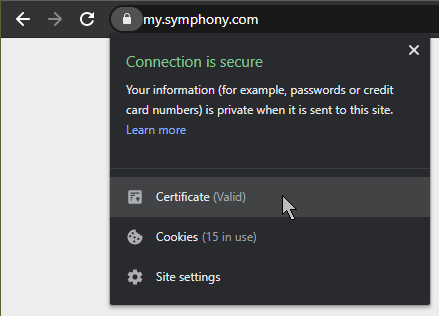
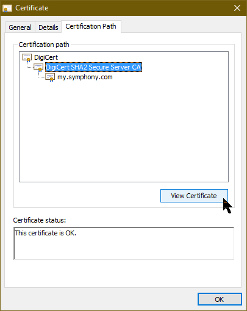
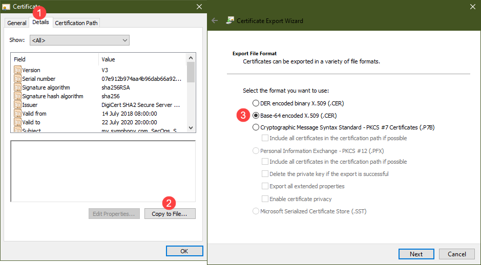

# Truststores

## Overview

In an enterprise environment, it is very common to have an internal root certificate authority (root CA) that signs all certificates used internally for TLS termination on HTTPS sites. While this trust is federated on the operating system level for all domain-connected Windows workstations, non-Windows servers are typically not configured the same way. Even on a Windows workstation, your Java runtime might not necessarily trust the enterprise root CA certificates.

If a Java application attempts to make a connection to an untrusted remote server, it will throw an `SSLException` and fail to connect.

## Java Truststores

A Java truststore is a bundle of certificates used when establishing connections to remote servers (this could be internal or on the Internet). Each Java runtime ships with a default truststore called `cacerts`. Adding certificates directly into `cacerts` is usually not recommended unless there is a centrally-managed deployment process for all workstations and servers.

## Bot Truststore

A bot requires connections to several servers like the key manager or API agent, as defined in your bot configuration. This configuration should also define the path to a custom truststore, which ensures that the trust relationship is maintained even as the bot's deployment location is moved, as long as the truststore file is moved together with the deployment artifacts.

### Java SDK / BDK 1.0

The Java SDK and BDK 1.0 uses the Java Key Store (JKS) format for its truststore. Your config.json should look like this:

```javascript
{
  // ...
  "truststorePath": "path/to/my-truststore.jks",
  "truststorePassword": "changeit"
}
```

### BDK 2.0

The BDK 2.0 uses the JKS format, but the configuration has moved under the `ssl` section:

```yaml
ssl:
  trustStorePath: path/to/my-truststore.jks
  trustStorePassword: changeit
```

### Python SDK

The Python SDK uses a concatenated PKCS format. Your config.json should look like this:

```bash
{
  // ...
  "truststorePath": "path/to/my-truststore.pem",
  "truststorePassword": "changeit"
}
```

You can follow the same steps as the Java process below for Python, except instead of using `keytool` to import the certificates, simply concatenate all the certificates into a single file.

## Certificate Chains

A typical internal certificate has has least 2 certificates in its chain - the certificate itself as well as the root CA certificate that signed it. Some enterprises will have intermediate CAs to form a 3-certificate chain. When Java establishes a connection to a remote server, it requires all signing certificates in that chain to be trusted. Hence, when building a truststore, you will need to **import every signing certificate in the chain of each remote server** that is not already present in the `cacerts` bundle.

Publicly-trusted signing certificates from established certificate authorities are already in `cacerts` so you will most likely not need to import certificates for services on the public Internet. However, if the Java runtime you are using pre-dates the existence of those certificates, then you will need to add them manually.

## Building a Java Truststore

The `keytool` command that ships with all Java runtimes is used to manage truststores. You can build a new truststore or append to an existing one using the same command as follows:

```bash
keytool -import -file my_cert_file -alias my_cert_alias -keystore my_truststore \
   -storepass my_store_password -trustcacerts
```

### Automatic: Convenience Shell Script

You may use the following convenience shell script to automatically build out a new truststore based on a list of servers. Please remember to include all possible connections that your bot requires. This may include: all Key Manager servers, all API Agent servers, the Symphony pod, any other third-party or internal endpoints that the bot will interact with.

```bash
#!/bin/bash
SERVERS=my-key-manager-2:8443,my-agent:443,my-company.symphony.com:443
TRUSTSTORE_FILENAME=truststore
TRUSTSTORE_PASSWORD=changeit

command -v keytool >/dev/null 2>&1||{ echo >&2 "Please add keytool to \$PATH";exit 1;}

# Download all certificates from all servers
for SERVER in $(echo $SERVERS | sed "s/,/ /g")
do
  HOSTNAME="${SERVER%%:*}"
  openssl s_client -showcerts -verify 5 -connect $SERVER< /dev/null | \
    awk -v h=$HOSTNAME '/BEGIN/,/END/{ if(/BEGIN/){a++}; out=h"-"a-1".crt"; print >out}'
done

# Remove end certificates
rm *-0.crt

# Loop unique list of signing certificates
for cert in `shasum *-*.crt | sort -k1 | uniq -w41 | sort -k2 | awk '{print $2}'`
do
  keytool -import -file $cert -alias $cert -trustcacerts -noprompt \
    -keystore $TRUSTSTORE_FILENAME -storepass $TRUSTSTORE_PASSWORD
done

# Cleanup and verify truststore
rm *-*.crt
keytool -list -keystore $TRUSTSTORE_FILENAME -storepass $TRUSTSTORE_PASSWORD
```

### Manual: Collating Certificates in Windows

If you have no access to a Linux-based shell, you can also manually perform this process within a Windows environment. All you need is a browser and a Java runtime with `keytool` installed.

**Step 1: Visit an endpoint on each server in your browser and view the certificate**



**Step 2: Select the next signing certificate**

In the `Certification Path` tab, select the end certificate's parent and `View Certificate`



**Step 3: Export the certificate**

In the `Details` tab, click `Copy to File..` and select the `Base-64 encoded X.509` option then save the certificate to disk.



**Step 4: Repeat for the rest of the chain**

Repeat Steps 2 and 3 until you have exported all signing certificates in the chain.

**Step 5: Build the trust store**

Launch command prompt and repeat this command for each exported certificate

```bash
keytool -import -file my_cert_file -alias my_cert_alias -keystore my_truststore \
  -storepass my_store_password -trustcacerts -noprompt
```

You can verify the entries by using the -list option:

```bash
keytool -list -keystore my_truststore -storepass my_store_password
```
