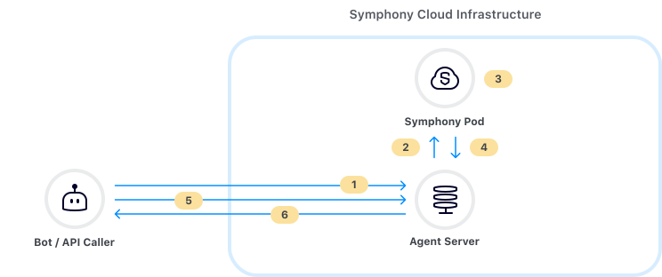
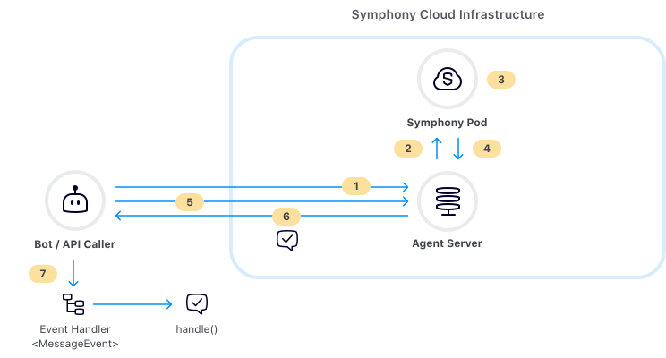

# Datafeed


**Datafeed v1 Deprecation Notice**\
****\
****The legacy Datafeed v1 service will no longer be supported on **April 30, 2023**. Please read [below](./#datafeed-v1-deprecation-notice) for more information on this transition.  Please reach out to your Technical Account Manager or to the Developer Relations team for more information.


## Overview of Datafeed

The Symphony datafeed provides a stream of real-time messages and events for all conversations that a bot is a member of. Any event that occurs within a bot's scope will be captured and delivered to the bot by the datafeed. The datafeed forms the basis of all interactive and conversational bot workflows as it allows bots to directly respond to Symphony messages and events.

## Datafeed Architecture

Symphony provides a Datafeed API that allows bots to easily [create](https://developers.symphony.com/restapi/reference#create-messagesevents-stream-v4) and [read](https://developers.symphony.com/restapi/reference#read-messagesevents-stream-v4) datafeeds.

Once a bot has created a datafeed, it has access to all of the [events](https://docs.developers.symphony.com/building-bots-on-symphony/datafeed/real-time-events) within its scope, acting as a secure channel between a bot and all activity happening in the Symphony Pod. Additionally, all messages and events within a bot's scope are encrypted by the Agent before reaching your bot. That way the bot is the only one who can access the contents of these events and messages being delivered.

The following illustrates the relationship between your bot, datafeed, and Symphony's components:



1. **Bot creates datafeed via Symphony’s REST API**
2. **Agent creates secure upstream connection with the Symphony Pod**
3. **End user sends a message to a bot in a chatroom**
4. **Pod delivers ‘MESSAGESENT’ event to Agent**
5. **Bot reads datafeed via REST API**
6. **Agent delivers ‘MESSAGESENT’ event payload to the Bot**

## Real-Time Events

Events are delivered to your bot via the datafeed as JSON objects. Each type of Symphony event corresponds to a different JSON payload.

For example, if a user sends your bot a message, an event of type `'MESSAGESENT'` will be delivered to your bot through the datafeed:

```javascript
{
    "id": "9rc1dr",
    "messageId": "Fd4Pc8xO5Vg6hVfzabFe2X___oyM1eXobQ",
    "timestamp": 1595365005847,
    "type": "MESSAGESENT",
    "initiator": {
        "user": {
            "userId": 344147139494862,
            "firstName": "Reed",
            "lastName": "Feldman",
            "displayName": "Reed Feldman (SUP)",
            "email": "reed.feldman@symphony.com",
            "username": "reedUAT"
        }
    },
    "payload": {
        "messageSent": {
            "message": {
                "messageId": "Fd4Pc8xO5Vg6hVfzabFe2X___oyM1eXobQ",
                "timestamp": 1595365005847,
                "message": "<div data-format=\"PresentationML\" data-version=\"2.0\" class=\"wysiwyg\"><p>hi</p></div>",
                "data": "{}",
                "user": {
                    "userId": 344147139494862,
                    "firstName": "Reed",
                    "lastName": "Feldman",
                    "displayName": "Reed Feldman (SUP)",
                    "email": "reed.feldman@symphony.com",
                    "username": "reedUAT"
                },
                "stream": {
                    "streamId": "IEj12WoWsfTkiqOBkATdUn___pFXhN9OdA",
                    "streamType": "IM"
                },
                "externalRecipients": false,
                "userAgent": "DESKTOP-43.0.0-10902-MacOSX-10.14.6-Chrome-83.0.4103.61",
                "originalFormat": "com.symphony.messageml.v2",
                "sid": "98202eac-dcf4-4b1e-a120-596db38319dc"
            }
        }
    }
}
```

Notice how each event returned by the datafeed has important metadata and attributes such as `messageId`, `timestamp`, (event) `type`, `initiator`, as well as the contents of the message itself inside of the payload object. Additionally, you can find the `streamID` corresponding to the message and also information regarding `externalRecipients`.

For a full list of the  JSON payloads corresponding to each event type, continue here:


[real-time-events.md](real-time-events.md)


## Handling Events using BDK 2.0 and WDK

The BDK (Bot Developer Kit) 2.0 comes bootstrapped with a `DatafeedEventService` class that handles all of the logic for creating/reading datafeeds via the API, has best practices for maintaining datafeeds, and also provides event handling architecture that makes it easy to orchestrate complex workflows and introduce custom business logic to your bot.

As a bot developer, all you have to do is to implement generic `EventHandler` classes, passing in a given event type as the type parameter for that class.

After the `DatafeedEventService` creates/reads from the datafeed API, it categorizes each event based on its event type seen [above](./#here-is-the-full-list-of-different-real-time-datafeed-events), and dispatches the event downstream to a generic event handler class. For example, If a user sends a message to bot inside a **chatroom**, the event will be read by the datafeed, and dispatched downstream to the `EventHandler` class that that takes `MessageEvent` in as a type parameter. Further the `handle()` method belonging to your `EventHandler` class will be called each type that event type is read by the datafeed.

The following diagram shows the event handling workflow:



1. **Bot creates datafeed via Symphony’s REST API**
2. **Agent creates secure upstream connection with the Symphony Pod**
3. **End user sends a message to a bot in a chatroom**
4. **Pod delivers ‘MESSAGESENT’ event to Agent**
5. **Bot reads datafeed via REST API**
6. **Agent delivers ‘MESSAGESENT’ event payload to the Bot**
7. **Bot routes event to appropriate event listener/handler**

Inside of `onMessageSent()` is where you implement your own business logic such as accessing a database, connecting to an external API, or reply back to your user by leveraging the Symphony API/BDK 2.0 methods:



```java
public class Example {

    public static void main(String[] args) { 
        // create bdk entry point
        final SymphonyBdk bdk = new SymphonyBdk(loadFromClasspath("/config.yaml"));
        
        // create listener to be subscribed
        final RealTimeEventListener listener = new RealTimeEventListener() {
            @Override
            public void onMessageSent(V4Initiator initiator, V4MessageSent event) {
                log.info("Message sent");
            }
        };

        // subscribe a listener
        bdk.datafeed().subscribe(listener);
       
        // start reading the datafeed 
        bdk.datafeed().start(); 
    }
}
```



```python
from symphony.bdk.core.config.loader import BdkConfigLoader
from symphony.bdk.core.symphony_bdk import SymphonyBdk
from symphony.bdk.core.service.datafeed.real_time_event_listener import RealTimeEventListener

class RealTimeEventListenerImpl(RealTimeEventListener):

    async def on_message_sent(self, initiator, event):
        # message received, interact with it
        pass

async def run():
    async with SymphonyBdk(BdkConfigLoader.load_from_symphony_dir("config.yaml")) as bdk:
        datafeed_loop = bdk.datafeed()
        # subscribe your listener
        datafeed_loop.subscribe(RealTimeEventListenerImpl())
        # start reading the datafeed
        await datafeed_loop.start()
```



## Conversational Workflow

As you can see, the datafeed acts as the backbone of your Bot. In many cases your Bot will be waiting for events to come in through the datafeed, which it constantly 'reads'. When an event or message comes through the datafeed, your bot will 'listen' for the event, extract the relevant data from the JSON payload and kick off its intended workflow.

While you can write all of this datafeed logic yourself, our dedicated BDK toolkits provide out-of-the-box datafeed support and event handling logic making it easy to bootstrap your bot and add custom business logic.

## Datafeed v1 deprecation notice

The legacy Datafeed v1 service will no longer be supported on **April 30, 2023**.

This will have an impact on you if some of your automations or bots are still using the Datafeed v1 APIs. Please consider upgrading them to use the new[ Datafeed v2 APIs](https://developers.symphony.com/restapi/reference/create-datafeed-v5).

To facilitate this transition, a new feature called the **bridge** has been introduced in the Agent service so consumers of the deprecated Datafeed v1 APIs will transparently use the Datafeed v2 service.

* This bridge is available starting with Agent 20.15 (May 2022) and can be enabled through the following configuration flag `agent.df1ToDf2Bridge.enabled`.&#x20;
* In a subsequent Agent release, this bridge will be enabled by default, but could still be disabled through configuration (October 2022).&#x20;
* Then in a subsequent Agent release, the bridge will be always enabled (January 2023).

We encourage you to validate the bridge with your existing bots, or to migrate your bots to use the new Datafeed 2 APIs, which is the **preferred option**. If you use the BDK 2.0 in [Java](https://symphony-bdk-java.finos.org/) or [Python](https://symphony-bdk-python.finos.org/), the migration between Datafeed 1 APIs and Datafeed 2 APIs is a simple configuration change. We advise you to take this opportunity to migrate your bots to the **BDK 2.0** if you haven’t done so, the Developer Relations team can guide you through it.

Please reach out to your Technical Account Manager or to the Developer Relations team for more information.
