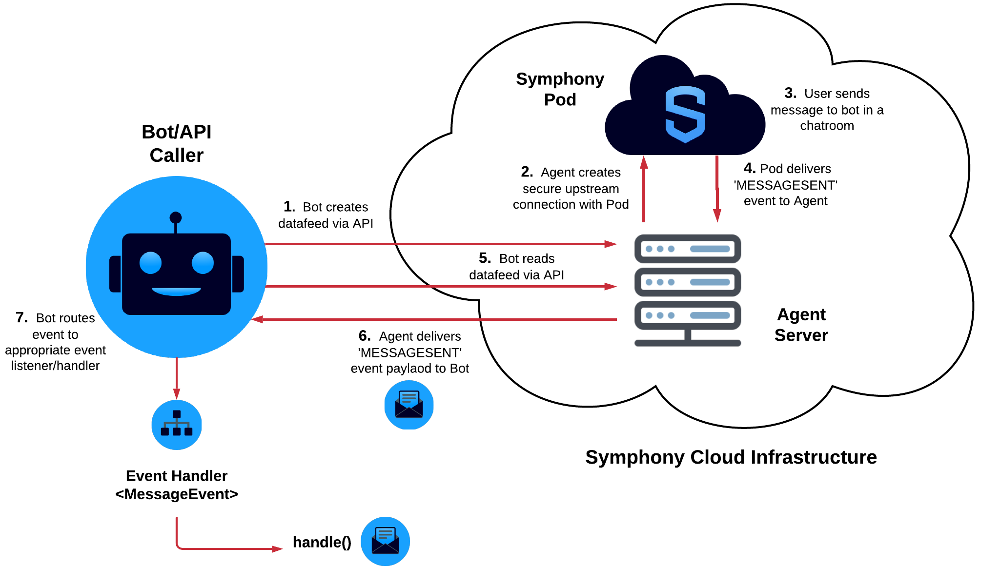

# Datafeed

## Overview of Datafeed

The Symphony datafeed provides a stream of real-time messages and events for all conversations that a bot is a member of. Any event that occurs within a bot's scope will be captured and delivered to the bot by the datafeed. The datafeed forms the basis of all interactive and conversational bot workflows as it allows bots to directly respond to Symphony messages and events.

## Datafeed Architecture

Symphony provides a Datafeed API that allows bots to easily [create](https://developers.symphony.com/restapi/reference#create-messagesevents-stream-v4) and [read](https://developers.symphony.com/restapi/reference#read-messagesevents-stream-v4) datafeeds.

Once a bot has created a datafeed, it has access to all of the [events](./#real-time-events) within its scope, acting as a secure channel between a bot and all activity happening in the Symphony Pod. Additionally, all messages and events within a bot's scope are encrypted by the Agent before reaching your bot. That way the bot is the only one who can access the contents of these events and messages being delivered.

The following illustrates the relationship between your bot, datafeed, and Symphony's components:


## Real-Time Events

Events are delivered to your bot via the datafeed as JSON objects. Each type of Symphony event corresponds to a different JSON payload.

For example, if a user sends your bot a message, an event of type `'MESSAGESENT'` will be delivered to your bot through the datafeed:

```text
{
    "id": "9rc1dr",
    "messageId": "Fd4Pc8xO5Vg6hVfzabFe2X___oyM1eXobQ",
    "timestamp": 1595365005847,
    "type": "MESSAGESENT",
    "initiator": {
        "user": {
            "userId": 344147139494862,
            "firstName": "Reed",
            "lastName": "Feldman",
            "displayName": "Reed Feldman (SUP)",
            "email": "reed.feldman@symphony.com",
            "username": "reedUAT"
        }
    },
    "payload": {
        "messageSent": {
            "message": {
                "messageId": "Fd4Pc8xO5Vg6hVfzabFe2X___oyM1eXobQ",
                "timestamp": 1595365005847,
                "message": "<div data-format=\"PresentationML\" data-version=\"2.0\" class=\"wysiwyg\"><p>hi</p></div>",
                "data": "{}",
                "user": {
                    "userId": 344147139494862,
                    "firstName": "Reed",
                    "lastName": "Feldman",
                    "displayName": "Reed Feldman (SUP)",
                    "email": "reed.feldman@symphony.com",
                    "username": "reedUAT"
                },
                "stream": {
                    "streamId": "IEj12WoWsfTkiqOBkATdUn___pFXhN9OdA",
                    "streamType": "IM"
                },
                "externalRecipients": false,
                "userAgent": "DESKTOP-43.0.0-10902-MacOSX-10.14.6-Chrome-83.0.4103.61",
                "originalFormat": "com.symphony.messageml.v2",
                "sid": "98202eac-dcf4-4b1e-a120-596db38319dc"
            }
        }
    }
}
```

Notice how each event returned by the datafeed has important metadata and attributes such as `messageId`, `timestamp`, \(event\) `type`, `initiator`, as well as the contents of the message itself inside of the payload object. Additionally, you can find the `streamID` corresponding to the message and also information regarding `externalRecipients`.

### Here is the full list of different real-time datafeed events:

<table>
  <thead>
    <tr>
      <th style="text-align:left"><b>Event Type</b>
      </th>
      <th style="text-align:left"><b>Description</b>
      </th>
    </tr>
  </thead>
  <tbody>
    <tr>
      <td style="text-align:left"><b>Message Sent</b>
      </td>
      <td style="text-align:left">Generated when a message is sent in an IM, MIM, or chatroom of which the
        user in context is a member, including messages sent by the user themselves.</td>
    </tr>
    <tr>
      <td style="text-align:left"><b>Messages Suppressed</b>
      </td>
      <td style="text-align:left">Generated when messages are suppressed.</td>
    </tr>
    <tr>
      <td style="text-align:left"><b>Symphony Elements Action</b>
      </td>
      <td style="text-align:left">Generated when a user replies to a bot message that contains an interactive
        form with UX components such as text fields, radio buttons, checkboxes,
        person selectors and more.</td>
    </tr>
    <tr>
      <td style="text-align:left"><b>Shared Wall Post</b>
      </td>
      <td style="text-align:left">
        <p>Generated when either:</p>
        <ul>
          <li>The user in context shares a wall post written by another user.</li>
          <li>Another user shares a wall post written by the user in context.</li>
        </ul>
      </td>
    </tr>
    <tr>
      <td style="text-align:left"><b>IM/MIM Created</b>
      </td>
      <td style="text-align:left">Generated when an IM or MIM is created with the user in context as a member,
        initiated either by the user in context or another user.</td>
    </tr>
    <tr>
      <td style="text-align:left"><b>Room Created</b>
      </td>
      <td style="text-align:left">Generated when a room is created by the user in context.</td>
    </tr>
    <tr>
      <td style="text-align:left"><b>Room Updated Message</b>
      </td>
      <td style="text-align:left">Generated when a room of which the user in context is a member is updated,
        including rooms updated by the user himself.</td>
    </tr>
    <tr>
      <td style="text-align:left"><b>Room Deactivated Message</b>
      </td>
      <td style="text-align:left">Generated when a room of which the user in context is a member is deactivated,
        including rooms deactivated by the user himself.</td>
    </tr>
    <tr>
      <td style="text-align:left"><b>Room Reactivated Message</b>
      </td>
      <td style="text-align:left">Generated when a room of which the user in context is a member is reactivated,
        including rooms reactivated by the user himself.</td>
    </tr>
    <tr>
      <td style="text-align:left"><b>User Requested to Join Room</b>
      </td>
      <td style="text-align:left">Generated when a user requests to join a room. Only the user who requested
        to join the room and the owners of that room will receive this event on
        their datafeeds.
        <br />The <code>affectedUsers</code> attribute represents the owners of the room.</td>
    </tr>
    <tr>
      <td style="text-align:left"><b>User Joined Room</b>
      </td>
      <td style="text-align:left">Generated when a new user joins or is added to a room of which the user
        in context is a member, including when the user himself joins or is added
        to a room.</td>
    </tr>
    <tr>
      <td style="text-align:left"><b>User Left Room</b>
      </td>
      <td style="text-align:left">Generated when a user leaves or is removed from a room of which the user
        in context is a member, including when the user himself leaves or is removed
        from a room.</td>
    </tr>
    <tr>
      <td style="text-align:left"><b>Room Member Promoted To Owner</b>
      </td>
      <td style="text-align:left">Generated when a user is promoted from a participant to an owner of a
        room of which the user in context is a member, including when the user
        himself is promoted to an owner or promotes another user.</td>
    </tr>
    <tr>
      <td style="text-align:left"><b>Room Member Demoted From Owner</b>
      </td>
      <td style="text-align:left">Generated when a user is demoted from an owner to a participant of a room
        of which the user in context is a member, including when the user himself
        is demoted to a participant or demotes another user.</td>
    </tr>
    <tr>
      <td style="text-align:left"><b>Connection Requested</b>
      </td>
      <td style="text-align:left">
        <p>Generated when a connection request is sent, either:</p>
        <ul>
          <li>Sent by the user in context to another user.</li>
          <li>Sent to the user in context by another user.</li>
        </ul>
      </td>
    </tr>
    <tr>
      <td style="text-align:left"><b>Connection Accepted</b>
      </td>
      <td style="text-align:left">
        <p>Generated when a connection request is accepted, either:</p>
        <ul>
          <li>Sent by the user in context and accepted by another user.</li>
          <li>Sent by another user and accepted by the user in context.</li>
        </ul>
      </td>
    </tr>
  </tbody>
</table>

For a full list of the  JSON payloads corresponding to each event type, continue here:



## Handling Events

## Handling Datafeed Events with SDKs

Symphony SDKs come bootstrapped with a `DatafeedEventService` class that handles all of the logic for creating/reading datafeeds via the API, has best practices for maintaining datafeeds, and also provides event handling architecture that makes it easy to orchestrate complex workflows and introduce custom business logic to your bot.

As a bot developer, all you have to do is to implement event listener interfaces that are provided out-of-the-box by Symphony's SDKs. The `DatafeedEventService` event service does all of the heavy lifting and acts as the backbone of your bot or workflow.

After the `DatafeedEventService` creates/reads from the datafeed API, it categorizes each event based on its event type seen [above](./#here-is-the-full-list-of-different-real-time-datafeed-events), and dispatches the event downstream to their appropriate event handler function. For example, if a user sends a message to a bot inside a **chatroom**, the event will be read by the datafeed, and dispatched to the `onRoomMessage()` function inside the `RoomListener` Interface.

The following diagram shows the event handling workflow:


Inside of `onRoomMessage()` is where you implement your own business logic such as accessing a database, connecting to an external API, or reply back to your user by leveraging the Symphony API/SDK methods:




```java
import clients.SymBotClient;
import listeners.IMListener;
import model.InboundMessage;
import model.OutboundMessage;
import model.Stream;

public class RoomListenerImpl implements RoomListener {
    public void onRoomMessage(InboundMessage message); {
        OutboundMessage msgOut = new OutboundMessage("Hello " + msg.getUser().getFirstName() + "!");
        this.botClient.getMessagesClient().sendMessage(msg.getStream().getStreamId(), msgOut);
    }
```





```python
import logging
from sym_api_client_python.clients.sym_bot_client import SymBotClient
from sym_api_client_python.listeners.room_listener import RoomListener
from sym_api_client_python.processors.sym_message_parser import SymMessageParser


class RoomListenerImpl(RoomListener):
    def __init__(self, sym_bot_client):
        self.bot_client = sym_bot_client
        self.message_parser = SymMessageParser()

    def on_room_msg(self, room_message):
        logging.debug('Room Message Received')

        first_name = self.message_parser.get_im_first_name(room_message)
        stream_id = self.message_parser.get_stream_id(room_message)

        message = f'<messageML>Hello {first_name}, hope you are doing well!</messageML>'
        self.bot_client.get_message_client().send_msg(stream_id, dict(message=message))
```




```javascript
  messages.forEach((message, index) => {
    let reply_message = 'Hello ' + message.user.firstName + ', hope you are doing well!!'
    Symphony.sendMessage(message.stream.streamId, reply_message, null, Symphony.MESSAGEML_FORMAT)
  })
}
```



```aspnet
public class MyRoomListener : RoomListener
    {
        private SymConfig symConfig;


        public void init(SymConfig symConfig)
        {
            this.symConfig = symConfig;
        }

        override public void onRoomMessage(Message message)
        {
            string FirstCommand = "";
            string SearchTerm = null;
            string SearchStatus = null;

            if (message.message.Contains("/form"))
            {
                    string fresponse = "";
                    fresponse += "<form id=\"form_id\">";
                    fresponse += "<text-field name=\"Question_Subject\" required=\"true\" placeholder=\"Ask a Question\" />";
                    fresponse += "<textarea name=\"comment\" placeholder=\"Add details (optional)\" required=\"false\"></textarea>";
                    fresponse += "<button type=\"reset\">Reset</button>";
                    fresponse += "<button name=\"submit_button\" type=\"action\">Submit</button>";
                    fresponse += "</form>";
                    sendMessage(message.stream.streamId, fresponse);
            }
        }

        private void sendMessage(String streamId, String messageText)
        {
            Console.WriteLine("streamId:" + streamId);
            OutboundMessage message = new OutboundMessage();
            message.message = "<messageML>"+messageText+"</messageML>";                
            RestRequestHandler restRequestHandler = new RestRequestHandler();
            string url = "https://" + this.symConfig.agentHost + "/agent/v4/stream/" + streamId + "/message/create";
            HttpWebResponse resp = restRequestHandler.executeRequest(message, url, false, WebRequestMethods.Http.Post, symConfig, true);

        }
    }
```



## Handling Events using the BDK

Similar to the SDKs, the BDK \(Bot Developer Kit\) comes bootstrapped with a `DatafeedEventService` class that handles all of the logic for creating/reading datafeeds via the API, has best practices for maintaining datafeeds, and also provides event handling architecture that makes it easy to orchestrate complex workflows and introduce custom business logic to your bot.

As a bot developer, all you have to do is to implement generic `EventHandler` classes, passing in a given event type as the type parameter for that class.

After the `DatafeedEventService` creates/reads from the datafeed API, it categorizes each event based on its event type seen [above](./#here-is-the-full-list-of-different-real-time-datafeed-events), and dispatches the event downstream to a generic event handler class. For example, If a user sends a message to bot inside a **chatroom**, the event will be read by the datafeed, and dispatched downstream to the `EventHandler` class that that takes `MessageEvent` in as a type parameter. Further the `handle()` method belonging to your `EventHandler` class will be called each type that event type is read by the datafeed.

The following diagram shows the event handling workflow:



Inside of `handle()` is where you implement your own business logic such as accessing a database, connecting to an external API, or reply back to your user by leveraging the Symphony API/SDK methods:




```java
import com.symphony.bdk.bot.sdk.event.EventHandler;
import com.symphony.bdk.bot.sdk.event.model.MessageEvent;
import com.symphony.bdk.bot.sdk.symphony.model.SymphonyMessage;

/**
 * Sample code. Implementation of {@link EventHandler} to send greeting message
 * to users joining a room with the bot.
 *
 */
public class RoomMessageEventHandler extends EventHandler<MessageEvent> {

  /**
   * Invoked when event is triggered in Symphony
   */
  @Override
  public void handle(MessagEvent event, SymphonyMessage response) {
    response.setMessage("Hey, <mention uid=\"" + event.getUserId() +
        "\"/>. It is good to have you here!");
  }

}
```




## Conversational Workflow

As you can see, the datafeed acts as the backbone of your Bot. In many cases your Bot will be waiting for events to come in through the datafeed, which it constantly 'reads'. When an event or message comes through the datafeed, your bot will 'listen' for the event, extract the relevant data from the JSON payload and kick off its intended workflow.

While you can write all of this datafeed logic yourself, our dedicated SDKs and BDK provide out-of-the-box datafeed support and event handling logic making it easy to bootstrap your bot and add custom business logic.

