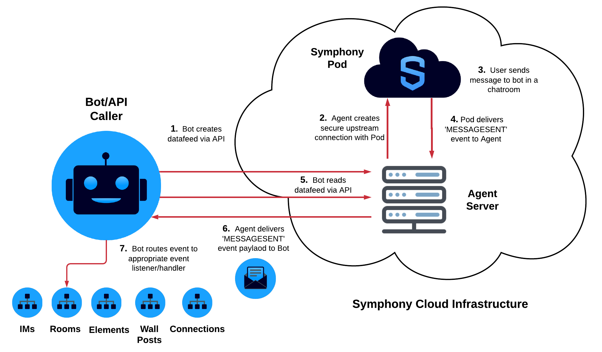

# Datafeed

## Overview of Datafeed

The Symphony datafeed is a real-time messages and events stream that provides messages and events from all conversations that a bot is in.  Any event that occurs within a bot's scope will be captured and delivered to the bot by the datafeed.  The datafeed forms the basis of all interactive and conversational bot workflows as it allows bots to directly respond to Symphony messages and events.  

## Datafeed Architecture

Symphony provides a Datafeed API that allows bots to easily [create](https://developers.symphony.com/restapi/reference#create-messagesevents-stream-v4) and [read](https://developers.symphony.com/restapi/reference#read-messagesevents-stream-v4) datafeeds.    

Once a bot has created a datafeed, it has access all of the [events](https://developers.symphony.com/restapi/docs/real-time-events) within its scope, acting as an interface between a Bot and all activity happening in the Symphony Pod.  Additionally, all messages and events within a Bot's scope are encrypted by the Agent before reaching your bot.  That way only the Bot is the only one who can access the contents of these events and messages being delivered to your bot.     

The following illustrates the relationship between your bot, datafeed, and Symphony's components:


## Real Time Events

Events are delivered to your Bot via the datafeed as JSON objects.  Each type of Symphony event corresponds to a different JSON payload.  

For example, if a user sends your Bot a message, an event of type 'MESSAGESENT' will be delivered to your bot through the datafeed.

```text
{
    "id": "9rc1dr",
    "messageId": "Fd4Pc8xO5Vg6hVfzabFe2X___oyM1eXobQ",
    "timestamp": 1595365005847,
    "type": "MESSAGESENT",
    "initiator": {
        "user": {
            "userId": 344147139494862,
            "firstName": "Reed",
            "lastName": "Feldman",
            "displayName": "Reed Feldman (SUP)",
            "email": "reed.feldman@symphony.com",
            "username": "reedUAT"
        }
    },
    "payload": {
        "messageSent": {
            "message": {
                "messageId": "Fd4Pc8xO5Vg6hVfzabFe2X___oyM1eXobQ",
                "timestamp": 1595365005847,
                "message": "<div data-format=\"PresentationML\" data-version=\"2.0\" class=\"wysiwyg\"><p>hi</p></div>",
                "data": "{}",
                "user": {
                    "userId": 344147139494862,
                    "firstName": "Reed",
                    "lastName": "Feldman",
                    "displayName": "Reed Feldman (SUP)",
                    "email": "reed.feldman@symphony.com",
                    "username": "reedUAT"
                },
                "stream": {
                    "streamId": "IEj12WoWsfTkiqOBkATdUn___pFXhN9OdA",
                    "streamType": "IM"
                },
                "externalRecipients": false,
                "userAgent": "DESKTOP-43.0.0-10902-MacOSX-10.14.6-Chrome-83.0.4103.61",
                "originalFormat": "com.symphony.messageml.v2",
                "sid": "98202eac-dcf4-4b1e-a120-596db38319dc"
            }
        }
    }
}
```

Notice how each event returned by the datafeed has important metadata and attributes such as messageId, timestamp, \(event\) type, initiator, as well as the contents of the message itself inside of the payload object. Additionally, you can find the streamID corresponding to the message and also information regarding externalRecipients.

## Handling Datafeed Events

Now that your bot has created a datafeed and has access to a real-time message and event stream, the bot must handle events and introduce its own business logic.  

To do so, bots can implement event event listener/handler classes provided by Symphony SDKs and BDKs.  Symphony SDKs and BDK provide an out-of-the-box event handling architecture, making it easy to introduce your custom business logic and orchestrate complex workflows:



## Handling Events using the SDK

## Handling Events using the BDK

## Conversational Workflow

As you can see, the datafeed acts as the backbone of your Bot. In many cases your Bot will be waiting for events to come in through the datafeed, which it constantly 'reads'. When an event or message comes through the datafeed, your bot will 'listen' for the event, extract the relevant data from the JSON payload and kick off its intented workflow.

While you can write all of this datafeed logic yourself, our dedicated SDKs provide out-of-the-box datafeed support and event handling logic making it easy to bootstrap your bot.

To learn more about how to handle datafeed events, continue here:



