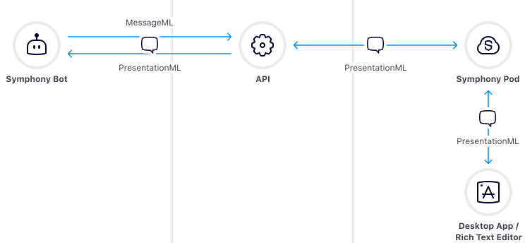
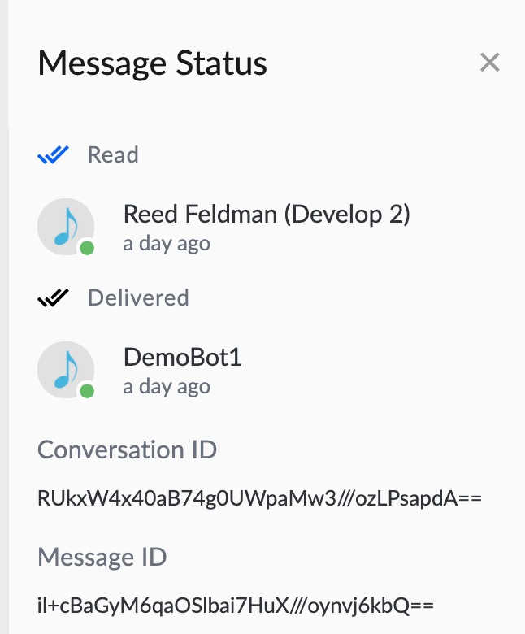

# Messages

## Message API endpoints

Bots in Symphony can use the following API endpoints to **create**, **update** and **suppress** messages in Symphony chats:

* Message **creation** via the Create Message v4 [endpoint](https://developers.symphony.com/restapi/reference#create-message-v4)
* Message **creation in multiple conversations** using the Blast Message [endpoint](https://developers.symphony.com/restapi/reference#blast-message)
* Message **update** via the Update Message [endpoint](https://developers.symphony.com/restapi/reference#update-message-v4). _Note this functionality is only supported on Client 2.0, as in other clients the updates will appear as new messages instead of replacing the actual message. Also, note the rules and limitations explained in the endpoint specifications documented_ [_here_](https://developers.symphony.com/restapi/v20.13/reference#update-message-v4)_._
* Message **suppression** via the Suppress Message [endpoint](https://developers.symphony.com/restapi/reference#suppress-message)

Please see below a quick animation showing a simple lifecycle of a bot message in Symphony with a message created by the bot, updated three times, and then finally suppressed.


## Overview of the Message Flow

In the Symphony message flow, messages are represented in the following markup language forms:

* **MessageML**: A tag-based language that is a subset of XHTML. MessageML allows templating in [Apache Freemarker](https://freemarker.apache.org/index.html).
* **PresentationML**: MessageML translated into the equivalent XHTML tags so it can be rendered and processed by any HTML client.
* **ExtensionML**: PresentationML translated to a special markup for use by a front end app to perform custom rendering of an entity.


Note: MessageML is just a subset of PresentationML that makes it easier to construct messages from your bot. The API can ingest either MessageML or PresentationML. However, the API will only deliver messages as PresentationML to a bot.


## PresentationML Live Renderer Tool

Symphony created the [Presentation ML Live Renderer Tool](https://renderer-tool.app.symphony.com) that you can use to see your MessageML rendered in PresentationML or markdown (mobile) without coding.

## Diagram of Symphony Message Flow:



The above diagram shows the following:

1. **Your bot uses the** [**Agent API**](../overview-of-rest-api/agent-api.md) **to send messages in MessageML.**
2. **The Agent API encrypts the messages, and converts them to PresentationML where they are stored in Symphony's data store.**  &#x20;
3. **The** [**Symphony Datafeed**](../datafeed/) **delivers messages to end users or to the Desktop Application as PresentationML.**
4. **When Bot's retrieve messages via the API, the messages are delivered as PresentationML.**  &#x20;

## Message Identifiers:

Each message in Symphony has a unique message ID.

**To find the message ID:**

* In the Symphony web or desktop client, click the message timestamp. The **Message Status** module overlay opens. The message ID is shown in the overlay footer:



* When a message is [created](https://rest-api.symphony.com/docs/create-message-v4) via the API, a `messageID` is returned in the response**.**

**Encoding:**

* The message ID in the UI is in standard Base64 encoding.
* Message IDs returned in API responses are in URL Safe Base64 encoding.
* A message ID used in a URL should be in URL Safe Base64 encoding.&#x20;
* To obtain the URL Safe Base64 conversation (stream) ID, replace forward slashes with underscores, replace pluses with minuses, and ignore any trailing equal signs.

|              **StreamID**              | **URL Safe Base64 encoded StreamID** |
| :------------------------------------: | :----------------------------------: |
| `RUkxW4x40aB74g0UWpaMw3///ozLPsapdA==` | `RUkxW4x40aB74g0UWpaMw3___ozLPsapdA` |


## Message Size Limits

Messages may include:

* Maximum 40 entities (#hashtags, $cashtags, and mentions).
* Maximum 2,500 unique tokens in the markdown representation of the message.
* 81,130 characters of the encrypted markdown representation of the message. Note that there is a greater chance of reaching the token or the entity limit than the character limit.
* The size of a message cannot exceed 1.5Mb.


```
{
message=Limit message-content-max-total-size reached, 
status=PAYLOAD_TOO_LARGE, 
code=LIMIT_MESSAGE_CONTENT_MAX_TOTAL_SIZE_REACHED
}
```


## Message Delivery for External Rooms (Cross-Pod)

In the Symphony architecture, messages are stored in each company data store. When messages are sent externally (for example in External rooms), the messages are copied and transferred from one company to the other using the Amazon AWS SQS service [At-least-once Delivery mechanism with Amazon AWS SQS](https://docs.aws.amazon.com/AWSSimpleQueueService/latest/SQSDeveloperGuide/standard-queues.html).\
Amazon AWS SQS service ensures high availability through redundancy, with "At-least-once delivery" guarantee. This means that on very rare occasions, a message can be received more than once.

If this occurs, you might receive a second copy of that message. Therefore, Bots designed to work with External rooms (cross pod) should be **idempotent**: they should not be affected adversely when processing the same message more than once. Continue [here](../bots-best-practices.md#duplicate-messages) to learn about how your bot should handle duplicate messages.

