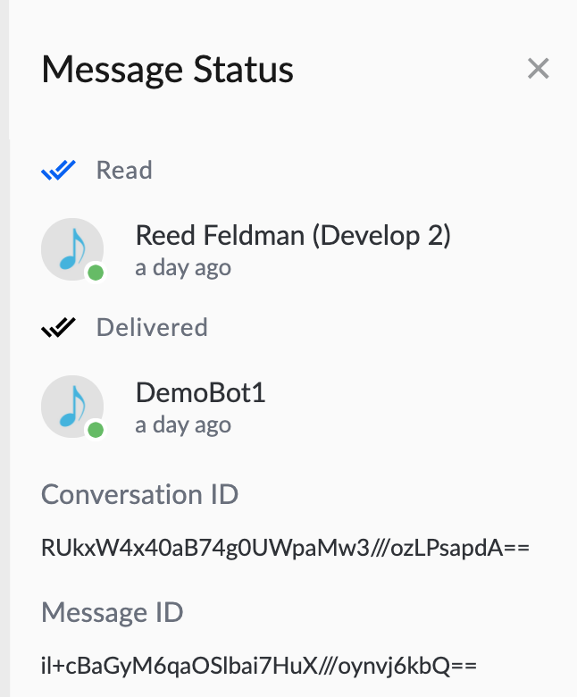

# MessageML

## Overview of the Message Workflow

In the Symphony message workflow, messages are represented in the following markup language forms:

* **MessageML**: A tag-based language that is a subset of XHTML. MessageML allows templating in [Apache Freemarker](https://freemarker.apache.org/index.html).
* **PresentationML**: MessageML translated into the equivalent XHTML tags so it can be rendered and processed by any HTML client.
* **ExtensionML**: PresentationML translated to a special markup for use by a front end app to perform custom rendering of an entity.


Note: MessageML is just a subset of PresentationML that makes it easier to construct messages from your Bot. The API can ingest either MessageML or PresentationML however, the API will only deliver messages as PresentationML to a Bot.


## Diagram of Symphony Message Workflow:

The above diagram shows the following:

1. Your bot uses the [Agent API](../../overview-of-rest-api/agent-api.md) to send messages in MessageML.
2. The Agent API encrypts the messages, and converts them to PresentationML where they are stored in Symphony's data store.   
3. The [Symphony Datafeed](../../datafeed/) delivers messages to end users or to the Desktop Application as PresentationML.
4. When Bot's retrieve messages via the API, the messages are delivered as PresentationML.   

## Message Identifiers:

Each message in Symphony has a unique message ID.

**To find the message ID:**

* In the Symphony web or desktop client, click the message timestamp. The **Message Status** module overlay opens. The message ID is shown in the overlay footer:

* When a message is [created](https://rest-api.symphony.com/docs/create-message-v4) via the API, a `messageID` is returned in the response**.**

**Encoding:**

* The message ID in the UI is in standard Base64 encoding.
* Message IDs returned in API responses are in URL Safe Base64 encoding.
* A message ID used in a URL should be in URL Safe Base64 encoding. 
* To obtain the URL Safe Base64 room ID, replace forward slashes with underscores, replace pluses with minuses, and ignore any trailing equal signs.

| **StreamID** | **URL Safe Base64 encoded StreamID** |
| :---: | :---: |
| RUkxW4x40aB74g0UWpaMw3///ozLPsapdA== | RUkxW4x40aB74g0UWpaMw3\_\_\_ozLPsapdA |

