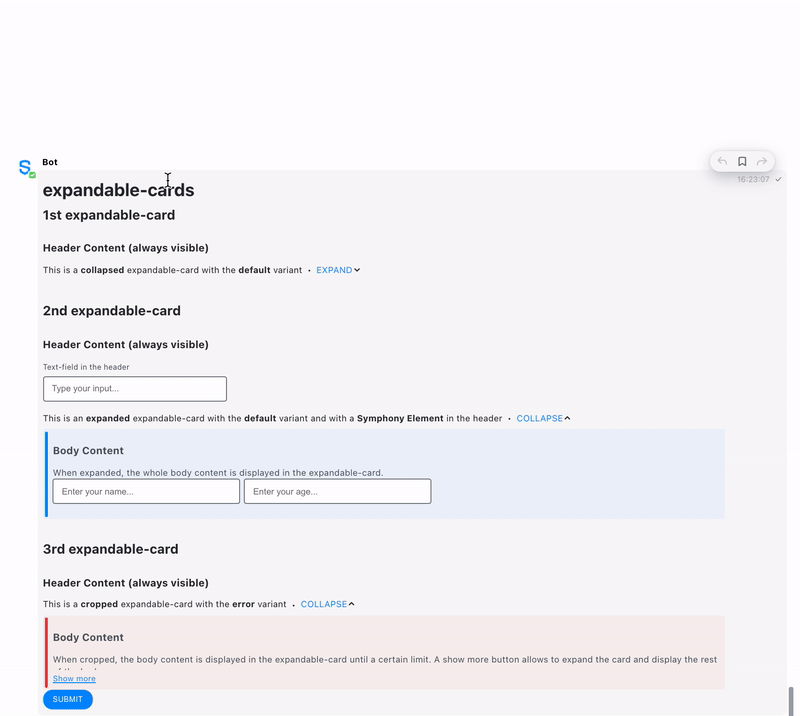

# Content Grouping

## Tags

MessageML supports the following tags for grouping information within a message:

| Tag                                            | Description                                                                                                                                                                                                                                                                                          | Optional attributes                                                                                                                                                                                                                                                                                                                                                                                                                  |
| ---------------------------------------------- | ---------------------------------------------------------------------------------------------------------------------------------------------------------------------------------------------------------------------------------------------------------------------------------------------------- | ------------------------------------------------------------------------------------------------------------------------------------------------------------------------------------------------------------------------------------------------------------------------------------------------------------------------------------------------------------------------------------------------------------------------------------ |
| `<h1>`, `<h2>`, `<h3>`, `<h4>`, `<h5>`, `<h6>` | Heading text. 6 levels.                                                                                                                                                                                                                                                                              | • `class`                                                                                                                                                                                                                                                                                                                                                                                                                            |
| `<p>paragraph</p>`                             | Paragraph formatting.                                                                                                                                                                                                                                                                                | • `class`                                                                                                                                                                                                                                                                                                                                                                                                                            |
| `<hr />`                                       | Horizontal rule.                                                                                                                                                                                                                                                                                     | None.                                                                                                                                                                                                                                                                                                                                                                                                                                |
| `<ul>` `<li>list item</li>` `</ul>`            | <p>Unordered or bullet list.<br><em>Cannot be empty, must contain at least one child <code>&#x3C;li></code> item.</em></p>                                                                                                                                                                           | • `class`                                                                                                                                                                                                                                                                                                                                                                                                                            |
| `<ol>` `<li>list item</li>` `</ol>`            | <p>Numbered list. <br><em>Cannot be empty, must contain at least one child <code>&#x3C;li></code> item.</em></p>                                                                                                                                                                                     | • `class`                                                                                                                                                                                                                                                                                                                                                                                                                            |
| `<div>paragraph</div>`                         | <p>Block of text.<br>• This tag can be used to specify visual styles, by adding a <code>class</code> attribute.<br><em></em>• This tag is used to create <a href="../entities/structured-objects.md">Structured objects</a>.<br>• This tag is also the root of any message read through the API.</p> | <p>• <code>class</code>: <a href="../../../../developer-tools/developer-tools/ui-style-guide/colors.md">color options</a><em></em><br><em></em>• <code>data-entity-id</code> <br>• <code>data-icon-src</code><br>• <code>data-accent-color</code> <br>• See below for list of translated PresentationML attributes.</p>                                                                                                              |
| `<card>` (see example below)                   | <p>Inserts a card. It contains two different sections:<br>• the <code>&#x3C;header></code> (always visible)<br>• the <code>&#x3C;body></code> (hidden)</p>                                                                                                                                           | <p>• <code>iconSrc</code>: image will be resized to 28 pixels by 28 pixels, use spacious mode. (.jpg, .png and .gif) <br>• <code>accent</code>: use <a href="../../../../developer-tools/developer-tools/ui-style-guide/colors.md">background color values</a> to select the accent color of the card.</p>                                                                                                                           |
| `<expandable-card>` (see example below)        | Inserts a card with new styles and multiple levels of display within the card                                                                                                                                                                                                                        | <p>• <code>state</code> (mandatory) in <code>&#x3C;expandable-card></code> can take 3 values:<br>- "collapsed": only header is visible<br>- "cropped": card expanded but the body is cropped<br>- "expanded": card fully expanded<br><br>• <code>variant</code> (optional) in <code>&#x3C;body></code>: defines the style of the card. It can be either "default" for the default blue style, or "error" for the red error style</p> |

## Examples

Here after you can find an example of a message sent by a bot and containing these content grouping tags as well as the structure of the messageML sent:







```markup
<messageML>
    <h1>Heading texts</h1>
        <h1>This is a h1 heading text</h1>
        <h2>This is a h2 heading text</h2>
        <h3>This is a h3 heading text</h3>
        <h4>This is a h4 heading text</h4>
        <h5>This is a h5 heading text</h5>
        <h6>This is a h6 heading text</h6><br/>
    <h1>Paragraphs</h1>
        <p>This is a paragraph.</p>
        <div style="color:red;">
            <p>This is a paragraph enclosed in a div that allows its text to be red.</p>
        </div><br/>
    <h1>Horizontal Rule</h1>
        Below you can see an horizontal rule<hr /><br/>
    <h1>Lists</h1>
        This is an unordered/bullet list:
        <ul>
            <li>Item 1</li>
            <li>Item 2</li>
        </ul>
        This is a numbered list:
        <ol>
            <li>Item 1</li>
            <li>Item 2</li>
        </ol><br/>
    <h1>Cards</h1>
        <card accent="tempo-bg-color--blue">
            <header>This is the header of a card</header>
            <body>This is the body of a card</body>
        </card>
        <expandable-card state="expanded">
            <header>This is the header of an expanded expandabled-card</header>
            <body variant="error">This is an error variant of the body of an expanded expandable-card</body>
        </expandable-card> 
</messageML>
```



_Please note that you can use content grouping tags mixed with other messageML tags such as Interactive Elements Forms. See the following example including forms in expandable-cards._&#x20;







```html
<messageML>
  <form id="form_id">
    <h1>expandable-cards</h1>
      <h2>1st expandable-card</h2>
      <expandable-card state="collapsed">
        <header><h3>Header Content (always visible)</h3>This is a <b>collapsed</b> expandable-card with the <b>default</b> variant</header>
        <body>
          <h3>Body Content</h3>
          It is possible to use Elements in the body as you can see below:
          <text-field name="id1" placeholder="Enter your name..."/>
          <text-field name="id2" placeholder="Enter your age..."/>
          <button type="reset">Reset</button>
        </body>
      </expandable-card><br/>
      <h2>2nd expandable-card</h2>
      <expandable-card state="expanded">
        <header><h3>Header Content (always visible)</h3><text-field name="id_header" label="Text-field in the header" placeholder="Type your input..."/>This is an <b>expanded</b> expandable-card with the <b>default</b> variant and with a <b>Symphony Element</b> in the header</header>
        <body>
          <h3>Body Content</h3>
          When expanded, the whole body content is displayed in the expandable-card.
          <text-field name="id3" placeholder="Enter your name..."/>
          <text-field name="id4" placeholder="Enter your age..."/>
        </body>
      </expandable-card><br/>
      <h2>3rd expandable-card</h2>
      <expandable-card state="cropped">
        <header><h3>Header Content (always visible)</h3>This is a <b>cropped</b> expandable-card with the <b>error</b> variant</header>
        <body variant="error">
          <h3>Body Content</h3>
          When cropped, the body content is displayed in the expandable-card until a certain limit. A show more button allows to expand the card and display the rest of the body.
        </body>
      </expandable-card>
    <button name="form_id_submit">Submit</button>
  </form>
</messageML>
```


