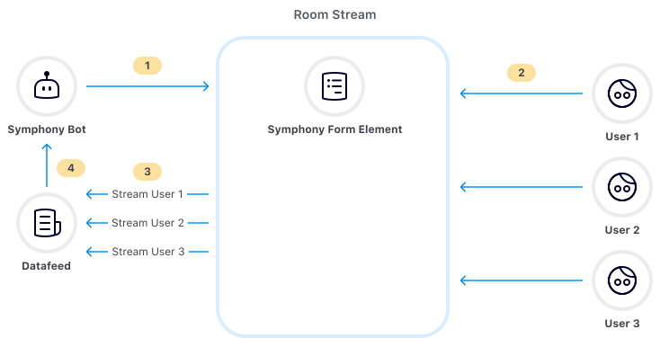

# Interactive Elements Forms

Symphony Elements Forms enable bots to send messages that contain interactive forms with pre-designed text fields, dropdown menus, person selectors, buttons and more. This allows bots to interact with users in a very easy and guided way.

By reusing our pre-designed standard UX component libraries, Elements provide developers with out-of-the-box tools to easily create interactive bot messages that look and feel like they belong in Symphony. To use the Elements, you just need to call the [Create Message](https://developers.symphony.com/restapi/reference#create-message-v4) endpoint with your bot, using the MessageML format.

Here after, you will find a brief introduction of how to send Elements, then an update of the message flow for Elements, and finally the form specifications.

## Sending Elements

To start using Symphony Elements, you first need to create a form element using the **`<form>` MessageML tag. The form element can be considered the "frame" of a message**, containing elements that will be sent by the bot and subsequently read by the datafeed.

You can see below an example of how a user can interact with a form that was sent by a bot, as well as the messageML structure of the message that was sent by the bot, and the payload that is generated and therefore delivered to the bot via the datafeed, containing the information completed and submitted by the user. Please use the tabs to navigate between these 3 documents.







```html
<messageML> 
    <form id="form_id"> 
        <h4>Personal Information</h4>
        <text-field name="name" required="true" placeholder="Name" />
        <text-field name="email" required="true" placeholder="email" />

        <h4>Select your country</h4>
        <select name="country">
            <option value="opt1">Australia</option>
            <option value="opt2">Brazil</option>
            <option value="opt3">China</option>
            <option value="opt4">Denmark</option>
            <option value="opt5">Ecuador</option>
            <option value="opt6">France</option>
            <option value="opt7">Germany</option>
            <option value="opt8">Italy</option>
            <option value="opt9">Japan</option>
        </select>

        <h4>Choose your option</h4>            
        <radio name="example_radio" value="option_01" checked="true">Marked</radio>
        <radio name="example_radio" value="option_02">Unmarked</radio>

        <h4>Choose your option</h4> 
        <checkbox name="checkbox_1" value="value01" checked="true">Checked</checkbox>
        <checkbox name="checkbox_2" value="value02">Unchecked</checkbox>

        <h4>Send a comment</h4> 
        <textarea name="comment" placeholder="Add your comment here" required="true" />

        <button type="reset">Reset</button>
        <button name="submit_button" type="action">Submit</button>

    </form>
</messageML>
```



```json
[
    {
        "id": "Y6OwLV",
        "messageId": "N0DEie_ig1_1MwfGQq0df3___oNnFeTobQ",
        "timestamp": 1634653051671,
        "type": "SYMPHONYELEMENTSACTION",
        "initiator": {
            "user": {
                "userId": 11338713661667,
                "firstName": "Thibault",
                "lastName": "Chays",
                "displayName": "Internal User",
                "email": "thibault.chays@symphony.com",
                "username": "thibault.chays"
            }
        },
        "payload": {
            "symphonyElementsAction": {
                "stream": {
                    "streamId": "usnBKBkH_BVrGOiVpaupEH___okFfE7QdA",
                    "streamType": "IM"
                },
                "formMessageId": "L87DKjjrGhjH3_WN8_rqYn___oNnJZ9AbQ",
                "formId": "form_id",
                "formValues": {
                    "action": "submit_button",
                    "name": "John",
                    "email": "john@email.com",
                    "country": "opt1",
                    "example_radio": "option_01",
                    "checkbox_1": "value01",
                    "checkbox_2": "value02",
                    "comment": "test"
                }
            }
        }
    }
]
```




## Known Limitations

* Once the user has submitted the form, it becomes disabled. However, if the conversation is reloaded, the form resets and the user is able to send a new reply. If your workflow requires a single reply per user, please implement this control on the Bot side.
* In read-only rooms, only the owners of the room are able to interact with Symphony Elements. For non-owner users, messages with Elements will be disabled.


**To begin leveraging Symphony Elements in your bot workflows continue onto our Available Elements that you can find in the subpages.**

## **Message** Flow (for Forms)

Every message exists as part of a flow, in a continuum of events that results in user interaction.

Here is that flow in colorful diagram form, for you to know more about each stage of the message:



1. **A Bot sends a message with Symphony Elements in a form**
2. **The message/from is visible to users.  Users interact with the elements**
3. **Once submitted, the data is submitted to the bot**
4. **Bots can access the data, by reading the datafeed. **

## **Form** specification

### MessageML Tag

Forms are represented by the **\<form>** tag, as you can see in the examples above.

### Attributes

| **Attribute** | **Type** | **Required?** | **Description**      |
| ------------- | -------- | ------------- | -------------------- |
| `id`          | String   | Yes           | Identifies the form. |

### Rules and Limitations

* The form element can be considered the "frame" of a message, containing elements that will be sent by the bot and subsequently read by the datafeed.
* To be considered valid, the form tag must contain at least one action type "Button" as a child. For more information, refer to [Buttons](buttons.md).
* All of the data within a form element will be sent to a bot via the datafeed when a user clicks one of the action buttons in that form. The `name` attribute of the button will be the value of the `action` field within the datafeed payload.  That way the bot manager can know which button triggered the submission of that form.
* If there is more than one element in the form having the same `name` attribute, the value is converted to an array. Every index of the array is related to a specific element value. The index order is not guaranteed, so the developer needs to iterate through this array and collect the values.
* When a form is submitted, all the elements within it will be disabled, not being possible to edit or resend the same form. However, if the page is refreshed, you can fill out the form again and submit it as a new form.
* When designing forms, it is important to consider the message size limit. For more information refer to [MessageML - Message size limits.](broken-reference)


