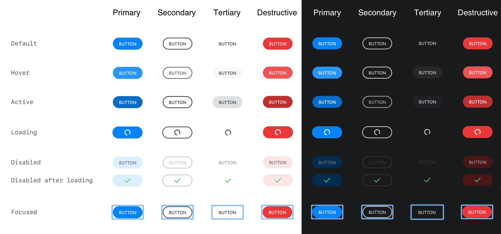
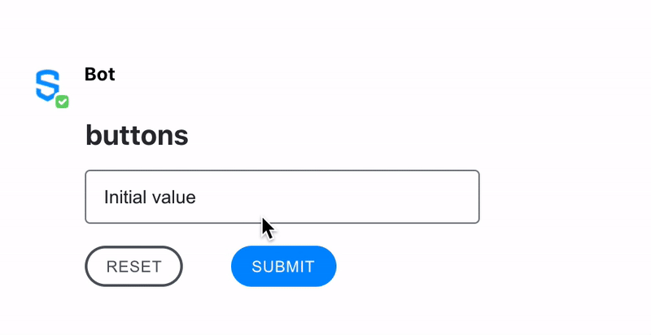

# Buttons

Buttons are the Symphony element responsible for submitting a form to the bot. As a result, all Symphony form elements are required to have at least one button where \`type=`action`\`. When an end-user clicks this button, the form and the contents inside will be submitted to the bot via the datafeed and presented as a JSON payload.

In addition, some forms can contain reset buttons. These buttons are used to reset a form back to its original state.

With Symphony Elements 2.0, a new palette of colors is available for the Button Element, allowing bot developers to determine how the button will look like. There are four types of buttons: `primary`, `secondary`, `tertiary` and `destructive`. Each of those has different colors to suit different actions (to convey meaning). Use the `class` attribute to configure them.

* Primary: use the Primary button when there is a clear primary action on a message. You can use it for the send button, for example.
* Secondary: use the Secondary button when there are multiple actions of the same importance or some actions with less importance than a single primary action.
* Tertiary: the Tertiary button is a low prominence option. Use the tertiary button alongside a Primary or as a standalone button with the ability to read more information.
* Destructive: use the Destructive button when an action results in the removal of an item or if it can result in a potentially serious negative consequence.




Note: Developers cannot toggle the 'Disabled' State.  Buttons will appear 'Disabled' if a button element is sent in a 'Read-Only' room where user input is not valid.  &#x20;


## Attributes

| Attribute | Type   | Required?                                                                                                    | Description                                                                                                                                                                                                                                                                                                                          |
| --------- | ------ | ------------------------------------------------------------------------------------------------------------ | ------------------------------------------------------------------------------------------------------------------------------------------------------------------------------------------------------------------------------------------------------------------------------------------------------------------------------------ |
| `name`    | String | Yes                                                                                                          | Identifies the clicked button.                                                                                                                                                                                                                                                                                                       |
| `type`    | String | <p>No<br><br>If <code>type</code> is not specified, the default value will be <code>type=”action”</code></p> | <p>Indicates whether the button is an <code>action</code> button or a <code>reset</code> button. When clicked, the action button sends the form information to the datafeed. On the other hand, the reset button resets the form-data to its initial values.<br><br>Accepted values: <code>action</code> and <code>reset</code>.</p> |
| `class`   | String | No                                                                                                           | Toggle between new palette of colors: `primary`, `secondary`, `tertiary`, and `destructive`.                                                                                                                                                                                                                                         |

## Rules and Limitations

* If `class` is not defined, the action button assumes the `primary` class by default. Action buttons should be used for affirmation or confirmation actions.
* Reset buttons have the `secondary` class set by default. Reset buttons should be used when the content of the fields need to return to their original state.

## Examples

The following example shows the use of the **Reset** and the **Submit** button when sending a text inserted in a [Text Field](text-field.md).





```markup
<messageML>
  <form id="form_id">
    <text-field name="text-field" placeholder="Add your comment here" required="true">Initial value</text-field>
    <button type="reset">Reset</button>
    <button name="submit_button" type="action">Submit</button>    
  </form>
</messageML>
```



```markup
<button name="send-primary" type="action" class="primary">Primary Button</button>
<button name="send-secondary" type="action" class="secondary">Secondary Button</button>
<button name="send-tertiary" type="action" class="tertiary">Tertiary Button</button>
<button name="send-destructive" type="action" class="destructive">Destructive Button</button>
```



```javascript
{
        "id": "UW2p27",
        "messageId": "4KrVjUU4gnGziWnlqMmD2n___oxo916XbQ",
        "timestamp": 1595966792040,
        "type": "SYMPHONYELEMENTSACTION",
        "initiator": {
            "user": {
                "userId": 7078106482890,
                "firstName": "User",
                "lastName": "Bot",
                "displayName": "User",
                "email": "user_bot@symphony.com",
                "username": "user_bot"
            }
        },
        "payload": {
            "symphonyElementsAction": {
                "stream": {
                    "streamId": "iMft6PLA4lHrEA9icKJobX___oyCKdVVdA",
                    "streamType": "ROOM"
                },
                "formMessageId": "zGeog3OqoYqVI2lwcX2o1X___oxo-A_ubQ",
                "formId": "form_id",
                "formValues": {
                    "action": "submit_button",
                    "init": "hello, my name is John Smith"
                }
            }
        }
    },
```



## Versions and Compatibility

| Main features introduced                                                                                                                                                                                                                                     | Client release | Backward client-compatibility behavior (e.g. external rooms)                                                                  | Agent needed to parse message sent by the bot |
| ------------------------------------------------------------------------------------------------------------------------------------------------------------------------------------------------------------------------------------------------------------ | -------------- | ----------------------------------------------------------------------------------------------------------------------------- | --------------------------------------------- |
| Initial release                                                                                                                                                                                                                                              | 1.55           | Not working                                                                                                                   | 2.55.9                                        |
| Reset features behaviour is to show back the initial value of the form                                                                                                                                                                                       | 20.4           | Working as previous behavior: clear fields                                                                                    | 2.55.9                                        |
| <p>New styles:<br>• New designs for the buttons<br>• Styles <code>primary destructive</code> and <code>secondary destructive</code> are deprecated<br>• Styles <code>tertiary</code> and <code>destructive</code> are introducedMain features introduced</p> | 20.6           | New styles are displayed as the previous ones, `tertiary` and `destructive` are displayed as the default blue `primary` style | 20.6                                          |
