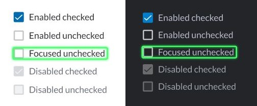

# Checkbox

The checkbox is an interactive box that can be toggled by the user to indicate an affirmative or negative choice.

When clicked, a checkmark (✓) appears inside the box, to indicate an affirmative choice (yes). When clicked again, the checkmark disappears, indicating a negative choice (no).

Checkboxes are used to let a user select one or more options from a limited number of choices. Frequently, a set of checkboxes represents a single question which the user can answer by selecting any number of possible answers.


Note: If you want the user to only be able to pick a single option, use the [Radio Button](radio-button.md) or the [Dropdown Menu](dropdown-menu.md) element.




## Attributes

| Attribute | Type    | Required? | Description                                                                                                                                      |
| --------- | ------- | --------- | ------------------------------------------------------------------------------------------------------------------------------------------------ |
| `name`    | String  | Yes       | Identifies the checkbox.                                                                                                                         |
| `value`   | String  | No        | The `value` is the string that will be sent to the server. If the value is not specified, the string **on** will be sent by default.             |
| `checked` | Boolean | No        | If `true`, it specifies that the `<checkbox>` element should be pre-selected (checked) when the page loads. Accepted values: `true` and `false`. |

## Rules and Limitations

* The text node of the MessageML will be converted to the `<label>` tag. This will preserve the formatting tags `<i>` and `<b>`, if present.
* A form can have a maximum of 50 checkboxes within it. Note: The limit in previous versions was set to 20, so this limit may still apply when sending messages to customers with an earlier version of Symphony (before 20.10).
* Once selected, checkboxes can be deselected by clicking them.
* Click the reset button to return the checkboxes to their original status (checked or unchecked).
* If a checkbox is sent without at least one checked option, it will not be displayed in the datafeed payload.

## Examples

The following example shows checkboxes being used. It shows how developers can use the **checked** parameter with the value01 preselected when the form is sent. It also shows how users can select or unselect one or several checkboxes before submitting the form, as well as how to reset it to its initial values.




```markup
<messageML>
  <form id="form_id">
    <checkbox name="id1" value="value01" checked="true">Red</checkbox>
    <checkbox name="id2" value="value02" checked="false">Green</checkbox>
    <checkbox name="id3" value="value03" checked="false">Blue</checkbox>
    <button type="reset">Reset</button>
    <button name="example-button" type="action">Submit</button>    
  </form>
</messageML>
```



```javascript
[
    {
        "id": "CfVa3O",
        "messageId": "TwSQ5mOSHJHaqABxRBYmmn___pQD5znvbQ",
        "timestamp": 1563302610448,
        "type": "SYMPHONYELEMENTSACTION",
        "initiator": {
            "user": {
                "userId": 7078106482890,
                "firstName": "User",
                "lastName": "Bot",
                "displayName": "User",
                "email": "user_bot@symphony.com",
                "username": "user_bot"
            }
        },
        "payload": {
            "symphonyElementsAction": {
                "stream": {
                  "streamId": "0YeiA-neZa1PrdHy1L82jX___pQjntU-dA",
                  "streamType": "ROOM"
                },
                "formMessageId": "en1LFlhkWTwdXyYvyMsna3///pQD6JE4dA==5856",
                "formId": "form_id",
                "formValues": {
                    "action": "checkbox",
                    "id3": "value03"
                }
            }
        }
    }
]
```



## Versions and Compatibility

| Main features introduced | Client release | Backward client-compatibility behavior (e.g. external rooms) | Agent needed to parse message sent by the bot |
| ------------------------ | -------------- | ------------------------------------------------------------ | --------------------------------------------- |
| Initial release          | 1.55           | Not working                                                  | 2.55.9                                        |
