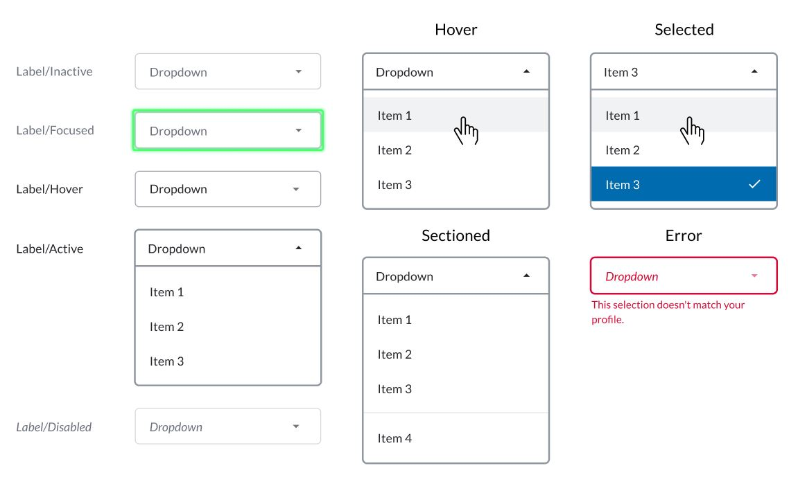

# Dropdown Menu

A dropdown menu **is a static list** of items that appears whenever a piece of text or a button is clicked. This is a graphical approach presented to users from which they can choose a value from the list presented.

A dropdown menu is also known as a pull-down menu, pull-down list, dropdown list or dropdown box.

The dropdown menu is represented by the `<select>` tag which provides a menu of `<options>`.\
Each `<option>` element should have a `value` attribute containing the data value to submit to the server when that option is selected; You can also include a `selected` attribute on an `<option>` element to make it selected by default when the page first loads.



## Attributes

| Attribute          | Type                                              | Required?                                                | Description                                                                                                                                                                                 |
| ------------------ | ------------------------------------------------- | -------------------------------------------------------- | ------------------------------------------------------------------------------------------------------------------------------------------------------------------------------------------- |
| `name`             | String                                            | Yes                                                      | Required attribute of the `<select>` tag. It identifies the dropdown menu.                                                                                                                  |
| `required`         | Boolean                                           | No                                                       | Optional attribute of the `<select>` tag. it is a Boolean attribute indicating that an option with a non-empty string value must be selected.                                               |
| `value`            | String                                            | Yes                                                      | Required attribute of the `<option>` tag. It contains the data value to submit to the server when that option is selected.                                                                  |
| `selected`         | Boolean                                           | Optional                                                 | You can include a selected attribute on an `<option>` element to make it selected by default when the page first loads. Accepted values: `true` and `false`.                                |
| `data-placeholder` | String                                            | Optional                                                 | Text displayed in the dropdown menu before an option is selected. It can be a short hint or a title for the dropdown menu.                                                                  |
| `title`            | It accepts a simple text and `\n` for line breaks | No                                                       | The description that will be displayed when clicking the tooltip icon located on top of the Masked Text Field Element. Max length: 256 characters. Available from Symphony v20.8 and above. |
| `label`            | String                                            | Not required but it is recommended if `title` is defined | Definition of the label that will be displayed on top of the Masked Text Field Element. Available from Symphony v20.8 and above.                                                            |

## Rules and Limitations

The `<select>` tag:

* The `<select>` tag stands for our dropdown parent tag, which has `<options>` as its children; one for each select.
* Select tags only accept `<option>` tags as children. The `<select>` tag must contain at least one `<option>` tag.
* The only valid attributes of the `<select>` tag are `name` and `required`.

The `<option>` tag:

* The `<option>` tag cannot have other `<option>` tags as children. The only valid child of a `<option>` tag is a text node, which specifies the text that will be displayed for that option inside the dropdown menu. The text node is also required.
* The only valid attributes of the `<option>` tag are `value` and `selected`.
* Only one `<option>` of a given select can have the attribute `selected` as true.

If neither the `selected` or `data-placeholder` attributes are set, the default text (title) of the dropdown menu will be "Dropdown".


Message Size Limit:

When designing forms with dropdowns within it be aware that there is a chance of reach the characters limit if too many dropdown options are included in the message. For more information about message size limits, refer to [MessageML](broken-reference).


## Examples

The following examples show dropdown menus being used as follows:

* The first dropdown (_init_) shows how to display a **default preselected option** ("opt2": "With selected option"). Note that the preselected option is sent to the payload when submitting the form.
* The second dropdown (_data-placeholder_) shows how a **placeholder text** ("Only data-placeholder") is displayed in the UI. Please note the placeholder text is not sent in the payload if no option from the dropdown menu has been selected by the enduser.
* The third dropdown (_noreq_) shows how a user can interact with a **non-required** field. Even no option is selected by the user, it does not prevent the enduser from submitting the form.
* The fourth dropdown (_req_) shows the behaviour of the unique **required** field of the form, which cannot be submitted in case no option from the dropdown menu is selected by the user; an error is displayed under the field in case the user submits the form with this empty field.
* The fifth dropdown (_label_) shows how a **label text** ("My Label") is displayed.
* The sixth dropdown (_tooltip_) shows how a **title text** ("My Tooltip/n With a second line") is inserted in the UI under the (i) icon, and how the text entered in the title parameter is displayed when the enduser clicks on the icon.




```markup

<messageML>
  <form id="form_id">
    <h2>dropdown menus</h2>
      <select name="init"><option value="opt1">Unselected option 1</option><option value="opt2" selected="true">With selected option</option><option value="opt3">Unselected option 2</option></select>
      <select name="data-placeholder" data-placeholder="Only data-placeholder"><option value="opt1">Unselected option 1</option><option value="opt2">Unselected option 2</option><option value="opt3">Unselected option 3</option></select>
      <select name="noreq" data-placeholder="Not required"><option value="opt1">First</option><option value="opt2">Second</option><option value="opt3">Third</option></select>
      <select name="req" required="true" data-placeholder="Required"><option value="opt1">First</option><option value="opt2">Second</option><option value="opt3">Third</option></select>
      <select name="label" label="My Label" data-placeholder="With Label"><option value="opt1">Unselected option 1</option><option value="opt2">Unselected option 2</option><option value="opt3">Unselected option 3</option></select>
      <select name="tooltip" title="My Tooltip\n With a second line" data-placeholder="With Tooltip"><option value="opt1">Unselected option 1</option><option value="opt2">Unselected option 2</option><option value="opt3">Unselected option 3</option></select>
      <button name="dropdown">Submit</button>
  </form>
</messageML>
```



```javascript
[    
    {
        "id": "JQgymy",
        "messageId": "h53CRuPWoInmYbfw2T8dkn___pNK27l7bQ",
        "timestamp": 1566407149188,
        "type": "SYMPHONYELEMENTSACTION",
        "initiator": {
            "user": {
                "userId": 7078106482890,
                "firstName": "User",
                "lastName": "Bot",
                "displayName": "User",
                "email": "user_bot@symphony.com",
                "username": "user_bot"
            }
        },
        "payload": {
            "symphonyElementsAction": {
                "actionStream": {
                    "streamId": "0YeiA-neZa1PrdHy1L82jX___pQjntU-dA"
                },
                "formStream": {
                    "streamId": "YuK1c2y2yuie6+UfQnjSPX///pQEn69idA=="
                },
                "formMessageId": "RfqsxcfTHCV08+UcO03HQH///pIqaO6fdA==",
                "formId": "form_id",
                "formValues": {
                    "action": "dropdown",
                    "init": "opt2",
                    "data-placeholder": "",
                    "noreq": "",
                    "req": "opt2",
                    "label": "",
                    "tooltip": ""
                }
            }
        }
    }
]
```



## Versions and Compatibility

| Main features introduced | Client release | Backward client-compatibility behavior (e.g. external rooms) | Agent needed to parse message sent by the bot |
| ------------------------ | -------------- | ------------------------------------------------------------ | --------------------------------------------- |
| Initial release          | 1.55           | Not working                                                  | 2.55.9                                        |
| Label                    | 20.9           | Label displayed and form can still be submitted              | 20.6                                          |
| Tooltip (title)          | 20.9           | Tooltip not displayed but form can still be submitted        | 20.7                                          |
