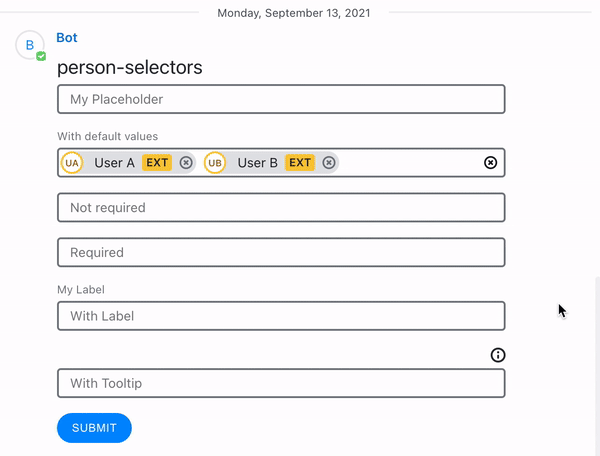

# Person Selector

The Person Selector is an element used for finding and selecting people. Person Selectors are used in many places within Symphony, so you should be familiar with how they work.

When a user types the person's name, a drop-down will be displayed with the results found for the data the user entered. The following example shows how three people with the same name (Vincent) have been found.


## Attributes

| Attribute     | Type                                              | Required?                                                | Description                                                                                                                                                                                  |
| ------------- | ------------------------------------------------- | -------------------------------------------------------- | -------------------------------------------------------------------------------------------------------------------------------------------------------------------------------------------- |
| `name`        | String                                            | Yes                                                      | Identifies the person selector                                                                                                                                                               |
| `placeholder` | String                                            | No                                                       | Specifies a short hint that describes the expected value of the input field.                                                                                                                 |
| `required`    | Boolean                                           | No                                                       | If `true`, it specifies that the person selector must be filled out before submitting the form, which means that at least one person must be "selected" Accepted values; `true` and `false`. |
| `title`       | It accepts a simple text and `\n` for line breaks | No                                                       | The description that will be displayed when clicking the tooltip icon located on top of the Masked Text Field Element. Max length: 256 characters. Available from Symphony v20.8 and above.  |
| `label`       | String                                            | Not required but it is recommended if `title` is defined | Definition of the label that will be displayed on top of the Masked Text Field Element. Available from Symphony v20.8 and above.                                                             |
| `value`       | <p>Array of </p><p><code>long</code></p>          | No                                                       | Default value that will be preselected in the person-selector when the user receive the form from the bot.                                                                                   |

## Rules and Limitations

* The Person Selector element supports multi-user selection which means that you can search for more than one person using the same selector.
* Please note that the `value` functionality is only supported for Symphony users on Client 2.0.

## Examples

The following examples show person selectors being used as follows:

* The first person-selector (_placeholder_) shows how a **placeholder text** ("My Placeholder") is displayed in the UI. Please note the placeholder text is not sent in the payload if no option from the dropdown menu has been selected by the enduser.
* The first person-selector (_placeholder_) shows how the bot can introduce a **default value** in the person selector. It shows as well how a Symphony user can interact with the clear all functionality.
* The third person-selector (_noreq_) shows how a user can interact with a **non-required** field. Even if nobody is selected by the user, it does not prevent the enduser from submitting the form.
* The fourth person-selector (_req_) shows the behaviour of the unique **required** field of the form, which cannot be submitted in case nobody from the person selector is selected by the user; an error is displayed under the field in case the user submits the form with this empty field. An auto-filtering behaviour allows the user to see less options as he digits some input. Also, it shows how Symphony users can remove some of the selected users with the cross associated to that specific user.
* The fifth person-selector (_label_) shows how a **label text** ("My Label") is displayed.
* The sixth person-selector (_tooltip_) shows how a **title text** ("My Tooltip/n With a second line") is inserted in the UI under the (i) icon, and how the text entered in the title parameter is displayed when the enduser clicks on the icon.





```markup
<messageML>
  <form id="form_id">
    <h2>person-selectors</h2>
      <person-selector name="placeholder" placeholder="My Placeholder"/>
      <person-selector name="value" label="With default values" value='[12987981109743,12987981109741]' />
      <person-selector name="noreq" placeholder="Not required"/>
      <person-selector name="req" required="true" placeholder="Required"/>
      <person-selector name="label" label="My Label" placeholder="With Label"/>
      <person-selector name="tooltip" title="My Tooltip\n With a second line" placeholder="With Tooltip"/>
      <button name="person-selector">Submit</button>
  </form>
</messageML>
```



```javascript
[
    {
        "id": "RJ4MqQ",
        "messageId": "BnjUz2Q26tKI_kQiplv0IX___pP-I0xXbQ",
        "timestamp": 1563399336872,
        "type": "SYMPHONYELEMENTSACTION",
        "initiator": {
            "user": {
                "userId": 7078106482890, 
                "firstName": "User",
                "lastName": "Bot",
                "displayName": "User",
                "email": "user_bot@symphony.com",
                "username": "user_bot"
            }
        },
        "payload": {
            "symphonyElementsAction": {
                "actionStream": {
                    "streamId": "0YeiA-neZa1PrdHy1L82jX___pQjntU-dA"
                },
                "formStream": {
                    "streamId": "YuK1c2y2yuie6+UfQnjSPX///pQEn69idA=="
                },
                "formMessageId": "ojfA0Eei0kSymzDpX72ysX///pP+I7LjdA==5615",
                "formId": "form_id",
                "formValues": {
                    "action": "person-selectors",
                    "placeholder": [],
                    "value": [
                        12987981109743
                    ],
                    "noreq": [],
                    "req": [
                        7078106482890
                    ],
                    "label": [],
                    "tooltip": []
                }
            }
        }
    }
]
```




### User ID

The result returned by the datafeed for the selected users is an array of user Ids, which is an array of `long`. &#x20;


## Versions and Compatibility

| Main features introduced | Client 1.5 release | Client 2.0 release | Backward client-compatibility behavior (e.g. external rooms)                     | Agent needed to parse message sent by the bot |
| ------------------------ | ------------------ | ------------------ | -------------------------------------------------------------------------------- | --------------------------------------------- |
| Initial release          | 1.55               |                    | Not working                                                                      | 2.55.9                                        |
| Label                    | 20.9               | 20.9               | Label displayed and form can still be submitted                                  | 20.7                                          |
| Tooltip (title)          | 20.9               | 20.9               | Tooltip not displayed but form can still be submitted                            | 20.7                                          |
| Value                    | Not Available      | 21.7               | For client 1.5, it displays the person-selector as if there was no default value | 20.12                                         |
