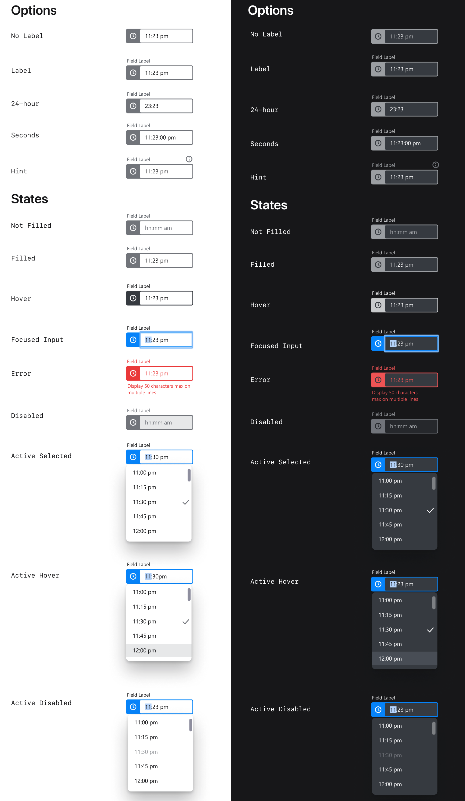
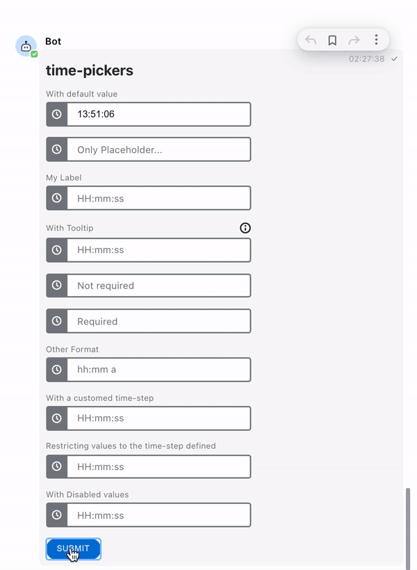

# Time Picker

Do you need users to pick a time as part of an interactive flow? With the Time Picker element, Symphony users can easily select a time from a list of possible values.

The Time Picker offers to Symphony users the possibility to enter the time in two different ways:

* Populating the field directly with the keyboard, following the appropriate format and the list of possible values (see attributes strict, min, max, and disabled-time)
* Clicking on the wished time from the dropdown displayed

## MessageML tag

The Time Picker is represented by the **\<time-picker>** tag, as you can see in the examples at the bottom of the page.

## Designs

You can see below the designs of the time picker.



## Attributes


| Attribute       | Type                                   | Required?                                                        | Description                                                                                                                                                                                                                                                                                                                                                                                                                                                                                                                                                                                                                                                                                                                                                                                                                                                                                                                                                                                                                           |
| --------------- | -------------------------------------- | ---------------------------------------------------------------- | ------------------------------------------------------------------------------------------------------------------------------------------------------------------------------------------------------------------------------------------------------------------------------------------------------------------------------------------------------------------------------------------------------------------------------------------------------------------------------------------------------------------------------------------------------------------------------------------------------------------------------------------------------------------------------------------------------------------------------------------------------------------------------------------------------------------------------------------------------------------------------------------------------------------------------------------------------------------------------------------------------------------------------------- |
| `name`          | String                                 | Yes                                                              | Identifies the time picker.                                                                                                                                                                                                                                                                                                                                                                                                                                                                                                                                                                                                                                                                                                                                                                                                                                                                                                                                                                                                           |
| `value`         | String `"HH:mm:ss"`                    | No                                                               | <p>Time with ISO_8601 format to be displayed by default by the time picker when rendered for the Symphony user.<br>Overrides the placeholder value.</p>                                                                                                                                                                                                                                                                                                                                                                                                                                                                                                                                                                                                                                                                                                                                                                                                                                                                               |
| `title`         | String (accepting `\n` for line break) | No                                                               | Description that will be displayed when clicking the tooltip icon located on top of the time picker Element.                                                                                                                                                                                                                                                                                                                                                                                                                                                                                                                                                                                                                                                                                                                                                                                                                                                                                                                          |
| `label`         | String                                 | Not required but it is recommended if `title` is defined         | The text of the label that will be displayed above the time picker field.                                                                                                                                                                                                                                                                                                                                                                                                                                                                                                                                                                                                                                                                                                                                                                                                                                                                                                                                                             |
| `required`      | Boolean (true or false)                | No                                                               | If `true`, it specifies that a time must be picked before submitting the form.                                                                                                                                                                                                                                                                                                                                                                                                                                                                                                                                                                                                                                                                                                                                                                                                                                                                                                                                                        |
| `placeholder`   | String                                 | No                                                               | <p>Specifies a short hint that describes the expected format of the time picker field.<br>If the attribute<code>value</code> is entered, the placeholder will not be displayed.<br>If the placeholder is not set, the accepted time format will be displayed by default.<br><br><em>Note: We recommend to use the default placeholder. It is better to rely on the label if context is needed, or the title if instructions are needed.</em></p>                                                                                                                                                                                                                                                                                                                                                                                                                                                                                                                                                                                      |
| `min`           | String `"HH:mm:ss"`                    | No                                                               | <p>Specifies the earliest acceptable time with ISO_8601 format.</p><p><em>Note: Times earlier than the min are not displayed in the time picker.</em></p>                                                                                                                                                                                                                                                                                                                                                                                                                                                                                                                                                                                                                                                                                                                                                                                                                                                                             |
| `max`           | String `"HH:mm:ss"`                    | No                                                               | <p>Specifies the latest acceptable time with ISO_8601 format.</p><p><em>Note: Times later than the max are not displayed in the time picker.</em></p>                                                                                                                                                                                                                                                                                                                                                                                                                                                                                                                                                                                                                                                                                                                                                                                                                                                                                 |
| `disabled-time` | Json array (in a String format)        | No                                                               | <p>Times or ranges of times that cannot be selected by the Symphony user.<br>Maximum length of 1024 characters.<br><br>There are 2 different patterns:<br>1. range of times: {"from": "HH:mm:ss", "to": "HH:mm:ss"},<br>2. specific time: {"time": "HH:mm:ss"}.<br><br><strong>Important</strong>: single quote <code>'</code> should wrap the xml parameter. See the examples below for more details.</p><p><em>Note: Disabled times are displayed as disabled values in the time picker.</em></p>                                                                                                                                                                                                                                                                                                                                                                                                                                                                                                                                   |
| `format`        | String                                 | No                                                               | <p>Format in which the time will be displayed to or should be entered by the Symphony user.<br>Only accepts the letters 'h', 'H', 'm', 's', and 'a' as well as ':' or space as separator.<br>• 'h' (for 12-hour format) and 'H' (for 24-hour format) define the hour. You can use either 1 ('h'; 'H') or 2 ('hh'; 'HH') to define the minimum number of digits displayed (i.e. corresponding to "3" or "03" for the third hour)<br>• 'm' defines the minutes. Similarly to the hours, you can use one or two ('m' or 'mm')<br>• 's' defines the seconds. Similarly to the hours and minutes, you can use one or two ('s' or 'ss')</p><p>• 'a' (usually placed after a space) allows to display 'AM' for morning times and 'PM' for afternoon times<br><br><em>Note 1: We recommend the use of the default value as much as possible.</em><br><em>Note 2: The format only impacts what the end user will see. It does not affect how you have to specify the value, min, max, disabled-time, or the format of the user reply.</em></p> |
| `step`          | Number                                 | <p>No</p><p><em>Default is 900 (corresponding to15 min)</em></p> | <p>The stepping interval (in seconds) for the times displayed in the dropdown menu.</p><p></p><p>Min value: 600 (corresponding to 10 min)</p><p>Max value: 43 200 (corresponding to half a day)</p>                                                                                                                                                                                                                                                                                                                                                                                                                                                                                                                                                                                                                                                                                                                                                                                                                                   |
| `strict`        | Boolean                                | <p>No</p><p><em>Default is false</em></p>                        | <p>Enforce that the user cannot select a time that is not in the proposed list (e.g. we want him to only select an hour, he can’t decide to set the field to 9:15, even with the keyboard).</p><p><em>Please note that in addition to this, the value picked will be validated against attributes min, max, and disabled-time.</em></p>                                                                                                                                                                                                                                                                                                                                                                                                                                                                                                                                                                                                                                                                                               |

## Accessibility

For the purpose of accessibility, Symphony users can interact with the time picker via their keyboard:

* First, using "Tab" to enter the component
* Using "Enter" or "Space" to open the dropdown when focus is on the icon, or just "Enter" when focus is on the input
* Using "Arrow up" or "Arrow down" to navigate within the dropdown list and using "Enter" to select the preselected value
* Either "Typing" or pressing "Tab" to go from the hours to the minutes, and then from the minutes to the seconds
* Either "Deleting" or pressing "Shift+Tab" to go back from the seconds to the minutes, and then from the minutes to the hours
* Finally using "Tab" to exit the component

## Rules and Limitations

* The max length of any time picker attribute is 256 except `disabled-time` attribute which max length is set to 1024 characters.
* If the format entered by the user is not correct or if the time entered is a disabled time, then an error message is displayed to the user. _Note that it is not possible for the user to submit the form with an invalid format or disabled time._
* You can add a **default time** in your text field by including it in the `value` parameter. Please note that unlike the `placeholder` text, the **default time** will be sent back to the Bot in the user reply when the form is submitted if it is not edited by the user.
* The time-picker will be supported on the following versions of clients:
  * 20.14 for Client 2.0
  * 20.13 for Client 1.5


Please note that a limited amount of values are displayed in the dropdown of the time picker (see attribute `step` which minimum is 10 min). However, you can note that the time picker supports a precision to the second (see `format` attribute). Also, if you don't use the attribute `strict`, then user will be able to populate the field via their keyboard with any other non-disabled and existing time value than proposed in the list.


## Examples

The following examples show the time picker being used as follows:

* The first time-picker (_init_) shows how to display a **default time**, as an initial value is entered as parameter. Note that the default value is present in the user reply as it has not been deleted before submitting the form.
* The second time-picker (_placeholder_) shows how a **placeholder** is displayed in the UI. Please note that any text is accepted as input. However, if you compare with the next time-pickers present in the form, you can notice that a default placeholder is generated (with a hint of the correct format to accepted by the time-picker field) in case no placeholder is set.
* The third time-picker (_label_) shows how a **label** ("My Label") is displayed.
* The fourth time-picker (_tooltip_) shows how the **title** attribute ("My Tooltip/n With a second line") is displayed.
* The fifth time-picker (_noreq_) shows how a user can interact with a **non-required** field. Even if the field is empty (only a placeholder text is present but does not count as a value), it does not prevent the user from submitting the form.
* The sixth time-picker (_req_) shows the behaviour of the unique **required** field of the form, which cannot be submitted in case it is not filled.
* The seventh time-picker (_format_) shows the way the placeholder evolves to adapt to a new **format** transmitted thanks to the format parameter. Also please note the accessible interaction with the time-picker via the keyboard.
* The eighth time-picker (_step_) shows how to modify the **step** between 2 consecutive values in the list of times. Please note that a Symphony user can select any other existing time by populating the field with his keyboard.
* The ninth time-picker (_strict\_step_) shows how to enforce the user to choose among the non-disabled values displayed in the dropdown, thanks to the **strict** attribute.
* The tenth time-picker (_rules_) shows how to interact with the following parameters: **min**, **max**, and **disabled-time**. Please note that a disabled time cannot be entered manually.





```markup
<messageML>
  <form id="form_id">
    <h2>time-pickers</h2>
      <time-picker name="init" label="With default value" value="13:51:06" />
      <time-picker name="placeholder" placeholder="Only Placeholder..." />
      <time-picker name="label" label="My Label" />
      <time-picker name="tooltip" label="With Tooltip" title="My Tooltip\n With a second line" />
      <time-picker name="noreq" placeholder="Not required" />
      <time-picker name="req" required="true" placeholder="Required" />
      <time-picker name="format" label="Other Format" format="hh:mm a" />
      <time-picker name="step" label="With a customed time-step" step="600" />
      <time-picker name="strict_step" label="Restricting values to the time-step defined" strict="true" />
      <time-picker name="rules" label="With Disabled values" min="08:00:00" max="17:00:00" disabled-time='[{"from": "12:00:00", "to": "14:00:00"}, {"time": "15:00:00"}]' />
      <button name="time-picker">Submit</button>
  </form>
</messageML>
```



```
[
    {
        "id": "uptHwx",
        "messageId": "9msDL6zbxKpXA82fG86tYH___oe6lh_LbQ",
        "timestamp": 1616072269876,
        "type": "SYMPHONYELEMENTSACTION",
        "initiator": {
            "user": {
                "userId": 7078106482890,
                "firstName": "User",
                "lastName": "Bot",
                "displayName": "User",
                "email": "userbot@symphony.com",
                "username": "user_bot"
            }
        },
        "payload": {
            "symphonyElementsAction": {
                "stream": {
                    "streamId": "tp3eVYR3ZTyW7K7vmsmgYX___oq6-yN5dA",
                    "streamType": "ROOM"
                },
                "formMessageId": "UG1jcvtbGMdRlWQlq1AXgH___oe65VckbQ",
                "formId": "form_id",
                "formValues": {
                    "action": "time-picker",
                    "init": "13:51:06",
                    "placeholder": "01:30:00",
                    "label": "",
                    "tooltip": "",
                    "noreq": "",
                    "req": "12:45:02",
                    "format": "00:45:00",
                    "step": "00:10:02",
                    "strict_step": "00:15:00",
                    "rules": "14:15:00"
                }
            }
        }
    }
]
```



## Versions and Compatibility <a href="#versions-and-compatibility" id="versions-and-compatibility"></a>

| Main features introduced | Agent needed to parse message sent by the bot | Client 2.0 release | _Client 1.5 release_ | _Backward client-compatibility behavior (e.g. external rooms)_ |
| ------------------------ | --------------------------------------------- | ------------------ | -------------------- | -------------------------------------------------------------- |
| Initial release          | 20.12                                         | 20.14              | _20.13_              | _Not working_                                                  |
