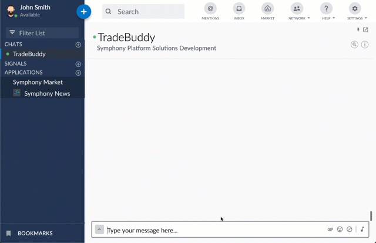
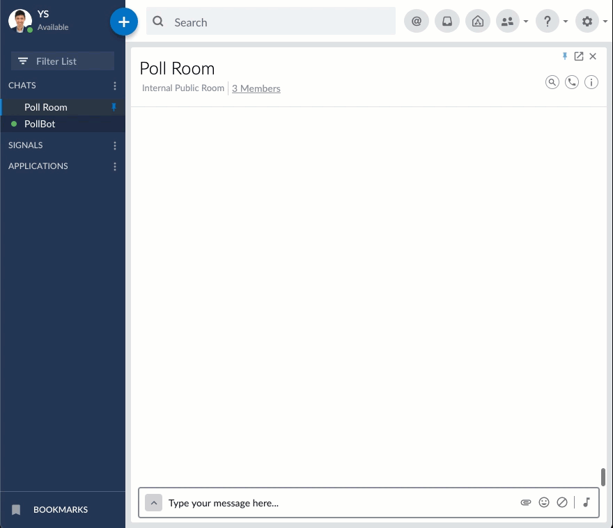

# Open Source Code Samples

Many members of our community are building bots and code samples and publishing their source code. We collect these examples in this page. You can use any of them as is, or to either bootstrap your own idea or just for inspiration.


This list is provided for information only, without warranty of any kind. All source code are protected by their respective license.


### Symphony Exporter

This bot provides users to retrieve and export all of their messages from Rooms and IMs.

| Property | Value |
| :--- | :--- |
| Language | Javascript \(NodeJS\) |
| Author | Symphony |
| License | MIT |
| Source Code | [_https://github.com/sym-bizops-bots/symphony-exporter_](https://github.com/sym-bizops-bots/symphony-exporter)\_\_ |

### Symphony Roomzilla

This bot provides capabilities to manage room creation and population using Active Directory, _.csv_ files or _.eml_ files \(email\).

| Property | Value |
| :--- | :--- |
| Language | JavaScript \(Node\) |
| Author | Symphony |
| License | MIT |
| Source Code | [https://github.com/SymphonyPlatformSolutions/symphony-roomzilla-bot](https://github.com/SymphonyPlatformSolutions/symphony-roomzilla-bot) |

### Symphony TradeBudy

This bot tracks watchlists for multiple users and displays a table with clickable buttons to allow users to join discussion rooms.

| Property | Value |
| :--- | :--- |
| Language | Java |
| Author | Symphony |
| License | MIT |
| Source Code | [https://github.com/SymphonyPlatformSolutions/symphony-trade-buddy-bot](https://github.com/SymphonyPlatformSolutions/symphony-trade-buddy-bot) |

### Symphony Poll Bot

This bot uses Symphony Elements to facilitate the creation of polls, firing of poll messages, ending polls and collation of results.

| Property | Value |
| :--- | :--- |
| Language | Java |
| Author | Symphony |
| Licence | MIT |
| Source Code | [https://github.com/SymphonyPlatformSolutions/symphony-poll-bot-java](https://github.com/SymphonyPlatformSolutions/symphony-poll-bot-java) |

