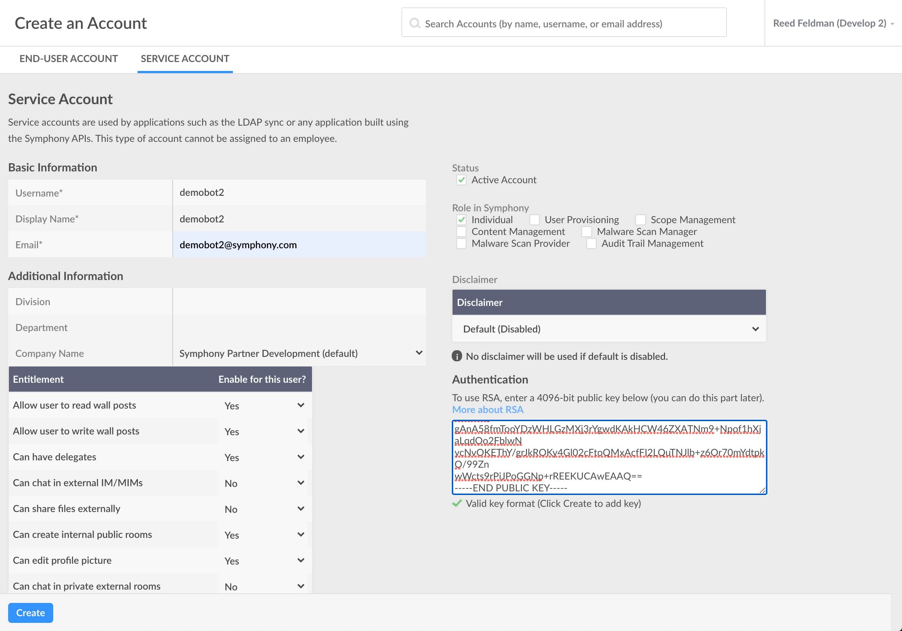
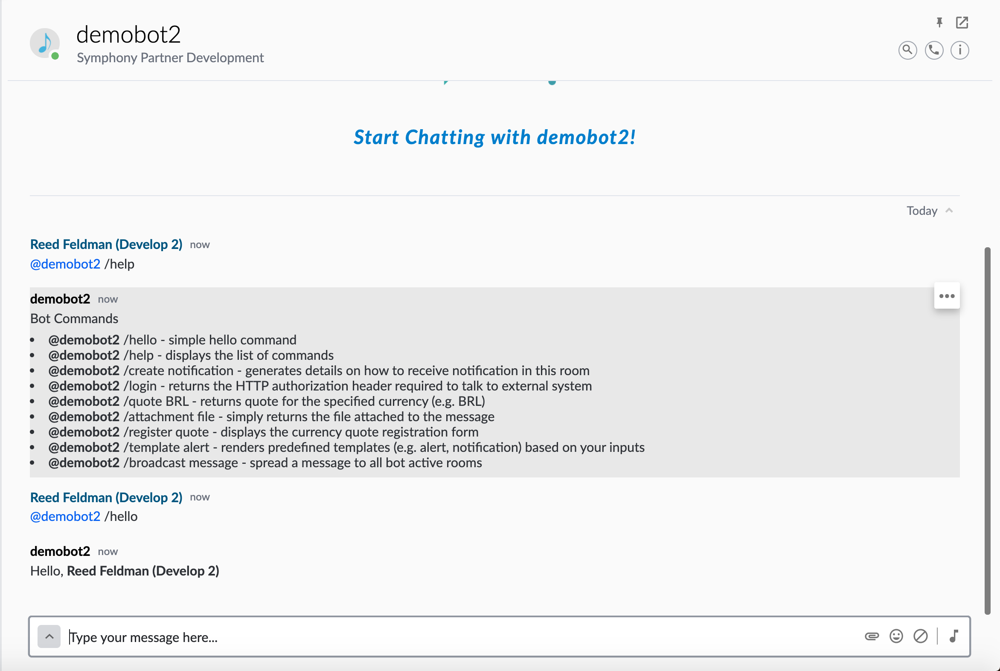

# Building a Chatbot using BDK

The following is a step-by-step guide for building a Chatbot using the dedicated Bot SDK and CLI tool that are both apart of the Bot Developer Kit.

## Prerequisites

* Node
* Yarn
* Java 8
* Maven 3
* Git

### Install Yarn:

```text
$ npm i -g yarn
```

### Install the BDK:

```text
$ npm i -g symphony-bdk-cli
```

### Confirm all the dependencies are met:

```text
$ symphony-bdk-cli --check-dependencies
```

## 1. Generate your Bot

To generate a new Bot project, enter the following:

```text
$ symphony-bdk-cli --bot
```

This will prompt with you a number of questions about your Bot and Pod configuration. Type in your bots metadata, use arrows to scroll, and press enter to move onto the next prompt:

```text
✔ All Dependencies are met!
Setting up a new Bot application
Please answer the following questions
? What's the bot project name? (required) demo-bot2
? What's the bot username? (required) demobot2
? What's the bot email address? (required) demobot2@symphony.com
? What's the base package? (required) com.symphony.documentation
? do you have an existing extension app?, if so what is the application ID declared in Symphony? 
? Please Provide the Symphony Pod address this bot will serve develop2.symphony.com

⠋ Generating bot RSA keys
Generating RSA private key, 4096 bit long modulus
.............................++
............................................................++
✔ Keys generated.
⠋ Installing dependencies  ✖ Ran install dependencies
    → Command failed: mvn clean package
✖
Project ready DONE
********************************************************************************************
Please find below the bot public key, it must be added to the bot user account
please visit: https://developers.symphony.com/restapi/docs/rsa-bot-authentication-workflow to learn more.
********************************************************************************************
-----BEGIN PUBLIC KEY-----
MIICIjANBgkqhkiG9w0BAQEFAAOCAg8AMIICCgKCAgEAzpiQJwzqUusEcAWqLKyM
lo8qZXUHhuT6kmb1UgSMxkZ9LZI7I1qfCD2v3HlBNj1fiTJkR08meCy//04DruBN
jiBbQTfJzryB+5xpu3RvUrhVhqRM8YsQHU/zo82q+XBe0LZa1E0OtH/Pc1B1HVvr
oOMFuSZJSwq4mB/eWz0gV+lK9FFS5crwFXZk7gfhIACcW4SCVKpj7iyu66iO/4ed
TqNwMsyiMY4XEFkfIlBy+nbdf3ciGG8e8JxeSlI5sU33u6IQ8JdFHslR1pN5vj++
3omwuSWPvsfixdEEq2HILKuYgX6jrwgWFLRbOs2WB7rP7O1R3RaoxeOU+N68ORSy
jALEaLppq+ephIajMgzNJJzmvFnoWrvfj+YuS6wn+6FWgSs6Mop+KoJaRo+94r4B
UQTe+nZDXASB1V0wSIXyohlwdrrAE+4F+UXzOybVAEaA6wxgWhTtWDJX9jrBM4Df
IaLg/Gn9qCwb3tUDSkRxKmSsLpbdNW7zmdm/JEYQfdoysiyb4/Nrt6DX+PYue7IP
xJ77TIQnl3SvmSeLqJSH65d76hf1f4Ld07cgGXZTVW+1LeDi2dIS01n40aAfyKNx
OZrGTfbHusNQFjy3UBmu8r2EaETbyCfUUmcye6Hqy3jKZ13ylvXr1AH4kRVG4TGs
cYtyBTslVQ5nUvIYPqPfrKECAwEAAQ==
-----END PUBLIC KEY-----
```


Leave the second to last question blank and press enter to skip.


Upon completion, the BDK CLI tool has created a public/private RSA key pair, a configuration and requirements file, as well as some default commands/datafeed event listeners.

## 2.  Configure your Bot

Once you have your generated Bot scaffold, the next step is to configure your Bot user:

Ensure that you or your admin has created a corresponding service account on the admin portal of your Symphony Pod. Additionally, you must upload the generated public key onto the service account created.

Copy the entire contents of this public key including the dashes on either side, and handoff to your system admin or upload directly to the pod and click save:


Note: The Bot username and Bot email address entered to the CLI tool must match exactly the Basic Information shown in the Pod above.




Open your generated Bot code in your favorite Java IDE and navigate to the bot-config.json file:

```text
{
  "sessionAuthHost": "develop2.symphony.com",
  "sessionAuthPort": 443,
  "keyAuthHost": "develop2.symphony.com",
  "keyAuthPort": 443,
  "podHost": "develop2.symphony.com",
  "podPort": 443,
  "agentHost": "develop2.symphony.com",
  "agentPort": 443,
  "appId": "",
  "appPrivateKeyPath": "certs/",
  "appPrivateKeyName": "demobot2_privatekey.pkcs8",
  "botPrivateKeyPath": "certs/",
  "botPrivateKeyName": "demobot2_privatekey.pkcs8",
  "botUsername": "demobot2",
  "authTokenRefreshPeriod": "30",
  "authenticationFilterUrlPattern": "/secure/",
  "showFirehoseErrors": false,
  "connectionTimeout": 45000,
  "botEmailAddress": "demobot2@symphony.com"
}
```

Confirm that the sessionAuthHost, keyAuthHost, and agentHost matches the correct Pod, Key Manager, and Agent endpoints respectfully. Again, confirm that the botUsername, and botEmailAddress matches the information entered in the admin portal on the Pod.

## 3. Dive into the Code

The Bot SDK provides all of the functionality as our regular Symphony SDKs such as easy to use authentication handlers, centralized configuration, convenient error handling, and API bindings so you can call the API directly in your Bot's code. The Bot SDK also provides out of the box Datafeed and event handling architecture that make it simple for your Bot to handle different events. The Bot SDK is also baked in with Bot's best practices and provides a lot of convenient out of the box code that can be used to bootstrap your bot quickly. To illustrate these best practices and convenient boilerplate code, navigate to HelpCommandHandler.java inside your project directory:



```java
package com.symphony.docs.demobot2.command;

import java.util.HashMap;
import java.util.Map;
import java.util.function.Predicate;
import java.util.regex.Pattern;

import com.symphony.bdk.bot.sdk.command.CommandHandler;
import com.symphony.bdk.bot.sdk.command.model.BotCommand;
import com.symphony.bdk.bot.sdk.symphony.model.SymphonyMessage;

/**
 * Sample code. Help command to return the list of available commands
 */
public class HelpCommandHandler extends CommandHandler {

  private static final String[] DESCRIPTIONS = {
      "/hello - simple hello command",
      "/help - displays the list of commands",
      "/create notification - generates details on how to receive notification in this room",
      "/login - returns the HTTP authorization header required to talk to external system",
      "/quote BRL - returns quote for the specified currency (e.g. BRL)",
      "/attachment file - simply returns the file attached to the message",
      "/register quote - displays the currency quote registration form",
      "/template alert - renders predefined templates (e.g. alert, notification) based on your inputs",
      "/broadcast message - spread a message to all bot active rooms"
  };

  @Override
  protected Predicate<String> getCommandMatcher() {
    return Pattern
        .compile("^@" + getBotName() + " /help$")
        .asPredicate();
  }

  /**
   * Invoked when command matches
   */
  @Override
  public void handle(BotCommand command, SymphonyMessage response) {
    Map<String, Object> data = new HashMap<>();
    data.put("bot_mention", "@" + getBotName());
    data.put("descriptions", DESCRIPTIONS);
    response.setTemplateFile("help-response", data);
  }

}
```



The DESCRIPTIONS dictionary defined on line 17 defines a help menu or list of commands that the bot understands out of the box. The Bot automatically follows our best practice naming convention of "@botusername /command" which is defined on line 32. Each of these commands listed in the help menu have their own corresponding command handler inside of the commands folder.

So for example when a user prompts the Bot with "@demobot2 /hello", the handle\(\) function inside HelpCommandHandler.java will be called:



```java
 public void handle(BotCommand command, SymphonyMessage response) {
    Map<String, String> variables = new HashMap<>();
    variables.put("user", command.getUser().getDisplayName());

    response.setTemplateMessage("Hello, <b>{{user}}</b>", variables);
  }
```



## 4.  Run your Bot

Lastly, start up your Spring Application by running your BotApplication.java and test that your chatbot works in a 1-1 IM:



To learn more about how your can add your own commands and business logic, navigate to our Developer Certification where we show you how to build a real-world FX Trading Bot using the Bot SDK and CLI tool:

