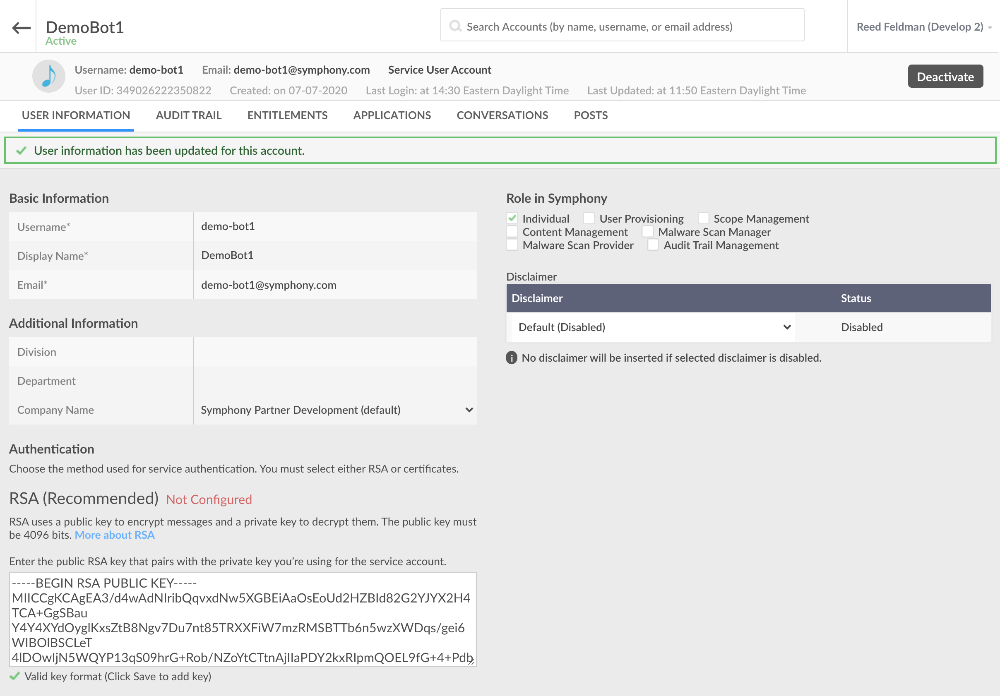

# Build a Chatbot using the Node.js SDK

## Prerequisites

### Complete the Bot Configuration guide:



## 1.  Generate Your Bot

To activate the Symphony Bot Generator:

```text
$ yo symphony
```

This will prompt you with a number of questions that you need to fill out according to your chatbots metadata. Type in your bots metadata, use arrows to scroll, and press enter to move onto the next prompt.

```text
/------------------------------------------/
/        SYMPHONY GENERATOR  1.2.3         /
/    by platformsolutions@symphony.com     /
/ (c) 2020 Symphony Communication Services /
/------------------------------------------/
? What do you want to create bot
? What is the name of your project demo-bot1
? What is your POD subdomain develop2
? What is your preferred programming language Node.js
? What is the BOT username demo-bot1
? What is the BOT email address demo-bot1@symphony.com
? What is your preferred encryption technology RSA - Generate New Keys
? Which template do you want to start with Request/Reply
* Generating bot Node.js code from Request/Reply template...
* Generating RSA public/private keys for BOT demo-bot1...
* BOT generated successfully!!
   create index.js
   create package.json
   create config.json
```


Note: In this guide, we will select 'RSA - Generate New Keys'. If you have pre-existing RSA keys use the option 'RSA - Use Existing Keys'.  If you wish to use certificates, select the certificate option.


Upon completion, the Symphony Bot Generator has created a folder for your project named after your bot.  It contains the following:

* **rsa/** : folder containing the RSA Public & Private Keys
* **config.json**: Bot configuration file
* **package.json**: Package dependencies file for your Node.js project
* **index.js**: Bot application logic.

```text
$ cd demo-bot1/
$ ls -lR
-rw-r--r--  1 vinay  619754511  714 14 Jul 11:45 config.json
-rw-r--r--  1 vinay  619754511  498 14 Jul 11:45 index.js
-rw-r--r--  1 vinay  619754511  321 14 Jul 11:45 package.json
drwxr-xr-x  4 vinay  619754511  128 14 Jul 11:45 rsa

./rsa:
-rw-r--r--  1 vinay  619754511  3238 14 Jul 11:45 rsa-private-demo-bot1.pem
-rw-r--r--  1 vinay  619754511   774 14 Jul 11:45 rsa-public-demo-bot1.pem
```

## 2. Configure your Bot

Once you have your generated Bot scaffold, the next step is to configure your Bot user:

Ensure that you or your admin has created a corresponding service account on the admin portal of your Symphony Pod. Additionally, you must upload the generated public key onto the service account created:

```aspnet
$ cd demo-bot1/rsa/
$ ls -l
-rw-r--r--  1 vinay  619754511  3238 14 Jul 11:45 rsa-private-demo-bot1.pem
-rw-r--r--  1 vinay  619754511   774 14 Jul 11:45 rsa-public-demo-bot1.pem
$
$ more rsa-public-demo-bot1.pem
-----BEGIN RSA PUBLIC KEY-----
WIIDDgKCAgEAgP74jV9jy5S9RQXDODyTabIHJNwgFATJgrPYTU2fXsmHUMdQ+GDva0zfyQpA
Awrs12A4qNMjebTlrGOM5qALPofDOpexd9dvcqh1engN/oARwHuZXr/Xhzf6aXr/YxDE0WSc
8bgeJsqk+EHALPMnOWJ8Gq2laywg3bBMVBAK3HYNFfkGy38wJ0ennAyV6vC0xblrpwx3iC1w
ONajPpYHxmITtA/ylyg5h33YJPNJy6iW9UYkZnBxFbPJU6WbBrNiPSzgm493ADPhepYHNpWH
QBsHOPS96wdKX/RDQq5soJgYy9bJ88hxUDuVePxGHW6L5nJuGUt/61N6rvZHTsPoViijPlYn
/2pESsuX5aZ7nx16xOdQEwn/6U8pmV0Lsu9KCUsk7y8dboir7QvzIft6iR/vdf5c38Bn5TYR
Bi4gVa5KiXiKBBpiJPVXS9TO/yGOgeQPZQhFCZV5/p+OEXe4uBrCzSxkAxtBIG1fiKkw/x06
GFyvu7C0N5i+1vPWsWjpuoRwerhhwlerkhwelrwherlkwhrlBeWYuDSoCdRxwBpXWzoGGD1/
g4Qq7SubtHnHTaWJY+A2HrgFdwtssFGghae58MHyrjvsXHPTEcY3UPQgixrv4HKJ2HXzqEz2
Hx5BxiecjxSr38OgaX0aET+mZCmat3KEaUJByTQkt/xdCDcCAwEAAQ==
-----END RSA PUBLIC KEY-----
```

Copy the entire contents of this public key including the dashes on either side, and handoff to your system admin or upload directly to the pod and click save:




Note: The Bot username and Bot email address entered to the Symphony Bot Generator must match exactly the Basic Information shown in the Pod above.


Open your generated Bot code in your favourite IDE and navigate to the config.json file:

```javascript
{
    "sessionAuthHost": "develop2.symphony.com",
    "sessionAuthPort": 443,
    "keyAuthHost": "develop2.symphony.com",
    "keyAuthPort": 443,
    "podHost": "develop2.symphony.com",
    "podPort": 443,
    "agentHost": "develop2.symphony.com",
    "agentPort": 443,
    "authType": "rsa",
    "botCertPath": "",
    "botCertName": "",
    "botCertPassword": "",
    "botPrivateKeyPath": "rsa/",
    "botPrivateKeyName": "rsa-private-demo-bot1.pem",
    "botUsername": "demo-bot1",
    "botEmailAddress": "demo-bot1@symphony.com",
    "appCertPath": "",
    "appCertName": "",
    "appCertPassword": "",
    "proxyURL": "",
    "proxyUsername": "",
    "proxyPassword": "",
    "authTokenRefreshPeriod": "30"
}
```

Confirm that the sessionAuthHost, keyAuthHost, and agentHost matches the correct Pod, Key Manager, and Agent endpoints respectfully. Again, confirm that the botUsername, and botEmailAddress matches the information entered in the admin portal on the Pod.

## 3. Install Dependencies

Navigate to your project folder:

```aspnet
$ cd demo-bot1/
```

You can view the package dependencies in the package.json file:

```text
$ more package.json

{
  "name": "demo-bot1",
  "version": "1.0.1",
  "description": "Sample Symphony Bot",
  "main": "index.js",
  "scripts": {
    "start": "node index.js",
    "test": "echo \"Error: no test specified\" && exit 1"
  },
  "author": "",
  "license": "MIT",
  "dependencies": {
    "symphony-api-client-node": "^1.0.11"
  }
}
```

Install the SDK and its child package dependencies:

```aspnet
$ npm install

added 31 packages from 30 contributors in 3.258s
```

## 4.  Dive into the code

Let's take a look at the bots application logic inside the demo-bot1/index.js file:

Running this file accomplishes four things:

* Configures your Bot \(below line 11\)
* Authenticates your Bot \(below line 12\)
* Starts up the Bot's datafeed event service \(below line 13\)
* Adds custom event listeners/handlers to the Bot's datafeed event service \(below line 4\)



```javascript
const Symphony = require('symphony-api-client-node')
Symphony.setDebugMode(true)

const botHearsSomething = (event, messages) => {
  messages.forEach((message, index) => {
    let reply_message = 'Hello ' + message.user.firstName + ', hope you are doing well!!'
    Symphony.sendMessage(message.stream.streamId, reply_message, null, Symphony.MESSAGEML_FORMAT)
  })
}

Symphony.initBot(__dirname + '/config.json')
  .then((symAuth) => {
    Symphony.getDatafeedEventsService(botHearsSomething)
  })
```



As shown on lines 4-9 above, any event that occurs inside an IM or chatroom with the Bot will be passed as JSON objects.

Any events that happen within your Bot's scope will be read and captured by the Bot's datafeed. Any events that happen inside of an IM with the Bot will be parsed. Depending on the type of event or message the bot will reply back accordingly. 

In this generated example, when an IM is sent to your Bot, it will be captured and as a result the bot will reply back with the message that is constructed on line 6 and reply back to the user using the sendMessage call on line 7.

The sendMessage  reply to the user is calling the following function which corresponds to the 'Create Message' endpoint on the Symphony REST API: [https://developers.symphony.com/restapi/reference\#create-message-v4](https://developers.symphony.com/restapi/reference#create-message-v4)



```python
Symphony.sendMessage(message.stream.streamId, reply_message, null, Symphony.MESSAGEML_FORMAT)
```



## 5.  Run your Bot

Now that you have a firm grasp on the datafeed event handling process implemented by the Bot and Symphony SDK, lets start up our bot to see it in action:

```aspnet
(demoEnv) dmeo-bot1 $ python3 main.py
```

Navigate to Symphony and create an IM with your Bot:


As you can see, your Bot replied with the message shown in the IM Listener class.

## 6.  Implementing your own Functionality

Lets create help menu as a best practice shown in step 1 of the chatbot workflow: [Chatbot](../#1-kick-off-your-workflow)

First create a a processors folder inside your listeners folder and add the following to a new file called im\_processor.py:



```python
from sym_api_client_python.processors.message_formatter import MessageFormatter
from sym_api_client_python.processors.sym_message_parser import SymMessageParser

class IMProcessor:
    def __init__(self, bot_client):
        self.bot_client = bot_client
        self.message_formatter = MessageFormatter()
        self.sym_message_parser = SymMessageParser()
        #enter your bot's ID here:
        self.bot_id = "349026222350822"

    async def process(self, msg):
        msg_text = self.sym_message_parser.get_text(msg)
        mentions = self.sym_message_parser.get_mention_ids(msg)

        self.default_message = dict(message= """<messageML> Sorry, I didn't quite catch that. </messageML>""")
        self.help_message = dict(message= """<messageML>
                                        <h3>Hi! Use Demo Bot to assist with all your onboarding needs! You can try:</h3>
                                            <ul>
                                                <li><mention uid="{0}"/> /help</li>
                                                <li><mention uid="{0}"/> /onboard</li>
                                                <li><mention uid="{0}"/>/documentation</li>
                                                <li><mention uid="{0}"/> /clear</li>
                                                <li><mention uid="{0}"/> /finish</li>
                                            </ul>
                                </messageML>""".format(self.bot_id))
        if mentions and mentions[0] == self.bot_id:
            if msg_text[1] == "/help":
                await self.bot_client.get_message_client().send_msg_async(msg['stream']['streamId'], self.help_message)
            else:
                await self.bot_client.get_message_client().send_msg_async(msg['stream']['streamId'], self.default_message)

        else:
            await self.bot_client.get_message_client().send_msg_async(msg['stream']['streamId'], self.default_message)
```




Check out our [Overview of MessageML](../../../messages/overview-of-messageml.md) guide for more information on message formatting and styling.


On line 10, you'll need to replace self.bot\_id with your Bot's User ID which can be found in the admin portal:


Import the IMProcessor class into your IMListener and add the process\(\) function to your on\_im\_message\(\) function:



```python
import logging
from sym_api_client_python.clients.sym_bot_client import SymBotClient
from sym_api_client_python.listeners.im_listener import IMListener
from sym_api_client_python.processors.sym_message_parser import SymMessageParser
from .processors.im_processor import IMProcessor

class IMListenerImpl(IMListener):
    def __init__(self, sym_bot_client):
        self.bot_client = sym_bot_client
        self.message_parser = SymMessageParser()
        self.im_processor = IMProcessor(self.bot_client)

    async def on_im_message(self, im_message):
        logging.debug('IM Message Received')

        msg_text = self.message_parser.get_text(im_message)
        first_name = self.message_parser.get_im_first_name(im_message)
        stream_id = self.message_parser.get_stream_id(im_message)

        await self.im_processor.process(im_message)

    async def on_im_created(self, im_created):
        logging.debug('IM created', im_created)
```



Next, start up your bot by running **python3 main.py** and test in a 1-1 IM:


**For an in depth video tutorial visit our "Developing Bots & Apps" course as apart of our Developer Certification program:**

