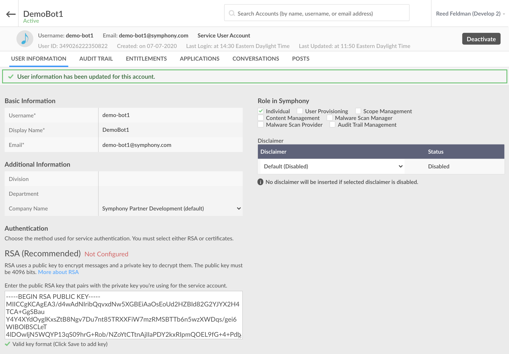
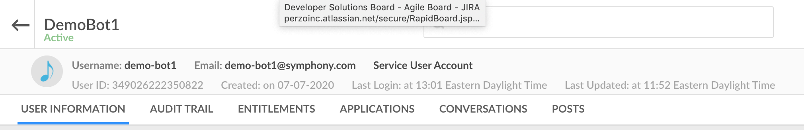

# Build a Chatbot using the Python SDK

The following is a step-by-step guide for building a Chatbot using the Python SDK and Symphony Bot Generator.  The Symphony Bot Generator is a Yeoman-based code generator that generates a project scaffold for the Symphony SDKs. You can use the Symphony Bot Generator for the following:

* RSA Key/Certificate creation
* Bot configuration
* Generate project structure
* Build of example projects

## Prerequisites

#### Install Symphony Bot Generator:

```text
$ npm install -g yo generator-symphony
```

## 1.  Generate Your Bot

To activate the Symphony Bot Generator:

```text
$ yo symphony
```

This will prompt you with a number of questions that you need to fill out according to your chatbots metadata.  Type in your bots metadata, use arrows to scroll, and press enter to move onto the next prompt.

```aspnet
/------------------------------------------/
/        SYMPHONY GENERATOR  1.1.1         /
/    by platformsolutions@symphony.com     /
/ (c) 2020 Symphony Communication Services /
/------------------------------------------/
? What do you want to create bot
? What is the name of your project demo-bot1
? What is your POD subdomain develop2
? What is your preferred programming language Python
? What is the BOT username demo-bot1
? What is the BOT email address demo-bot1@symphony.com
? What is your preferred encryption technology RSA - Generate New Keys
? Which template do you want to start with Request/Reply
* Generating bot Python code from Request/Reply template...
RSA - Generate New Keys
* Generating RSA public/private keys for BOT demo-bot1...
* BOT generated successfully!!
   create requirements.txt
   create python/main.py
   create python/listeners/connection_listener_impl.py
   create python/listeners/elements_listener_impl.py
   create python/listeners/im_listener_impl.py
   create python/listeners/room_listener_impl.py
   create resources/config.json
   create .env

```


Note: In this guide, we will select 'RSA - Generate New Keys'.  If you have preexisting RSA keys or wish to use certificates, select the other options.


Upon completion, the Symphony Bot Generator has created a public/private RSA key pair, a configuration and requirements file, and also datafeed event listeners.  

## 2. Configure your Bot

Once you have your generated Bot scaffold, the next step is to configure your Bot user:

Ensure that you or your admin has created a corresponding service account on the admin portal of your Symphony Pod.  Additionally, you must upload the generated public key onto the service account created:

```aspnet
$ cd demo-bot1
demo-bot1 $ ls
python			resources
requirements.txt	rsa

demo-bot1 $ cd rsa
rsa $ more rsa-public-demo-bot1.pem 
-----BEGIN RSA PUBLIC KEY-----
MIICCgKCAgEA3/d4wAdNIribQqvxdNw5XGBEiAaOsEoUd2HZBId82G2YJYX2H4TCA+GgSBau
Y4Y4XYdOyglKxsZtB8Ngv7Du7nt85TRXXFiW7mzRMSBTTb6n5wzXWDqs/gei6WIBOlBSCLeT
4lDOwIjN5WQYP13qS09hrG+Rob/NZoYtCTtnAjIIaPDY2kxRIpmQOEL9fG+4+PdbpjqhaJFg
PWe+ws3/bSK3QOt0yhFoND9bw+CUmhdV9/7q0H3s8Qnu5Lc/QDA8kok1yhFvGMtk/8jpnw2S
UAY6rnAv7rTDvK8l45phqw7FC4aul0r2CUnjZlVmN7WuMvTVeqxf9QdhosqDmP7BW9BaYnOP
ihq4xCLzCfiAqg36NhCXHW21taxQRLXu93+j3ZHGVTh1p0Tkz1Vb925W6c1THlehJDomzfDX
qCxV1pD3EW8R8osEbNUfuQ6K0Cdmi2f5T9cqRrAs0V8qZFrpYRUCtAWNiJoVK/BYtZoezt8M
VrEm80J2eQG6sGtgIMAycSXVzmOwNOHYejOgnDKkcHEYwgZ29wwBAAj9XavQ+2dy8GnAeYGL
QBzPToo620mTrP4kUQalqoWypDS3B8jzsh8YNRpUw2Jsd2wYgvwU1XmN5ZzSgCl68QGRgb9W
eIMZdsgrlDgVk6LSVGZbNu2aEDMbkI7DrR4UsOEr86XI4kkCAwEAAQ==
-----END RSA PUBLIC KEY----- 
```

Copy the entire contents of this public key including the dashes on either side, and handoff to your system admin or upload directly to the pod and click save:




Note: The Bot username and Bot email address entered to the Symphony Bot Generator must match exactly the Basic Information shown in the Pod above.


Open your generated Bot code in your favorite IDE and navigate to the config.json file:

```javascript
{
    "sessionAuthHost": "develop2.symphony.com",
    "sessionAuthPort": 443,
    "keyAuthHost": "develop2.symphony.com",
    "keyAuthPort": 443,
    "podHost": "develop2.symphony.com",
    "podPort": 443,
    "agentHost": "develop2.symphony.com",
    "agentPort": 443,
    "authType": "rsa",
    "botCertPath": "",
    "botCertName": "",
    "botCertPassword": "",
    "botPrivateKeyPath": "../rsa/",
    "botPrivateKeyName": "rsa-private-demo-bot1.pem",
    "botUsername": "demo-bot1",
    "botEmailAddress": "demo-bot1@symphony.com",
    "appCertPath": "",
    "appCertName": "",
    "appCertPassword": "",
    "proxyURL": "",
    "proxyUsername": "",
    "proxyPassword": "",
    "authTokenRefreshPeriod": "30",
    "truststorePath": ""
}
```

Confirm that the sessionAuthHost, keyAuthHost, and agentHost matches the correct Pod, Key Manager, and Agent endpoints respectfully.  Again, confirm that the botUsername, and botEmailAddress matches the information entered in the admin portal on the Pod.  

## 3. Install Dependencies

First setup a Python virtual environment:

```aspnet
demo-bot1 $ python3 -m venv demoEnv
demo-bot1 $ source demoEnv/bin/activate

```

Install SDK and its child dependencies:

```aspnet
(demoEnv) demo-bot1 $ pip install -r requirements.txt

```

## 4.  Dive into the code

Let's take a look at the main\(\) function inside or python/main.py file:

Running this file accomplishes four things:

* Configures your Bot
* Authenticates your Bot
* Starts up the Bot's datafeed event service
* Adds custom event listeners/handlers to the Bot's datafeed event service



```python
import os
import sys
import asyncio
import logging
from pathlib import Path
from sym_api_client_python.configure.configure import SymConfig
from sym_api_client_python.auth.auth import Auth
from sym_api_client_python.auth.rsa_auth import SymBotRSAAuth
from sym_api_client_python.clients.sym_bot_client import SymBotClient
from listeners.im_listener_impl import IMListenerImpl
from listeners.room_listener_impl import RoomListenerImpl
from listeners.elements_listener_impl import ElementsListenerImpl


def configure_logging():
    log_dir = os.path.join(os.path.dirname(__file__), "logs")
    if not os.path.exists(log_dir):
        os.makedirs(log_dir, exist_ok=True)
    logging.basicConfig(
        filename=os.path.join(log_dir, 'bot.log'),
        format='%(asctime)s - %(name)s - %(levelname)s - %(message)s',
        filemode='w', level=logging.DEBUG
    )
    logging.getLogger("urllib3").setLevel(logging.WARNING)

def main():
    # Configure log
    configure_logging()

    # Load configuration
    configure = SymConfig('../resources/config.json')
    configure.load_config()

    # Authenticate based on authType in config
    if ('authType' not in configure.data or configure.data['authType'] == 'rsa'):
        print('Python Client runs using RSA authentication')
        auth = SymBotRSAAuth(configure)
    else:
        print('Python Client runs using certificate authentication')
        auth = Auth(configure)
    auth.authenticate()

    # Initialize SymBotClient with auth and configure objects
    bot_client = SymBotClient(auth, configure)

    # Initialize datafeed service
    datafeed_event_service = bot_client.get_async_datafeed_event_service()

    # Initialize listener objects and append them to datafeed_event_service
    # Datafeed_event_service polls the datafeed and the event listeners
    # respond to the respective types of events
    datafeed_event_service.add_im_listener(IMListenerImpl(bot_client))
    datafeed_event_service.add_room_listener(RoomListenerImpl(bot_client))

    # Create and read the datafeed
    print('Starting datafeed')
    try:
        loop = asyncio.get_event_loop()
        loop.run_until_complete(datafeed_event_service.start_datafeed())
    except (KeyboardInterrupt, SystemExit):
        None
    except:
        raise


if __name__ == "__main__":
    main()

```



As shown on lines 52-53, any event that occurs inside an IM or chatroom with the Bot will be passed as JSON objects to the event listeners.  The generated IMListenerImpl class is as follows: 



```python
import logging
from sym_api_client_python.clients.sym_bot_client import SymBotClient
from sym_api_client_python.listeners.im_listener import IMListener
from sym_api_client_python.processors.sym_message_parser import SymMessageParser


class IMListenerImpl(IMListener):
    def __init__(self, sym_bot_client):
        self.bot_client = sym_bot_client
        self.message_parser = SymMessageParser()

    async def on_im_message(self, im_message):
        logging.debug('IM Message Received')

        msg_text = self.message_parser.get_text(im_message)
        first_name = self.message_parser.get_im_first_name(im_message)
        stream_id = self.message_parser.get_stream_id(im_message)

        message = f'<messageML>Hello {first_name}, hope you are doing well!</messageML>'
        self.bot_client.get_message_client().send_msg(stream_id, dict(message=message))

    async def on_im_created(self, im_created):
        logging.debug('IM created', im_created)
        
```



Any events that happen within your Bot's scope will be read and captured by the Bot's datafeed.  Any events that happen inside of an IM with the Bot will be parsed and directed to its IM Listener.  Depending on the type of event, the corresponding IM Listener function will be called.  So if for example, you send a message to your Bot 1-1, that event will be captured and as a result the on\_im\_message\(\) will be executed.  

In this generated example, when an IM is sent to your Bot, it will capture the event, and reply to the user by calling the following function which corresponds to the 'Create Message' endpoint on the Symphony REST API: [https://developers.symphony.com/restapi/reference\#create-message-v4](https://developers.symphony.com/restapi/reference#create-message-v4)



```python
self.bot_client.get_message_client().send_msg()

```



## 5.  Run your Bot

Now that you have a firm grasp on the datafeed event handling process implemented by the Bot and Symphony SDK, lets start up our bot to see it in action:

```aspnet
(demoEnv) dmeo-bot1 $ python3 main.py

```

Navigate to Symphony and create an IM with your Bot:


As you can see, your Bot replied with the message shown in the IM Listener class.

## 6.  Implementing your own Functionality

Lets create help menu as a best practice shown in step 1 of the chatbot workflow: [Chatbot](../#1-kick-off-your-workflow)

First create a a processors folder inside your listeners folder and add the following to a new file called im\_processor.py:



```python
from sym_api_client_python.processors.message_formatter import MessageFormatter
from sym_api_client_python.processors.sym_message_parser import SymMessageParser

class IMProcessor:
    def __init__(self, bot_client):
        self.bot_client = bot_client
        self.message_formatter = MessageFormatter()
        self.sym_message_parser = SymMessageParser()
        #enter your bot's ID here:
        self.bot_id = "349026222350822"

    async def process(self, msg):
        msg_text = self.sym_message_parser.get_text(msg)
        mentions = self.sym_message_parser.get_mention_ids(msg)

        self.default_message = dict(message= """<messageML> Sorry, I didn't quite catch that. </messageML>""")
        self.help_message = dict(message= """<messageML>
                                        <h3>Hi! Use Demo Bot to assist with all your onboarding needs! You can try:</h3>
                                            <ul>
                                                <li><mention uid="{0}"/> /help</li>
                                                <li><mention uid="{0}"/> /onboard</li>
                                                <li><mention uid="{0}"/>/documentation</li>
                                                <li><mention uid="{0}"/> /clear</li>
                                                <li><mention uid="{0}"/> /finish</li>
                                            </ul>
                                </messageML>""".format(self.bot_id))
        if mentions and mentions[0] == self.bot_id:
            if msg_text[1] == "/help":
                await self.bot_client.get_message_client().send_msg_async(msg['stream']['streamId'], self.help_message)
            else:
                await self.bot_client.get_message_client().send_msg_async(msg['stream']['streamId'], self.default_message)

        else:
            await self.bot_client.get_message_client().send_msg_async(msg['stream']['streamId'], self.default_message)

```



  You'll need to replace self.bot\_id with your Bot's User ID which can be found in the admin portal: 



Import the IMProcessor class into your IMListener and add the process\(\) function to your on\_im\_message\(\) function:



```python
import logging
from sym_api_client_python.clients.sym_bot_client import SymBotClient
from sym_api_client_python.listeners.im_listener import IMListener
from sym_api_client_python.processors.sym_message_parser import SymMessageParser
from .processors.im_processor import IMProcessor

class IMListenerImpl(IMListener):
    def __init__(self, sym_bot_client):
        self.bot_client = sym_bot_client
        self.message_parser = SymMessageParser()
        self.im_processor = IMProcessor(self.bot_client)

    async def on_im_message(self, im_message):
        logging.debug('IM Message Received')

        msg_text = self.message_parser.get_text(im_message)
        first_name = self.message_parser.get_im_first_name(im_message)
        stream_id = self.message_parser.get_stream_id(im_message)

        await self.im_processor.process(im_message)

    async def on_im_created(self, im_created):
        logging.debug('IM created', im_created)
```



Next, start up your bot by running **python3 main.py** and test in a 1-1 chatroom:


