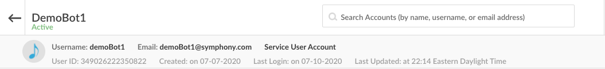

# Build a Chatbot using the SDKs

## Prerequisites

#### Complete the Bot Configuration guide

We will be using the **Request/Reply** example from the Bot Generator.



## Install Dependencies



```
mvn dependency:resolve
```



```bash
python3 -m venv ./venv
source ./venv/bin/activate
pip install -r requirements.txt
```



```
npm install
```



```
dotnet restore
```



## Dive into the code

Let's take a look at the logic inside the main file.

Running this file accomplishes four things:

* Configures your bot
* Authenticates your bot
* Starts up the bot's datafeed event service
* Adds custom event listeners to the bot's datafeed event service




```java
try {
    SymBotClient botClient = SymBotClient.initBotRsa("config.json");

    botClient.getDatafeedEventsService().addListeners(
        new IMListenerImpl(botClient),
        new RoomListenerImpl(botClient)
    );
} catch (Exception e) {
    log.error("Error", e);
}
```





```python
def main():
    configure_logging()

    configure = SymConfig('../resources/config.json')
    configure.load_config()

    if ('authType' not in configure.data or configure.data['authType'] == 'rsa'):
        print('Python Client runs using RSA authentication')
        auth = SymBotRSAAuth(configure)
    else:
        print('Python Client runs using certificate authentication')
        auth = Auth(configure)
    auth.authenticate()

    bot_client = SymBotClient(auth, configure)
    datafeed_event_service = bot_client.get_async_datafeed_event_service()

    datafeed_event_service.add_im_listener(IMListenerImpl(bot_client))
    datafeed_event_service.add_room_listener(RoomListenerImpl(bot_client))

    print('Starting datafeed')
    try:
        loop = asyncio.get_event_loop()
        loop.run_until_complete(datafeed_event_service.start_datafeed())
    except (KeyboardInterrupt, SystemExit):
        None
    except:
        raise
```





```javascript
Symphony.initBot(__dirname + '/config.json')
  .then((symAuth) => {
    Symphony.getDatafeedEventsService(botHearsSomething)
  })
```





```csharp
static void Main(string[] args)
{
    string filePath = Path.GetFullPath("config.json");
    SymBotClient symBotClient = new SymBotClient();
    DatafeedEventsService datafeedEventsService = new DatafeedEventsService();
    SymConfig symConfig = symBotClient.initBot(filePath);
    RoomListener botLogic = new BotLogic();
    DatafeedClient datafeedClient = datafeedEventsService.init(symConfig);
    Datafeed datafeed = datafeedEventsService.createDatafeed(symConfig, datafeedClient);
    datafeedEventsService.addRoomListener(botLogic);
    datafeedEventsService.getEventsFromDatafeed(symConfig, datafeed, datafeedClient);
}
```




Events that occur inside an IM or room containing the bot will be passed as JSON objects to the event listeners. The sample Room Listener implementation for this Request/Reply example are as follows:




```java
public class RoomListenerImpl implements RoomListener {
    private SymBotClient botClient;

    public RoomListenerImpl(SymBotClient botClient) {
        this.botClient = botClient;
    }

    public void onRoomMessage(InboundMessage msg) {
        OutboundMessage msgOut = new OutboundMessage("Hi " + msg.getUser().getFirstName() + "!");
        botClient.getMessagesClient().sendMessage(msg.getStream().getStreamId(), msgOut);
    }

    public void onUserJoinedRoom(UserJoinedRoom userJoinedRoom) {
        OutboundMessage msgOut = new OutboundMessage("Welcome " + userJoinedRoom.getAffectedUser().getFirstName() + "!");
        botClient.getMessagesClient().sendMessage(userJoinedRoom.getStream().getStreamId(), msgOut);
    }
    
    // ...
}
```





```python
class RoomListenerImpl(RoomListener):
    def __init__(self, sym_bot_client):
        self.bot_client = sym_bot_client
        self.message_parser = SymMessageParser()

    async def on_room_msg(self, room_message):
        logging.debug('Room Message Received')

        msg_text = self.message_parser.get_text(room_message)
        first_name = self.message_parser.get_im_first_name(room_message)
        stream_id = self.message_parser.get_stream_id(room_message)

        message = f'<messageML>Hello {first_name}, hope you are doing well!</messageML>'
        self.bot_client.get_message_client().send_msg(stream_id, dict(message=message))
    
    # ...
```





```javascript
const botHearsSomething = (event, messages) => {
  messages.forEach((message, index) => {
    let reply_message = 'Hello ' + message.user.firstName + ', hope you are doing well!!'
    Symphony.sendMessage(message.stream.streamId, reply_message, null, Symphony.MESSAGEML_FORMAT)
  })
}
```





```csharp
public class BotLogic : RoomListener
{
    public void onRoomMessage(Message inboundMessage)
    {
        string filePath = Path.GetFullPath("config.json");
        SymBotClient symBotClient = new SymBotClient();
        SymConfig symConfig = symBotClient.initBot(filePath);
        Message message2 = new Message();
        message2.message = "<messageML> Hi "+inboundMessage.user.firstName+"!</messageML>";
        MessageClient messageClient = new apiClientDotNet.MessageClient();
        messageClient.sendMessage(symConfig, message2, inboundMessage.stream);

    }
    // ...
}
```




Any events that happen within your Bot's scope will be read and captured by the Bot's datafeed. Any events that happen inside of an IM with the Bot will be parsed and directed to its IM Listener. Depending on the type of event, the corresponding IM Listener function will be called. So if for example, you send a message to your Bot 1-1, that event will be captured and as a result the on\_im\_message\(\) will be executed.

In this generated example, when an message is sent in a room containing your Bot, it will capture the event, and reply to the user by calling the following function which corresponds to the 'Create Message' endpoint on the Symphony REST API: [https://developers.symphony.com/restapi/reference\#create-message-v4](https://developers.symphony.com/restapi/reference#create-message-v4)



```java
OutboundMessage msg = new OutboundMessage("Hello")
botClient.getMessagesClient().sendMessage("streamId", msg);
```



```python
self.bot_client.get_message_client().send_msg('streamId', dict(message='Hello'))
```



```javascript
Symphony.sendMessage('streamId', 'Hello', null, Symphony.MESSAGEML_FORMAT)
```



```csharp
Message msg = new Message();
msg.message = "<messageML>Hello</messageML>";
new apiClientDotNet.MessageClient().sendMessage(symConfig, msg, stream);
```



## Run your Bot

Now that you have a firm grasp on the datafeed event handling process implemented by the bot and Symphony SDK, lets start up our bot to see it in action:



```
mvn compile exec:java -Dexec.mainClass=RequestReplyBot
```



```bash
python3 main.py
```



```
npm start
```



```
dotnet build
dotnet run
```



Navigate to Symphony, create a room and add your bot into that room. Then try sending a message into the room.


As you can see, your Bot replied with the message shown in the Room Listener implementation.

## Implementing your own Functionality

Lets create help menu as a best practice shown in step 1 of the chatbot workflow: [Chatbot](./#1-kick-off-your-workflow)

First create a a processors folder inside your listeners folder and add the following to a new file called im\_processor.py:



```python
from sym_api_client_python.processors.message_formatter import MessageFormatter
from sym_api_client_python.processors.sym_message_parser import SymMessageParser

class IMProcessor:
    def __init__(self, bot_client):
        self.bot_client = bot_client
        self.message_formatter = MessageFormatter()
        self.sym_message_parser = SymMessageParser()
        #enter your bot's ID here:
        self.bot_id = "349026222350822"

    async def process(self, msg):
        msg_text = self.sym_message_parser.get_text(msg)
        mentions = self.sym_message_parser.get_mention_ids(msg)

        self.default_message = dict(message= """<messageML> Sorry, I didn't quite catch that. </messageML>""")
        self.help_message = dict(message= """<messageML>
                                        <h3>Hi! Use Demo Bot to assist with all your onboarding needs! You can try:</h3>
                                            <ul>
                                                <li><mention uid="{0}"/> /help</li>
                                                <li><mention uid="{0}"/> /onboard</li>
                                                <li><mention uid="{0}"/>/documentation</li>
                                                <li><mention uid="{0}"/> /clear</li>
                                                <li><mention uid="{0}"/> /finish</li>
                                            </ul>
                                </messageML>""".format(self.bot_id))
        if mentions and mentions[0] == self.bot_id:
            if msg_text[1] == "/help":
                await self.bot_client.get_message_client().send_msg_async(msg['stream']['streamId'], self.help_message)
            else:
                await self.bot_client.get_message_client().send_msg_async(msg['stream']['streamId'], self.default_message)

        else:
            await self.bot_client.get_message_client().send_msg_async(msg['stream']['streamId'], self.default_message)
```




Check out our [Overview of MessageML](../../messages/overview-of-messageml.md) guide for more information on message formatting and styling.


On line 10, you'll need to replace self.bot\_id with your Bot's User ID which can be found in the admin portal:



Import the IMProcessor class into your IMListener and add the process\(\) function to your on\_im\_message\(\) function:



```python
import logging
from sym_api_client_python.clients.sym_bot_client import SymBotClient
from sym_api_client_python.listeners.im_listener import IMListener
from sym_api_client_python.processors.sym_message_parser import SymMessageParser
from .processors.im_processor import IMProcessor

class IMListenerImpl(IMListener):
    def __init__(self, sym_bot_client):
        self.bot_client = sym_bot_client
        self.message_parser = SymMessageParser()
        self.im_processor = IMProcessor(self.bot_client)

    async def on_im_message(self, im_message):
        logging.debug('IM Message Received')

        msg_text = self.message_parser.get_text(im_message)
        first_name = self.message_parser.get_im_first_name(im_message)
        stream_id = self.message_parser.get_stream_id(im_message)

        await self.im_processor.process(im_message)

    async def on_im_created(self, im_created):
        logging.debug('IM created', im_created)
```



Next, start up your bot by running **python3 main.py** and test in a 1-1 IM:


**For an in depth video tutorial visit our "Developing Bots & Apps" course as apart of our Developer Certification program:**

