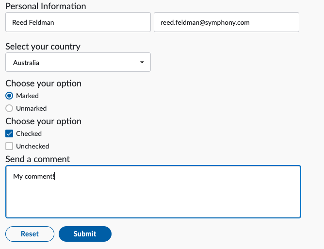

# Interactive Bot

Interactive Bots are a form of Chatbot where the conversational flow is driven by Symphony Elements. Instead of listening for plain text as the only source of data, Interactive Bots can collect data or commands through structured forms.

Symphony Elements allow bots to send messages that contain interactive forms with pre-designed text fields, dropdown menus, person selectors, buttons and more. Additionally, Symphony Elements reuse Symphony's UX component libraries, enabling developers to easily create interactive bot messages that look and feel like they belong in Symphony.

To learn more about Symphony Elements navigate here:


[symphony-elements-1](../../messages/overview-of-messageml/symphony-elements-1/)


## Interactive Bot Workflow

## 1.  Kick off your Workflow

Users can interact with chatbots in chatrooms, MIMs, and IMs. In order to initiate your Interactive Bot's workflow we recommend that users @mention the bot's username in order to get the bot's attention and signal to the bot to begin its intended function. That way, bots can be active members of chatrooms or MIMs, but eliminate noise that is outside the scope of its intended workflow.

It is common for bots to contain multiple commands or sub workflows that it can action upon. It is best practice to list these commands in a help menu. Additionally, it is best practice for all commands to follow a "/" so that it's clear what text is meant to be processed as a command. The following illustrates these best practices:


## 2. Listen for Events

A core aspect of all Interactive Bots is the ability to 'listen' to different types of commands and events and reply to them accordingly. The mechanism that enables Symphony Bots to listen to events in chatrooms, MIMs, and IMs is the **Symphony Datafeed**.

The **Symphony Datafeed** is a real-time message and event stream that can be created using the REST API. The datafeed provides a secure stream of messages and events from all conversations that a bot is in.

In order to 'listen' and respond to user events, bots create a single datafeed and subsequently have access to all chatroom activity including non-chat based events such as users being added/removed from chatrooms, external connection requests, and chatrooms, MIMs, IMs being created..

To learn more about the Symphony Datafeed continue here:


[datafeed](../../datafeed/)


When an end-user submits a Symphony Element form, the bot is able to access the contents of that form through the Symphony Datafeed. The Symphony Elements form lifecycle is illustrated below:

First an Interactive Bot sends a Symphony Element which is an extension of messageML:

```markup
<messageML>
  <form id="form_id"><h4>Personal Information</h4>
    <text-field name="name_01" required="true" placeholder="Name"/>
    <text-field name="email_01" required="true" placeholder="email"/>

    <h4>Select your country</h4>
    <select name="country">
    <option value="opt1">Australia</option>
    <option value="opt2">Brazil</option>
    <option value="opt3">China</option>
    <option value="opt4">Denmark</option>
    <option value="opt5">Ecuador</option>
    <option value="opt6">France</option>
    <option value="opt7">Germany</option>
    <option value="opt8">Italy</option>
    <option value="opt9">Japan</option>
    </select>

    <h4>Choose your option</h4>            
    <radio name="example_radio" value="option_01" checked="true">Marked</radio>
    <radio name="example_radio" value="option_02">Unmarked</radio>

    <h4>Choose your option</h4>
    <checkbox name="checkbox_1" value="value01" checked="true">Checked</checkbox>
    <checkbox name="checkbox_2" value="value02">Unchecked</checkbox>

    <h4>Send a comment</h4>
    <textarea name="comment" placeholder="Add your comment here" required="true"></textarea>

    <button type="reset">Reset</button>
    <button name="submit_button" type="action">Submit</button>

  </form>
</messageML>
```

The messageML is sent by your Bot and rendered as a form or Symphony Element:[  \
](https://app.gitbook.com/@symphony-1/s/symphony-developers-documentation/building-bots-on-symphony/datafeed)



After the user fills out their information and clicks the 'Submit' button, the following payload is captured by the datafeed and delivered to the bot:

```javascript
{
    "id": "tkld79",
    "messageId": "iJXn_RBQwGmixJN94ZSfYn___oyx4HHubQ",
    "timestamp": 1594743557649,
    "type": "SYMPHONYELEMENTSACTION",
    "initiator": {
        "user": {
            "userId": 344147139494862,
            "firstName": "Reed",
            "lastName": "Feldman",
            "displayName": "Reed Feldman (SUP)",
            "email": "reed.feldman@symphony.com",
            "username": "reedUAT"
        }
    },
    "payload": {
        "symphonyElementsAction": {
            "stream": {
                "streamId": "IEj12WoWsfTkiqOBkATdUn___pFXhN9OdA",
                "streamType": "IM"
            },
            "formMessageId": "p1tZHt5dL8ZR5RPgl4TJ6X___oyx4sfxbQ",
            "formId": "form_id",
            "formValues": {
                "action": "submit_button",
                "name_01": "Reed Feldman",
                "email_01": "reed.feldman@symphony.com",
                "country": "opt1",
                "example_radio": "option_01",
                "checkbox_1": "value01",
                "comment": "My comment!"
            }
        }
    }
}
```

## 3.  Handle Events with Custom Business Logic

The next step of your Interactive Bot workflow is to introduce your bot's custom business logic. Now that you have access to the bot's events, messages, and elements payloads through the Symphony Datafeed, the next step is to create dedicated event listeners. Inside these listeners is where you parse messages and datafeed payloads, fetch data from external sources, manage conversation state, and make requests to Symphony's REST API in order to reply to users directly or performs administrative functions such as creating chatrooms.

You can learn more about parsing events and introducing custom business logic [here](../../datafeed/#handling-events).

## Next Steps:

Continue on to our [Getting Started with Interactive Bots](https://docs.developers.symphony.com/building-bots-on-symphony/planning-your-bot/interactive-bot/getting-started) guide in order to learn more about our development tools and appropriate development pathway for building your first Symphony Interactive Bot:


[getting-started.md](getting-started.md)

