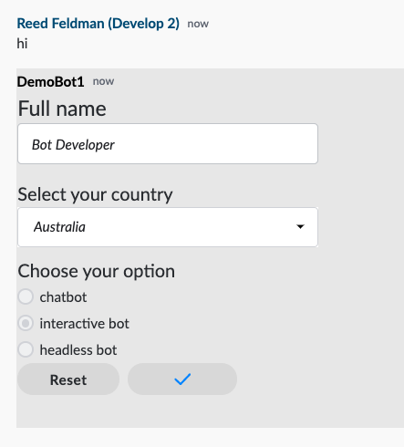

# Build an Interactive Bot using the Python SDK

## Prerequisites

### Complete the SDK Bot Configuration guide:



## 1.  Install Dependencies

First setup a Python virtual environment:

```aspnet
demoBot1 $ python3 -m venv demoEnv
demoBot1 $ source demoEnv/bin/activate
```

Install SDK and its child dependencies:

```aspnet
(demoEnv) demoBot1 $ pip install -r requirements.txt
```

## 2. Dive into the code

Let's take a look at the main\(\) function inside our python/main.py file:

Running this file accomplishes four things:

* Configures your Bot
* Authenticates your Bot
* Starts up the Bot's datafeed event service
* Adds custom event listeners/handlers to the Bot's datafeed event service



```python
import os
import sys
import asyncio
import logging
from pathlib import Path
from sym_api_client_python.configure.configure import SymConfig
from sym_api_client_python.auth.auth import Auth
from sym_api_client_python.auth.rsa_auth import SymBotRSAAuth
from sym_api_client_python.clients.sym_bot_client import SymBotClient
from listeners.im_listener_impl import IMListenerImpl
from listeners.room_listener_impl import RoomListenerImpl
from listeners.elements_listener_impl import ElementsListenerImpl


def configure_logging():
    log_dir = os.path.join(os.path.dirname(__file__), "logs")
    if not os.path.exists(log_dir):
        os.makedirs(log_dir, exist_ok=True)
    logging.basicConfig(
        filename=os.path.join(log_dir, 'bot.log'),
        format='%(asctime)s - %(name)s - %(levelname)s - %(message)s',
        filemode='w', level=logging.DEBUG
    )
    logging.getLogger("urllib3").setLevel(logging.WARNING)

def main():
    # Configure log
    configure_logging()

    # Load configuration
    configure = SymConfig('../resources/config.json')
    configure.load_config()

    # Authenticate based on authType in config
    if ('authType' not in configure.data or configure.data['authType'] == 'rsa'):
        print('Python Client runs using RSA authentication')
        auth = SymBotRSAAuth(configure)
    else:
        print('Python Client runs using certificate authentication')
        auth = Auth(configure)
    auth.authenticate()

    # Initialize SymBotClient with auth and configure objects
    bot_client = SymBotClient(auth, configure)

    # Initialize datafeed service
    datafeed_event_service = bot_client.get_async_datafeed_event_service()

    # Initialize listener objects and append them to datafeed_event_service
    # Datafeed_event_service polls the datafeed and the event listeners
    # respond to the respective types of events
    datafeed_event_service.add_im_listener(IMListenerImpl(bot_client))
    datafeed_event_service.add_room_listener(RoomListenerImpl(bot_client))

    # Create and read the datafeed
    print('Starting datafeed')
    try:
        loop = asyncio.get_event_loop()
        loop.run_until_complete(datafeed_event_service.start_datafeed())
    except (KeyboardInterrupt, SystemExit):
        None
    except:
        raise


if __name__ == "__main__":
    main()
```



As shown on lines 52-53, any event that occurs inside an IM or chatroom with the Bot will be passed as JSON objects to the event listeners. The generated IMListenerImpl class is as follows:



```python
import logging
from sym_api_client_python.clients.sym_bot_client import SymBotClient
from sym_api_client_python.listeners.im_listener import IMListener
from sym_api_client_python.processors.sym_message_parser import SymMessageParser


class IMListenerImpl(IMListener):
    def __init__(self, sym_bot_client):
        self.bot_client = sym_bot_client
        self.message_parser = SymMessageParser()

    async def on_im_message(self, im_message):
        logging.debug('IM Message Received')

        msg_text = self.message_parser.get_text(im_message)
        first_name = self.message_parser.get_im_first_name(im_message)
        stream_id = self.message_parser.get_stream_id(im_message)

        message = f'<messageML>Hello {first_name}, hope you are doing well!</messageML>'
        self.bot_client.get_message_client().send_msg(stream_id, dict(message=message))

    async def on_im_created(self, im_created):
        logging.debug('IM created', im_created)
```



Any events that happen within your Bot's scope will be read and captured by the Bot's datafeed. Any events that happen inside of an IM with the Bot will be parsed and directed to its IM Listener. Depending on the type of event, the corresponding IM Listener function will be called. So if for example, you send a message to your Bot 1-1, that event will be captured and as a result the on\_im\_message\(\) will be executed.

In this generated example, when an IM is sent to your Bot, it will capture the event, and reply to the user by calling the following SDK function, which corresponds to the 'Create Message' endpoint on the Symphony REST API: [https://developers.symphony.com/restapi/reference\#create-message-v4](https://developers.symphony.com/restapi/reference#create-message-v4)



```python
self.bot_client.get_message_client().send_msg()
```



## 3.  Adding our own functionality

Since we are building an Interactive Bot, instead of sending only text, our Bot will also send Symphony Elements. An interactive bot can send Symphony elements by calling the method used above since Symphony Elements are just messageML. Let's construct a form in order to capture user name, country, and type of bot being built.


Note: In order to for a Symphony Element to be considered valid, it must contain opening and closing &lt;form&gt; tags and also a &lt;button&gt; with type="action"


```markup
<messageML> 
    <form id="form_id"> 
        <h2>Full name</h2>
        <text-field name="name_01" required="true" />

        <h4>Select your country</h4>
        <select name="Country">
            <option value="opt1">Australia</option>
            <option value="opt2">Brazil</option>
            <option value="opt3">China</option>
            <option value="opt4">Denmark</option>
            <option value="opt5">Ecuador</option>
            <option value="opt6">France</option>
            <option value="opt7">Germany</option>
            <option value="opt8">Italy</option>
            <option value="opt9">Japan</option>
        </select>

        <h4>Choose your option</h4>            
        <radio name="chatbot" value="chatbot" checked="false">Marked</radio>
        <radio name="interactive bot" value="interactive bot" checked="true">Unmarked</radio>
        <radio name="headless bot" value="headless bot" checked="false">Unmarked</radio>


        <button type="reset">Reset</button>
        <button name="submit_button" type="action">Submit</button>

    </form>
</messageML>
```

Replace line 19 in your im\_listener\_impl.py with your newly constructed messageML form. Your listener should look like the following:

```python
import logging
from sym_api_client_python.clients.sym_bot_client import SymBotClient
from sym_api_client_python.listeners.im_listener import IMListener
from sym_api_client_python.processors.sym_message_parser import SymMessageParser


class IMListenerImpl(IMListener):
    def __init__(self, sym_bot_client):
        self.bot_client = sym_bot_client
        self.message_parser = SymMessageParser()

    async def on_im_message(self, im_message):
        logging.debug('IM Message Received')

        msg_text = self.message_parser.get_text(im_message)
        first_name = self.message_parser.get_im_first_name(im_message)
        stream_id = self.message_parser.get_stream_id(im_message)

        message = """<messageML> 
                        <form id="form_id"> 
                            <h2>Full name</h2>
                            <text-field name="name_01" required="true" />

                            <h4>Select your country</h4>
                            <select name="Country">
                                <option value="opt1">Australia</option>
                                <option value="opt2">Brazil</option>
                                <option value="opt3">China</option>
                                <option value="opt4">Denmark</option>
                                <option value="opt5">Ecuador</option>
                                <option value="opt6">France</option>
                                <option value="opt7">Germany</option>
                                <option value="opt8">Italy</option>
                                <option value="opt9">Japan</option>
                            </select>

                            <h4>Choose your option</h4>            
                            <radio name="chatbot" value="chatbot" checked="false">Marked</radio>
                            <radio name="interactive bot" value="interactive bot" checked="true">Unmarked</radio>
                            <radio name="headless bot" value="headless bot" checked="false">Unmarked</radio>

                            <button type="reset">Reset</button>
                            <button name="submit_button" type="action">Submit</button>

                        </form>
                    </messageML>"""
        self.bot_client.get_message_client().send_msg(stream_id, dict(message=message))

    async def on_im_created(self, im_created):
        logging.debug('IM created', im_created)
```


Note: Elements can be sent and received in chatrooms, MIMs, and IMs. However, Symphony Elements are handled separately than other Symphony events.

The Symphony SDKs have dedicated **Elements Listeners** to listen for and handle Symphony Elements submitted to your bot. Even though and end user submits and elements or form inside of an IM, the event **will not** be captured by the IM Listener class.


In order to handle datafeed events from Symphony Elements you have to add the Elements Listener to your datafeed listeners on line 54 of main.py:



```python
datafeed_event_service.add_elements_listener(ElementsListenerImpl(bot_client))
```



## 4.  Run your Bot

To see your Symphony Element or form rendered, run your Bot.

```python
(demoEnv) demoBot1 $ python3 main.py
```

Navigate to Symphony, create an IM with your Bot, and type any message to see the form rendered:



When you fill out the form and click submit, the datafeed handles the event and dispatches it to your ElementsListenerImpl class:



```python
import logging
from sym_api_client_python.clients.sym_bot_client import SymBotClient
from sym_api_client_python.listeners.elements_listener import ElementsActionListener


class ElementsListenerImpl(ElementsActionListener):
    def __init__(self, sym_bot_client):
        self.bot_client = sym_bot_client

    async def on_elements_action(self, action):
        logging.debug('Elements Action Recieved: {}'.format(json.dumps(action, indent=4)))
```



To see the contents of the form, check the logs:



```python
Elements Action Recieved: {
    "id": "AZMiKp",
    "messageId": "FzrzYWA-U_12AaqQfLuY_n___oyn4HF9bQ",
    "timestamp": 1594911329922,
    "type": "SYMPHONYELEMENTSACTION",
    "initiator": {
        "user": {
            "userId": 349026222344902,
            "firstName": "Reed",
            "lastName": "Feldman",
            "displayName": "Reed Feldman (Develop 2)",
            "email": "reed.feldman@symphony.com",
            "username": "reed.feldman@symphony.com"
        }
    },
    "payload": {
        "symphonyElementsAction": {
            "stream": {
                "streamId": "RUkxW4x40aB74g0UWpaMw3___ozLPsapdA",
                "streamType": "IM"
            },
            "formMessageId": "DRlrBfa6m5g7BeFP7xH48H___oyn4IdWbQ",
            "formId": "form_id",
            "formValues": {
                "action": "submit_button",
                "name_01": "asdf",
                "Country": "opt2",
                "interactive bot": "interactive bot"
            }
        }
    }
}
```



As you can see, the datafeed captures metadata about the form, the stream in which the form was submitted, the user who submitted it, and also the form values themselves.

**For an in depth video tutorial visit our "Developing Bots & Apps" course as apart of our Developer Certification program:**

