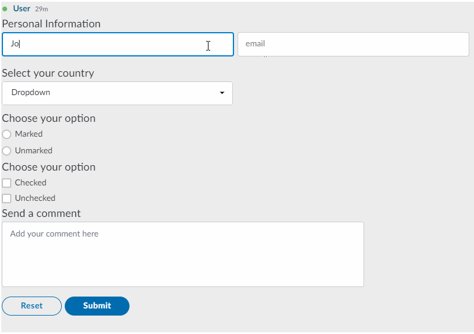

# Symphony Elements

Symphony Elements lets you reuse our standard UX component libraries to create rich workflows for your bots, without having to worry about complicated code and UI design.

Send bot messages that contain interactive forms with pre-designed text fields, dropdown menus, person selectors, buttons and more. Interactive forms allow messages to evolve in response to actions by users.

Elements provides developers with out-of-the-box tools to easily create interactive bot messages that look and feel like they belong in Symphony.

### The Elements

Symphony Elements are a library of pre-designed reusable UX components \(text fields, dropdown menus, person selectors, buttons and more\). You can use the Elements to create forms that enable Symphony users to interact graphically with bot messages.


## Known Limitations:


View our available Elements:



#### Symphony Elements x SDKs

With the upgrade to Symphony v20.3, any bot or application that utilizes Elements requires that customers have the Agent upgraded to 2.57.x, and also to confirm the SDK used to build the bot or application supports the new Elements payload. The Symphony-supported SDK versions are:

• Java SDK 1.1.1 or later  
• Python SDK 1.1.0 or later  
• NodeJS 1.1.1 or later

For customers who have developed their own SDK or have incorporated a third-party SDK, you must ensure that the SDK supports the modified JSON payload response. This is detailed in the Symphony API Specification located here [https://github.com/symphonyoss/symphony-api-spec/blob/20.3.1/agent/agent-api-public.yaml\#L3643](https://github.com/symphonyoss/symphony-api-spec/blob/20.3.1/agent/agent-api-public.yaml#L3643).

#### Symphony Elements with Cards

With Symphony v20.3, the usage of cards with Symphony Elements became possible. For more information, refer to our available elements:



