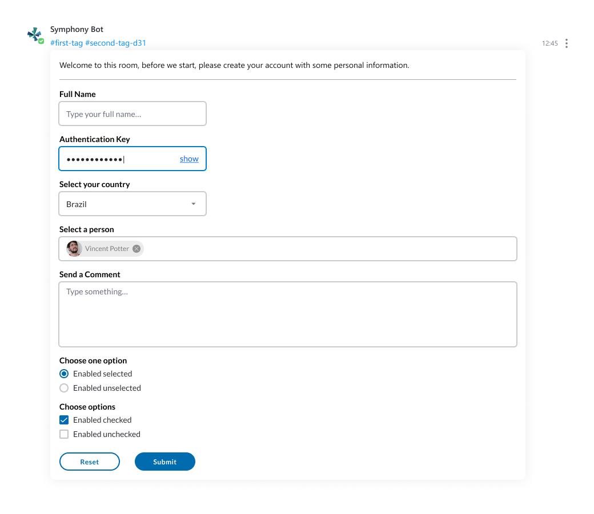

# Symphony Elements

Symphony Elements enable bots to send messages that contain interactive forms with pre-designed text fields, dropdown menus, person selectors, buttons and more.

By reusing our standard UX component libraries, Elements provide developers with out-of-the-box tools to easily create interactive bot messages that look and feel like they belong in Symphony.

### The Elements

Symphony Elements are a library of pre-designed reusable UX components \(text fields, dropdown menus, person selectors, buttons and more\). You can use the Elements to create forms that enable Symphony users to interact graphically with bot messages:


## Availability

* It is only available on pods that have been updated to 20.3.1 and running an Agent 20.3.1 \(2.57.0\) or above.
* It is allowed to be displayed in cross-pod rooms.
* Forms and their responses are exported in Content Export.
* Our iOS application \(versions 1.56.0 and above\) fully supports Symphony Elements.
* Our Android application fully supports Symphony Elements with Agent version 2.57.0 and above.



## Known Limitations

* User replies are not processed by DLP \(Data Loss Prevention\)
* In read-only rooms, only the owners of the room are able to interact with Symphony Elements. For non-owner users, messages with Elements will be disabled


**To begin leveraging Symphony Elements in your bot workflows continue onto our Available Elements guide:**



### Symphony Elements x SDKs

With the upgrade to Symphony v20.3, any bot or application that utilizes Elements requires that customers have the Agent upgraded to 2.57.x, and also to confirm the SDK used to build the bot or application supports the new Elements payload. The Symphony-supported SDK versions are:

• Java SDK 1.1.1 or later  
• Python SDK 1.1.0 or later  
• NodeJS 1.1.1 or later

For customers who have developed their own SDK or have incorporated a third-party SDK, you must ensure that the SDK supports the modified JSON payload response. This is detailed in the Symphony API Specification located here [https://github.com/symphonyoss/symphony-api-spec/blob/20.3.1/agent/agent-api-public.yaml\#L3643](https://github.com/symphonyoss/symphony-api-spec/blob/20.3.1/agent/agent-api-public.yaml#L3643).

### Symphony Elements with Cards

With Symphony v20.5, the usage of cards with Symphony Elements became possible.

