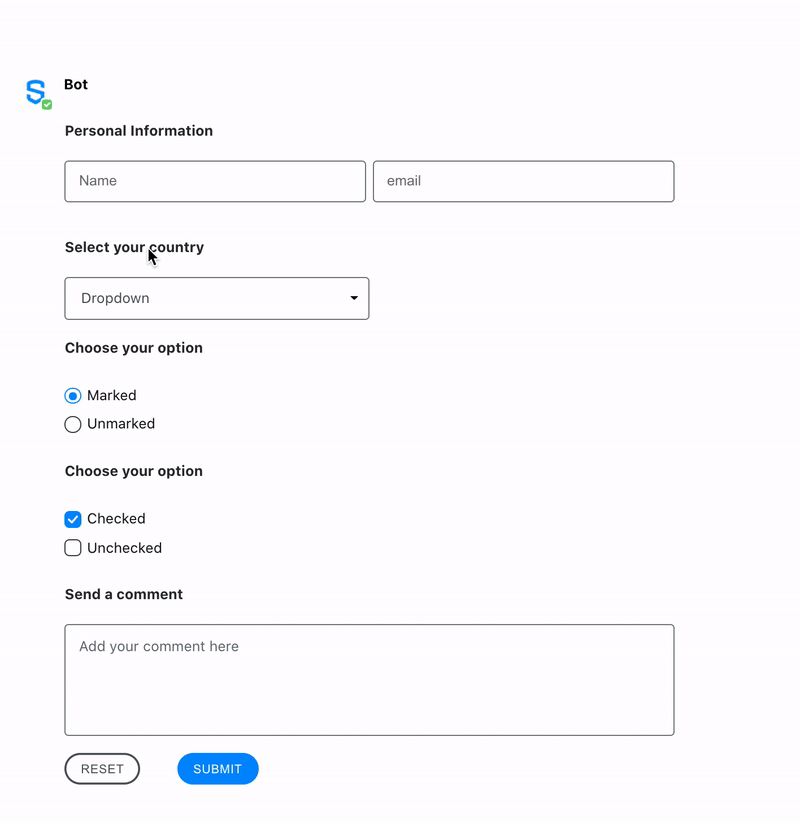

# Symphony Elements

Symphony Elements enable bots to send messages that contain interactive forms with pre-designed text fields, dropdown menus, person selectors, buttons and more.

By reusing our standard UX component libraries, Elements provide developers with out-of-the-box tools to easily create interactive bot messages that look and feel like they belong in Symphony.


### The Elements

Symphony Elements are a library of pre-designed reusable UX components \(text fields, dropdown menus, person selectors, buttons and more\). You can use the Elements to create forms that enable Symphony users to interact graphically with bot messages:




## Availability

* It is only available on pods that have been updated to 20.3.1 and running an Agent 20.3.1 \(2.57.0\) or above.
* Our iOS application \(versions 1.56.0 and above\) fully supports Symphony Elements.
* Our Android application fully supports Symphony Elements with Agent version 2.57.0 and above.
* If you are using a custom SDK to build your Bot, please note it needs to support the modified JSON payload response, see Symphony API Specification located here [https://github.com/symphonyoss/symphony-api-spec/blob/20.3.1/agent/agent-api-public.yaml\#L3643](https://github.com/symphonyoss/symphony-api-spec/blob/20.3.1/agent/agent-api-public.yaml#L3643). We advise you to upgrade to a supported Symphony SDK.



## Known Limitations

* Once the user has submitted the form, it becomes disabled. However, if the conversation is reloaded, the form resets and the user is able to send a new reply. If your workflow requires a single reply per user, please implement this control on the Bot side.
* In read-only rooms, only the owners of the room are able to interact with Symphony Elements. For non-owner users, messages with Elements will be disabled


**To begin leveraging Symphony Elements in your bot workflows continue onto our Available Elements guide:**



### Symphony Elements with Cards

You can include Symphony Elements inside Cards, both in the card `<header>` and the card `<body>.`

Note: the new expandable-card is available starting with Symphony v20.9

For more information regarding the usage of cards within the messageML, please refer to [Message Format - MessageML](../messages/overview-of-messageml/message-format-messageml.md)







```markup
<messageML>
  <form id="form_id">
    <h1>expandable-cards</h1>
      <h2>1st expandable-card</h2>
      <expandable-card state="collapsed">
        <header><h3>Header Content (always visible)</h3>This is a <b>collapsed</b> expandable-card with the <b>default</b> variant</header>
        <body>
          <h3>Body Content</h3>
          It is possible to use Elements in the body as you can see below:
          <text-field name="id1" placeholder="Enter your name..."/>
          <text-field name="id2" placeholder="Enter your age..."/>
          <button type="reset">Reset</button>
        </body>
      </expandable-card><br/>
      <h2>2nd expandable-card</h2>
      <expandable-card state="expanded">
        <header><h3>Header Content (always visible)</h3><text-field name="id_header" label="Text-field in the header" placeholder="Type your input..."/>This is an <b>expanded</b> expandable-card with the <b>default</b> variant and with a <b>Symphony Element</b> in the header</header>
        <body>
          <h3>Body Content</h3>
          When expanded, the whole body content is displayed in the expandable-card.
          <text-field name="id3" placeholder="Enter your name..."/>
          <text-field name="id4" placeholder="Enter your age..."/>
        </body>
      </expandable-card><br/>
      <h2>3rd expandable-card</h2>
      <expandable-card state="cropped">
        <header><h3>Header Content (always visible)</h3>This is a <b>cropped</b> expandable-card with the <b>error</b> variant</header>
        <body variant="error">
          <h3>Body Content</h3>
          When cropped, the body content is displayed in the expandable-card until a certain limit. A show more button allows to expand the card and display the rest of the body.
        </body>
      </expandable-card>
    <button name="form_id_submit">Submit</button>
  </form>
</messageML>
```




