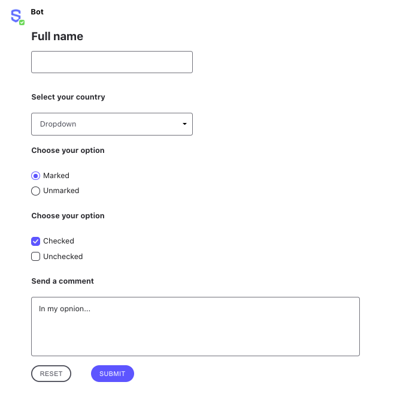

# Available Elements

Using Symphony Elements and the [Create Message](https://developers.symphony.com/restapi/reference#create-message-v4) API, developers can send bot messages that contain interactive forms with UX components such as text fields, radio buttons, checkboxes, person selectors and more.

## Sending Elements

Like any other message, Symphony Elements are sent by a bot as MessageML. To start using Symphony Elements, you first need to create a form element using the `<form>` MessageML tag. The form element can be considered the "frame" of a message, containing elements that will be sent by the bot and subsequently read by the datafeed.

Currently, all the available elements use a specific structure to render messages based on MessageML:

```markup
<messageML> 
    <form id="form_id"> 
        <h2>Full name</h2>
        <text-field name="name_01" required="true" />

        <h4>Select your country</h4>
        <select name="Country">
            <option value="opt1">Australia</option>
            <option value="opt2">Brazil</option>
            <option value="opt3">China</option>
            <option value="opt4">Denmark</option>
            <option value="opt5">Ecuador</option>
            <option value="opt6">France</option>
            <option value="opt7">Germany</option>
            <option value="opt8">Italy</option>
            <option value="opt9">Japan</option>
        </select>

        <h4>Choose your option</h4>            
        <radio name="example_radio" value="option_01" checked="true">Marked</radio>
        <radio name="example_radio" value="option_02">Unmarked</radio>

        <h4>Choose your option</h4> 
        <checkbox name="checkbox_1" value="value01" checked="true">Checked</checkbox>
        <checkbox name="checkbox_2" value="value02">Unchecked</checkbox>

        <h4>Send a comment</h4> 
        <textarea name="comment" placeholder="In my opnion..." required="true">In my opnion...</textarea>

        <button type="reset">Reset</button>
        <button name="submit_button" type="action">Submit</button>

    </form>
</messageML>
```

The messageML above is rendered as the following:



After completing and submitting the form, the following elements payload is generated and delivered to the bot via the datafeed:

```javascript
{
    "id": "4t8d4K",
    "messageId": "UpUnarQVI3EG4xYxtiShln___oyS8RCmbQ",
    "timestamp": 1595262562137,
    "type": "SYMPHONYELEMENTSACTION",
    "initiator": {
        "user": {
            "userId": 349026222344902,
            "firstName": "Reed",
            "lastName": "Feldman",
            "displayName": "Reed Feldman (Develop 2)",
            "email": "reed.feldman@symphony.com",
            "username": "reed.feldman@symphony.com"
        }
    },
    "payload": {
        "symphonyElementsAction": {
            "stream": {
                "streamId": "RUkxW4x40aB74g0UWpaMw3___ozLPsapdA",
                "streamType": "IM"
            },
            "formMessageId": "jyGfHa72wXhcQDq-hjch2H___oyS87G6bQ",
            "formId": "form_id",
            "formValues": {
                "action": "submit_button",
                "name_01": "Bot Developer ",
                "Country": "opt1",
                "example_radio": "option_01",
                "checkbox_1": "value01",
                "comment": "Sample comment"
            }
        }
    }
}
```

### **Currently available Symphony Elements:** 

* \*\*\*\*[**Form**](form.md)\*\*\*\*
* \*\*\*\*[**Buttons**](buttons.md)\*\*\*\*
* \*\*\*\*[**Checkbox**](checkbox.md)\*\*\*\*
* \*\*\*\*[**Dropdown Menu**](dropdown-menu.md)
* \*\*\*\*[**Text Area**](text-area.md)
* \*\*\*\*[**Radio Button**](radio-button.md)\*\*\*\*
* \*\*\*\*[**Person Selector**](person-selector.md)\*\*\*\*
* \*\*\*\*[**Text Field**](text-field.md)\*\*\*\*
* \*\*\*\*[**Tables**](table-select.md)\*\*\*\*
* \*\*\*\*[**Masked Text Field**](masked-text-field.md)\*\*\*\*

