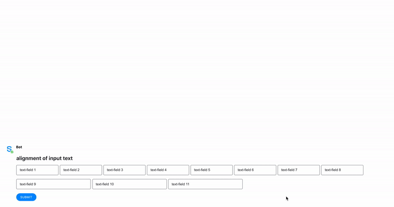

# Alignment of input texts

Text fields are grouped at a max of 4 per row, depending on the screen size. This number decreases until one per row as the screen gets smaller.

This rule is applied only for input texts such as [Text Field](text-field.md) and [Masked Text Field](masked-text-field.md).

The following image shows the behavior of the input texts as the screen gets smaller:

