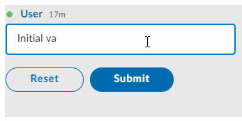

# Buttons

Buttons provide a direct call to action. Each button can trigger a reaction, being one of the most important elements.


## Attributes

| Attribute | Type | Required? | Description |
| :--- | :--- | :--- | :--- |
| `name` | String | Yes | Identifies the clicked button. |
| `type` | String | No  If `type` is not specified, the default value will be `type=”action”` | Indicates whether the button is an `action` button or a `reset` button. When clicked, the action button sends the form information to the datafeed. On the other hand, the reset button resets the form-data to its initial values.  Accepted values: `action` and `reset`. |

## Rules and Limitations

* By default, action buttons are blue with white outline and text, and should be used for affirmation or confirmation actions.
* Reset buttons are transparent with blue outline and text, and should be used when the content of the fields need to return to their original state.
* Reset buttons do not need name attributes

## Examples

The following example shows the use of the **Reset** and the **Submit** button when sending a text inserted in a [Text Field](text-field.md):





```markup
<messageML>
  <form id="form_id">
    <text-field name="text-field" placeholder="Add your comment here" required="true">Initial value</text-field>
    <button type="reset">Reset</button>
    <button name="submit_button" type="action">Submit</button>    
  </form>
</messageML>
```



```
{
    "id": "Qt19wS",
    "messageId": "9ZqMz_dSgpBsmBw-Y6G56n___oyR7N3nbQ",
    "timestamp": 1595279614488,
    "type": "SYMPHONYELEMENTSACTION",
    "initiator": {
        "user": {
            "userId": 344147139494862,
            "firstName": "Reed",
            "lastName": "Feldman",
            "displayName": "Reed Feldman (SUP)",
            "email": "reed.feldman@symphony.com",
            "username": "reedUAT"
        }
    },
    "payload": {
        "symphonyElementsAction": {
            "stream": {
                "streamId": "IEj12WoWsfTkiqOBkATdUn___pFXhN9OdA",
                "streamType": "IM"
            },
            "formMessageId": "6at-HcW92iKf9Hv2tbomdH___oyR7WaebQ",
            "formId": "form_id",
            "formValues": {
                "action": "submit_button",
                "text-field": "hello, my name is john smith"
            }
        }
    }
}
```



