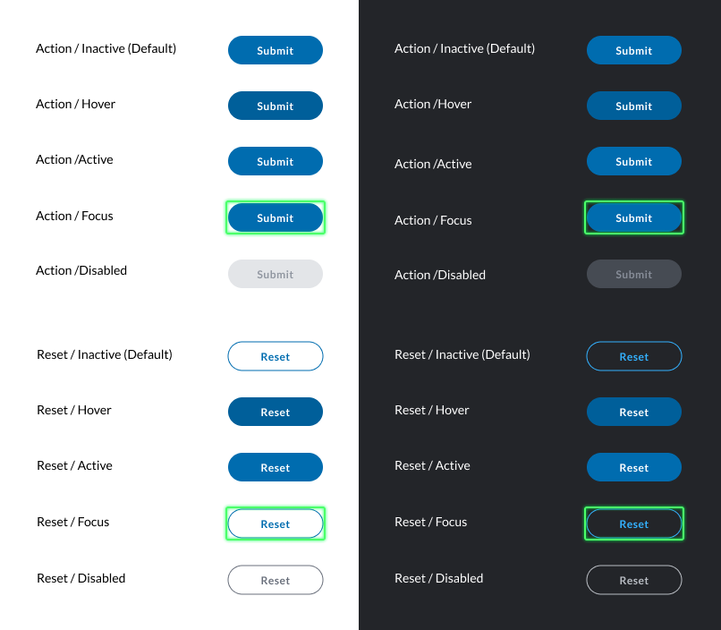

# Buttons

Buttons are the Symphony element responsible for submitting a form to the bot. As a result, all Symphony form elements are required to have at least one button where \`type=action\`. When an end-user clicks this button, the form and the contents inside will be submitted to the bot via the datafeed and presented as a JSON payload.

In addition, some forms can contain reset buttons. These buttons are used to reset a form back to its original state.



## Attributes

| Attribute | Type | Required? | Description |
| :--- | :--- | :--- | :--- |
| `name` | String | Yes | Identifies the clicked button. |
| `type` | String | No  If `type` is not specified, the default value will be `type=”action”` | Indicates whether the button is an `action` button or a `reset` button. When clicked, the action button sends the form information to the datafeed. On the other hand, the reset button resets the form-data to its initial values.  Accepted values: `action` and `reset`. |

## Rules and Limitations

* By default, action buttons are blue with white outline and text, and should be used for affirmation or confirmation actions.
* Reset buttons are transparent with blue outline and text, and should be used when the content of the fields need to return to their original state.

## Examples

The following example shows the use of the **Reset** and the **Submit** button when sending a text inserted in a [Text Field](text-field.md):




```markup
<messageML>
  <form id="form_id">
    <text-field name="text-field" placeholder="Add your comment here" required="true">Initial value</text-field>
    <button type="reset">Reset</button>
    <button name="submit_button" type="action">Submit</button>    
  </form>
</messageML>
```



```javascript
{
        "id": "UW2p27",
        "messageId": "4KrVjUU4gnGziWnlqMmD2n___oxo916XbQ",
        "timestamp": 1595966792040,
        "type": "SYMPHONYELEMENTSACTION",
        "initiator": {
            "user": {
                "userId": 7078106482890,
                "firstName": "User",
                "lastName": "Bot",
                "displayName": "User",
                "email": "user_bot@symphony.com",
                "username": "user_bot"
            }
        },
        "payload": {
            "symphonyElementsAction": {
                "stream": {
                    "streamId": "iMft6PLA4lHrEA9icKJobX___oyCKdVVdA",
                    "streamType": "ROOM"
                },
                "formMessageId": "zGeog3OqoYqVI2lwcX2o1X___oxo-A_ubQ",
                "formId": "form_id",
                "formValues": {
                    "action": "submit_button",
                    "text-field": "hello, my name is John Smith"
                }
            }
        }
    },
```



