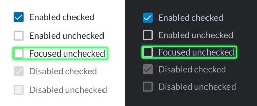
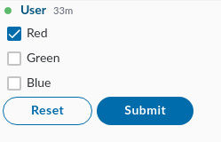

# Checkbox

The checkbox is an interactive box that can be toggled by the user to indicate an affirmative or negative choice.

When clicked, a checkmark \(✓\) appears inside the box, to indicate an affirmative choice \(yes\). When clicked again, the checkmark disappears, indicating a negative choice \(no\).

Checkboxes are used to let a user select one or more options from a limited number of choices. Frequently, a set of checkboxes represents a single question which the user can answer by selecting any number of possible answers.


Note: If you want the user to only be able to pick a single option, use the [Radio Button](radio-button.md) or the [Dropdown Menu](dropdown-menu.md) element.




## Attributes

| Attribute | Type | Required? | Description |
| :--- | :--- | :--- | :--- |
| `name` | String | Yes | Identifies the checkbox. |
| `value` | String | No | The `value` is the string that will be sent to the server. If the value is not specified, the string **on** will be sent by default. |
| `checked` | Boolean | No | If `true`, it specifies that the `<checkbox>` element should be pre-selected \(checked\) when the page loads. Accepted values: `true` and `false`. |

## Rules and Limitations

* The text node of the MessageML will be converted to the `<label>` tag. This will preserve the formatting tags `<i>` and `<b>`, if present.
* A form can have a maximum of 20 checkboxes within it.
* Once selected, checkboxes can be deselected by clicking them.
* Click the reset button to return the checkboxes to their original status \(checked or unchecked\).
* If a checkbox is sent without at least one checked option, it will not be displayed in the datafeed payload.

## Examples





```markup
<messageML>
  <form id="form_id">
    <checkbox name="id1" value="value01" checked="true">Red</checkbox>
    <checkbox name="id2" value="value02" checked="false">Green</checkbox>
    <checkbox name="id3" value="value03" checked="false">Blue</checkbox>
    <button type="reset">Reset</button>
    <button name="example-button" type="action">Submit</button>    
  </form>
</messageML>
```



```javascript
{
    "id": "3dtVXF",
    "messageId": "amKuCXE9wjfEFX7qQPzanX___oyR5rbWbQ",
    "timestamp": 1595280017705,
    "type": "SYMPHONYELEMENTSACTION",
    "initiator": {
        "user": {
            "userId": 344147139494862,
            "firstName": "Reed",
            "lastName": "Feldman",
            "displayName": "Reed Feldman (SUP)",
            "email": "reed.feldman@symphony.com",
            "username": "reedUAT"
        }
    },
    "payload": {
        "symphonyElementsAction": {
            "stream": {
                "streamId": "IEj12WoWsfTkiqOBkATdUn___pFXhN9OdA",
                "streamType": "IM"
            },
            "formMessageId": "BFawdKkxmV0ZQmSuIzgfTX___oyR5yO2bQ",
            "formId": "form_id",
            "formValues": {
                    "action": "example-button",
                    "id1": "value01",
                    "id2": "value02"
                }
        }
    }
}
```



