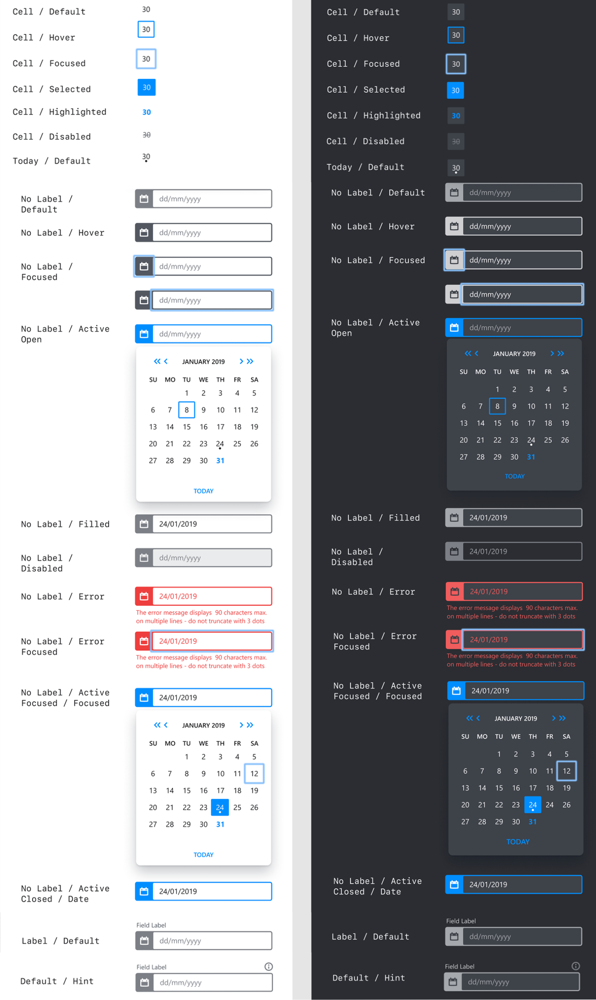
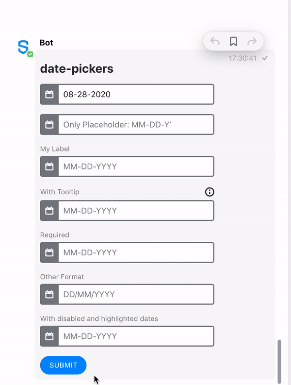

# Date Picker

Do you need users to pick a date as part of an interactive flow? With the Date Picker element, Symphony users can easily select a date from a calendar-style UI component.

The Date Picker offers to Symphony users the possibility to enter the date in two different ways:

* Populating the field directly with the keyboard, following the appropriate format
* Clicking on the wished day from the calendar UI in a monthly display

## MessageML tag

The Date Picker is represented by the **&lt;date-picker&gt;** tag, as you can see in the examples at the bottom of the page.

## Accessibility

For the purpose of accessibility, Symphony users can interact with the calendar UI with their keyboard:

* Using "Enter" to open/close the calendar UI
* Then using "Tab" to navigate in the different functionalities of the calendar: day selection; then "today" button; then "previous year" button; then "previous month" button; then "next month" button; then "next year" button; and finally going back to the day selection panel
* Once in the day selection area, using the arrows from the keyboard allows navigating in the month to select the right day
* Finally, using "Enter" allows to close the panel with the day selected or to trigger one of the functionalities selected \(buttons\)

In the day selection area, some more keyboard controls are available in the date picker:

* "Home" key: Moves focus to the first day \(e.g. Sunday\) of the current week
* "End" key: Moves focus to the last day \(e.g. Saturday\) of the current week
* "Page Up" key: Moves to the previous month, with focus on the same day of the same week \(or either previous or next week if it does not exist\)
* "Page Down" key: Moves to the next month, with focus on the same day of the same week \(or either previous or next week if it does not exist\)
* "Shift" + "Page Up" key: Moves to the previous year, with focus on the same day of the same week \(or either previous or next week if it does not exist\)
* "Shift" + "Page Down" key: Moves to the next year, with focus on the same day of the same week \(or either previous or next week if it does not exist\)

## Designs

You can see below the designs of the date picker.  
The main points to be highlighted are the following:

* A dot is displayed under the today date
* A disabled date is displayed in grey and stroke through
* An highlighted date is displayed in blue

For a list of all the available elements, refer to [Elements](./).



## Attributes

| Attribute | Type | Required? | Description |
| :--- | :--- | :--- | :--- |
| `name` | String | Yes | Identifies the date picker. |
| `value` | String `"yyy-MM-dd"` | No | Date with ISO\_8601 format to be displayed by default by the date picker when rendered for the Symphony user. Overrides the placeholder value. |
| `title` | String \(accepting `\n` for line break\) | No | The description that will be displayed when clicking the tooltip icon located on top of the date picker Element. |
| `label` | String | Not required but it is recommend if `title` is defined | Definition of the label that will be displayed on top of the date picker Element. |
| `required` | Boolean \(true or false\) | No | If `true`, it specifies that a date must be picked before submitting the form. |
| `placeholder` | String | No | Specifies a short hint that describes the expected format of the date picker. Accepts any string value but is overridden by the value if a value is entered. If not set, the accepted format will be displayed.  _Note: be careful as adding a placeholder might bring confusion to the end user. Therefore we recommend to use the default one as much as possible, to use the label if context is needed, or the title if instructions are needed._ |
| `min` | String `"yyy-MM-dd"` | No | Specifies the earliest acceptable date with ISO\_8601 format. |
| `max` | String `"yyy-MM-dd"` | No | Specifies the latest acceptable date with ISO\_8601 format. |
| `disabled-date` | Json array \(in a String format\) | No | Dates or ranges of dates that cannot be selected by the Symphony user. Maximum length of 1024 characters.  There are 3 different patterns: 1. range of date: {"from": "yyyy-MM-dd", "to": "yyyy-MM-dd"}, 2. date: {"day": "yyyy-MM-dd"}, 3. recurring day in the week: {"daysOfWeek": \[0, 1, 6\]},  **Important**: single quote `'` should wrap the xml parameter. See the examples below for more details.  _Note: for the `daysOfWeek`: 0 always corresponds to Sunday, 6 to Saturday._ See the examples below for more details. |
| `highlighted-date` | Json array \(in a String format\) | No | Dates or ranges of dates that are highlighted to the Symphony user. Maximum length of 1024 characters.  There are 3 different patterns: 1. range of date: {"from": "yyyy-MM-dd", "to": "yyyy-MM-dd"}, 2. date: {"day": "yyyy-MM-dd"}, 3. recurring day in the week: {"daysOfWeek": \[0, 1, 6\]},  **Important**: single quote `'` should wrap the xml parameter. See the examples below for more details.  _Note: for the `daysOfWeek`: 0 always corresponds to Sunday, 6 to Saturday._ See the examples below for more details. |
| `format` | String | No | Format in which the date will be displayed to or should be entered by the Symphony user. Only accepts the letters 'y', 'M', and 'd'. • 'd' defines the day of the month. It can be either 'd' or 'dd' to define the minimum of digits displayed \(i.e. corresponding to "3" or "03" for the third day\) • 'M' defines the month. Use one or two \('M' or 'MM'\) for the numerical month; three 'MMM' for the abbreviation \(i.e. "Sep"\); four 'MMMM' for the full name \(i.e. "September"\); or five 'MMMMM' for the narrow name \(i.e. "S"\) • 'y' defines the year. Use n of it to define n minimum of digits displayed \(i.e. use 'yyyyy' to display the year 2020 as 02020\)  _Note: be careful as many combinations may be possible, may have a weird display for the Symphony user, and are not restricted in the messageML. Therefore, we strongly recommend to use the default value as much as possible._ _Note 2: The format only impacts what the end user will see. It does not affect how you have to specify the value, disabled-date, highlighted-date, or the format of the response._ |

## Rules and Limitations

* The max length of any date picker attribute is 256 except `disabled-date` and `highlighted-date` attributes which max length is set to 1024 characters.
* The date picker is displayed differently to the end user depending on the language chosen in the settings specific of each user. _Please note that if a format is specified, then the format overrides the default format chosen based on the settings._
  * English: the calendar-UI is in English, the weeks start on Sunday, the default format is MM-dd-yyyy, and the date picker accepts value to be entered with the keyboard in English only \(i.e. August\)
  * French: the calendar-UI is in French, the weeks start on Monday, the default format is dd/MM/yyyy, and the date picker accepts value to be entered with the keyboard in French only \(i.e. Août\)
  * Japanese: the calendar-UI is in Japanese, the weeks start on Monday, the default format is yyyy日MM月dd年, and the date picker accepts value to be entered with the keyboard in Japanese only
* If the user enters the value of a valid day and month combination with his keyboard, then the current year is preselected. If he continues entering another year, then this last one will be selected.
* If the format entered by the user is not correct or if the date entered is a disabled date, then an error message is displayed to the user. _Note that it is not possible for the user to submit the form with an invalid format or disabled date._
* You can add a **default date** in your text field by including it in the value parameter. Please note that unlike the `placeholder` text, the **default date** will be sent in the formReply when the form is submitted if not edited by the user.


### Date as disabled and highlighted

Note that currently, if a date is entered in the disabled and highlighted parameters at the same time, it cannot be selected via the calendar UI first. However, it can be enabled if the user enters this particular date manually. This behaviour will be fixed in the next versions and the date will then be considered as disabled and displayed as such.


## Examples

The following examples show the date picker being used as follows:

* The first date-picker \(_init_\) shows how to display a **default date**, as an initial value is entered as parameter. Note that the default text will be sent to the payload given that it was not deleted before submitting the form.
* The second date-picker \(_placeholder_\) shows how a **placeholder** is displayed in the UI. Please note that any text is accepted as input. However, if you compare with the next date-pickers present in the form, you can notice that a default placeholder is generated \(with a hint of the correct format to accepted by the date-picker field\) in case no placeholder is mentioned in parameter.
* The third date-picker \(_label_\) shows how a **label** is displayed. In the GIF below, it shows also the interaction with the form when the user directly writes an input with an incorrect format: an error message is displayed and the form cannot be sent.
* The fourth date-picker \(_tooltip_\) shows how the **title** attribute is displayed. Note that when a user enters the month and the date in the correct format, the current year is automatically preselected. It can be modified if the user continues writing the year in the input field.
* The fifth date-picker \(_req_\) shows the behaviour of the unique **required** field of the form, which cannot be submitted in case it is not filled. Also note the use of the "today" button.
* The sixth date-picker \(_format_\) shows the way the placeholder evolves to adapt to a new **format** transmitted thanks to the format parameter. Also please note the accessible interaction with the date-picker via the keyboard.
* The seventh date-picker \(_rules_\) shows how to interact with the following parameters: **min**, **max**, **disabled**, and **highlighted**. Please note that a disabled date cannot be entered manually.





```markup
<messageML>
  <form id="form_id">
    <h2>date-pickers</h2>
      <date-picker name="init" value="2020-08-28"></date-picker>
      <date-picker name="placeholder" placeholder="Only Placeholder: MM-DD-YYYY"></date-picker>
      <date-picker name="label" label="My Label"></date-picker>
      <date-picker name="tooltip" label="With Tooltip" title="My Tooltip\n With a second line"></date-picker>
      <date-picker name="req" required="true" label="Required"></date-picker>
      <date-picker name="format" label="Other Format" format="dd/MM/yyyy"></date-picker>
      <date-picker name="rules" label="With disabled and highlighted dates" min="2021-01-04" max="2021-01-27" disabled-date='[{"from": "2021-01-13", "to": "2021-01-15"}, {"from": "2021-01-19", "to": "2021-01-21"}, {"day": "2021-01-06"}, {"daysOfWeek": [0,6]}]' highlighted-date='[{"day": "2021-01-05"}, {"day": "2021-01-26"}]' />
      <button name="date-picker">Submit</button>
  </form>
</messageML>
```



```
[
    {
        "id": "iMpXPu",
        "messageId": "q9zkRlpFCYtzPiJ1aoCuWH___okHkL4TbQ",
        "timestamp": 1610485809644,
        "type": "SYMPHONYELEMENTSACTION",
        "initiator": {
            "user": {
                "userId": 7078106482890,
                "firstName": "User",
                "lastName": "Bot",
                "displayName": "User",
                "email": "userbot@symphony.com",
                "username": "user_bot"
            }
        },
        "payload": {
            "symphonyElementsAction": {
                "stream": {
                    "streamId": "iiI-kbayOnMXCO-rb4hDN3___orZLc2XdA",
                    "streamType": "IM"
                },
                "formMessageId": "GZQEfj3SQ6UF_kPuqXo3eH___okIkJySbQ",
                "formId": "form_id",
                "formValues": {
                    "action": "date-picker",
                    "init": "2020-08-28",
                    "placeholder": "",
                    "label": "2021-01-16",
                    "tooltip": "2021-01-15",
                    "req": "2021-01-12",
                    "format": "2020-02-29",
                    "rules": "2021-01-05"
                }
            }
        }
    }
]
```



## Versions and Compatibility

| Main features introduced | Client release | Backward client-compatibility behavior \(e.g. external rooms\) | Agent needed to parse message sent by the bot |
| :--- | :--- | :--- | :--- |
| Initial release | 20.12 | Not working: date-picker is not displayed but the form can be sent | 20.12 |

