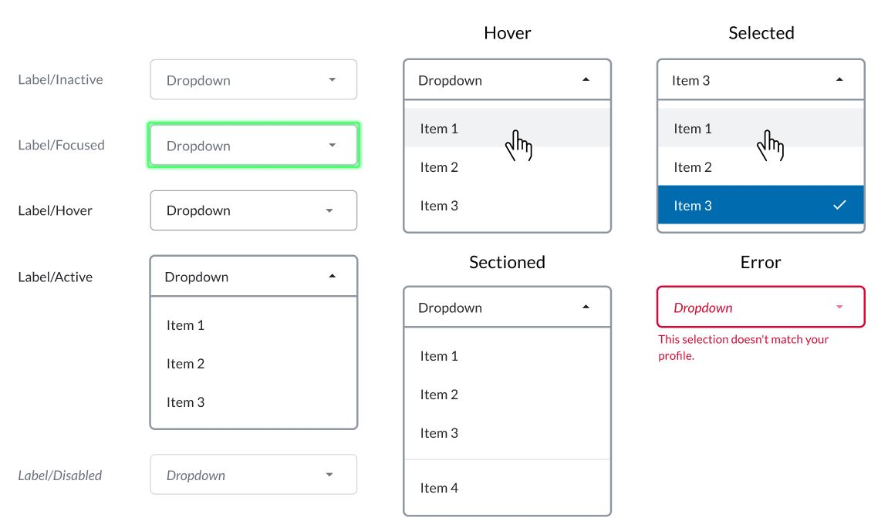
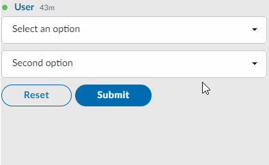

# Dropdown Menu

A dropdown menu **is a static list** of items that appears whenever a piece of text or a button is clicked. This is a graphical approach presented to users from which they can choose a value from the list presented.

A dropdown menu is also known as a pull-down menu, pull-down list, dropdown list or dropdown box.

The dropdown menu is represented by the &lt;select&gt; tag which provides a menu of &lt;options&gt;.  
Each &lt;option&gt; element should have a `value` attribute containing the data value to submit to the server when that option is selected; You can also include a `selected` attribute on an &lt;option&gt; element to make it selected by default when the page first loads.



## Attributes

| Attribute | Type | Required? | Description |
| :--- | :--- | :--- | :--- |
| `name` | String | Yes | Required attribute of the &lt;select&gt; tag. It identifies the dropdown menu. |
| `required` | Boolean | No | Optional attribute of the &lt;select&gt; tag. it is a Boolean attribute indicating that an option with a non-empty string value must be selected. |
| `value` | String | Yes | Required attribute of the &lt;option&gt; tag. It contains the data value to submit to the server when that option is selected. |
| `selected` | Boolean | Optional | You can include a selected attribute on an &lt;option&gt; element to make it selected by default when the page first loads. Accepted values: `true` and `false`. |
| `data-placeholder` | String | Optional | Text displayed in the dropdown menu before an option is selected. It can be a short hint or a title for the dropdown menu. |

## Rules and Limitations

The &lt;select&gt; tag:

* The &lt;select&gt; tag stands for our dropdown parent tag, which has &lt;options&gt; as its children; one for each select.
* Select tags only accept &lt;option&gt; tags as children. The &lt;select&gt; tag must contain at least one &lt;option&gt; tag.
* The only valid attributes of the &lt;select&gt; tag are `name` and `required`.

The &lt;option&gt; tag:

* The &lt;option&gt; tag cannot have other &lt;option&gt; tags as children. The only valid child of a &lt;option&gt; tag is a text node, which specifies the text that will be displayed for that option inside the dropdown menu. The text node is also required.
* The only valid attributes of the &lt;option&gt; tag are `value` and `selected`.
* Only one &lt;option&gt; of a given select can have the attribute `selected` as true.

If neither the `selected` or `data-placeholder` attributes are set, the default text \(title\) of the dropdown menu will be "Dropdown".


Message Size Limit:

When designing forms with dropdowns within it be aware that there is a chance of reach the characters limit if too many dropdown options are included in the message.  For more information about message size limits, refer to [messageML](../../messages/overview-of-messageml/message-format-messageml.md#message-size-limits)


## Examples





```markup
<messageML>
  <form id="form_01">
    <select name="example-select" required="true" data-placeholder="Select an option">
        <option value="opt1">First option</option>
        <option value="opt2">Second option</option>
        <option value="opt3">Third option</option>
    </select>
    <select name="example-select2" >
        <option value="opt1">First option</option>
        <option value="opt2" selected="true">Second option</option>
        <option value="opt3">Third option</option>
    </select>
    <button type="reset">Reset</button> 
    <button name="example-button" type="action">Submit</button>     
  </form>
</messageML>
```



```
{
    "id": "3dtVXF",
    "messageId": "amKuCXE9wjfEFX7qQPzanX___oyR5rbWbQ",
    "timestamp": 1595280017705,
    "type": "SYMPHONYELEMENTSACTION",
    "initiator": {
        "user": {
            "userId": 344147139494862,
            "firstName": "Reed",
            "lastName": "Feldman",
            "displayName": "Reed Feldman (SUP)",
            "email": "reed.feldman@symphony.com",
            "username": "reedUAT"
        }
    },
    "payload": {
        "symphonyElementsAction": {
            "stream": {
                "streamId": "IEj12WoWsfTkiqOBkATdUn___pFXhN9OdA",
                "streamType": "IM"
            },
            "formMessageId": "BFawdKkxmV0ZQmSuIzgfTX___oyR5yO2bQ",
            "formId": "form_id",
            "formValues": {
                    "action": "example-button",
                    "example-select": "opt1",
                    "example-select2": "opt2"
                }
        }
    }
}
```



