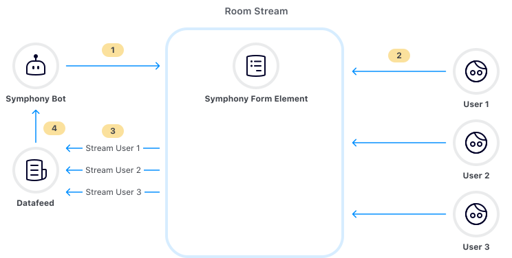
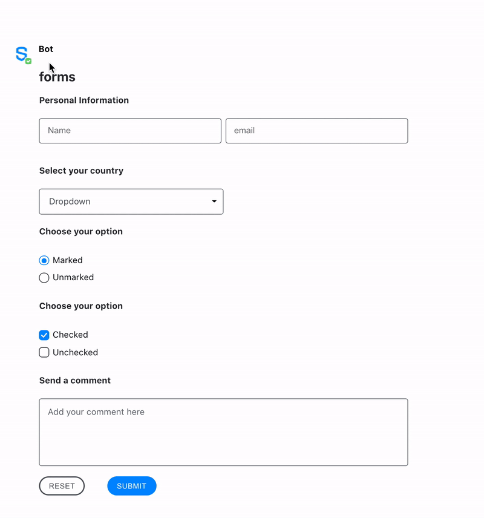

# Form

The form element can be considered the "frame" of a message, containing elements that will be sent by the bot and subsequently read by the datafeed.

All of the data within a form element will be sent to a bot via the datafeed when a user clicks one of the action buttons in that form. The `name` attribute of the button will be the value of the `action` field within the datafeed payload.  That way the bot manager can know which button triggered the submission of that form.

If there is more than one element in the form having the same `name` attribute, the value is converted to an array. Every index of the array is related to a specific element value. The index order is not guaranteed, so the developer needs to iterate through this array and collect the values.

## The Message Flow

Every message exists as part of a flow, in a continuum of events that results in user interaction.

Here is that flow in colorful diagram form, for you to know more about each stage of the message:



1. **A Bot sends a message with Symphony Elements in a form**
2. **The message/from is visible to users.  Users interact with the elements**
3. **Once submitted, the data is submitted to the bot**
4. **Bots can access the data, by reading the datafeed.** 

## Form Attributes

| **Attribute** | **Type** | **Required?** | **Description** |
| :--- | :--- | :--- | :--- |
| `id` | String | Yes | Identifies the form. |

## Rules and Limitations

* To be considered valid, the form tag must contain at least one action type "Button" as a child. For more information, refer to [Buttons](buttons.md).
* When a form is submitted, all the elements within it will be disabled, not being possible to edit or resend the same form. However, if the page is refreshed, you can fill out the form again and submit it as a new form.
* When designing forms, it is important to consider the message size limit. For more information refer to [MessageML - Message size limits.](../../messages/overview-of-messageml/message-format-messageml.md#message-size-limits)

## Examples

The following example shows a form being presented in MessageML. Also, you can see the returned datafeed payload:





```markup
<messageML>
  <form id="form_id">
    <h2>forms</h2>
    <h4>Personal Information</h4>
    <text-field name="name_01" required="true" placeholder="Name"/>
    <text-field name="email_01" required="true" placeholder="email"/>

    <h4>Select your country</h4>
    <select name="country">
    <option value="opt1">Australia</option>
    <option value="opt2">Brazil</option>
    <option value="opt3">China</option>
    <option value="opt4">Denmark</option>
    <option value="opt5">Ecuador</option>
    <option value="opt6">France</option>
    <option value="opt7">Germany</option>
    <option value="opt8">Italy</option>
    <option value="opt9">Japan</option>
    </select>

    <h4>Choose your option</h4>            
    <radio name="example_radio" value="option_01" checked="true">Marked</radio>
    <radio name="example_radio" value="option_02">Unmarked</radio>

    <h4>Choose your option</h4> 
    <checkbox name="checkbox_1" value="value01" checked="true">Checked</checkbox>
    <checkbox name="checkbox_2" value="value02">Unchecked</checkbox>

    <h4>Send a comment</h4> 
    <textarea name="comment" placeholder="Add your comment here" required="true"></textarea>
    
    <button type="reset">Reset</button>
    <button name="submit_button" type="action">Submit</button>

  </form>
</messageML>
```



```javascript
[
    {
        "id": "80Jvub",
        "messageId": "w5MM7WgArWpSB1yVhaeBvH___oxpIy9GbQ",
        "timestamp": 1595963920569,
        "type": "SYMPHONYELEMENTSACTION",
        "initiator": {
            "user": {
                "userId": 7078106482890,
                "firstName": "User",
                "lastName": "Bot",
                "displayName": "User",
                "email": "user_bot@symphony.com",
                "username": "user_bot"
            }
        },
        "payload": {
            "symphonyElementsAction": {
                "stream": {
                    "streamId": "iMft6PLA4lHrEA9icKJobX___oyCKdVVdA",
                    "streamType": "ROOM"
                },
                "formMessageId": "WnXgBsdZ_JMwg4ZKSeh-2X___oxpJE6WbQ",
                "formId": "form_id",
                "formValues": {
                    "action": "submit_button",
                    "name_01": "John",
                    "email_01": "john@email.com",
                    "country": "opt1",
                    "example_radio": "option_01",
                    "checkbox_1": "value01",
                    "checkbox_2": "value02",
                    "comment": "test"
                }
            }
        }
    }
]
```



