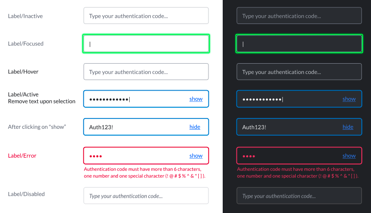
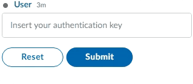

# Masked Text Field

The masked text input is a single-line plain text editor control in which the text is masked by replacing each character with a dot \(•\) symbol, providing a way for the user to enter data without people over their shoulder being able to see what they are entering.

Use the `maxlength` and `minlength` attributes to specify the maximum and minimum length of the value that can be entered.



## Attributes

| Attribute | Type | Required? | Description |
| :--- | :--- | :--- | :--- |
| `name` | String | Yes | Identifies the input content. |
| `placeholder` | String | No | Specifies a short hint that describes the expected value of the input field. |
| `required` | Boolean | No | If `true`, it specifies that the input field must be filled out before submitting the form. Accepted values; `true` and `false`. |
| `masked` | Boolean | Yes | In case you want to include a text field with masked characters \[hidden by asterisk \(\*\) symbols\] , you must set `masked`as true. If `true`, it creates a masked text field with hide/show options. |
| `maxlength` | Integer | No | The `maxlength` attribute allows you to specify a maximum number of characters that the user can input. |
| `minlength` | Integer | No | The `minlength` attribute allows you to specify a minimum number of characters that the user can input. |
| `pattern` | String | No | Regex String to match for input validation |
| `pattern-error-message` | String | No | Error message returned to user if `pattern` parameter matches user input |


For more information of pattern matching and input validation, see our guide on [Regular Expressions](../regular-expressions-regex.md).


## Rules and Limitations

* The masked text field has a max number of 128 characters.
* The masked text field must be a self-closing tag or have no children.
* The masked text field is a feature that only hides the content in the UI. Even though it is masked in the UI, the text will be submitted in clear and processed & encrypted the same way as any other text entered in Symphony.
* Compliance Officers have access to the content of the masked text field.

## Examples

The masked text field element is presented as a single-line text field whose characters are masked by dot \(•\) symbols. On the right side of the input, there is a link button called "show". When clicked, this link shows the entered characters. Note that after having displayed the characters, the link changes back to "hide".





```markup
<messageML>
  <form id="form_id">
    <text-field name="auth_key" placeholder="Insert your authentication key" required="true" masked="true" minlength="3" maxlength="40"></text-field>
    <button type="reset">Reset</button>
    <button name="example-button" type="action">Submit</button>    
  </form>
</messageML>
```



```javascript
{
    "id": "3dtVXF",
    "messageId": "amKuCXE9wjfEFX7qQPzanX___oyR5rbWbQ",
    "timestamp": 1595280017705,
    "type": "SYMPHONYELEMENTSACTION",
    "initiator": {
        "user": {
            "userId": 344147139494862,
            "firstName": "Reed",
            "lastName": "Feldman",
            "displayName": "Reed Feldman (SUP)",
            "email": "reed.feldman@symphony.com",
            "username": "reedUAT"
        }
    },
    "payload": {
        "symphonyElementsAction": {
            "stream": {
                "streamId": "IEj12WoWsfTkiqOBkATdUn___pFXhN9OdA",
                "streamType": "IM"
            },
            "formMessageId": "BFawdKkxmV0ZQmSuIzgfTX___oyR5yO2bQ",
            "formId": "form_id",
            "formValues": {
                "action": "example-button",
                "auth_key": "Byx*kjuygb#hghg265763"
                }
        }
    }
}
```



