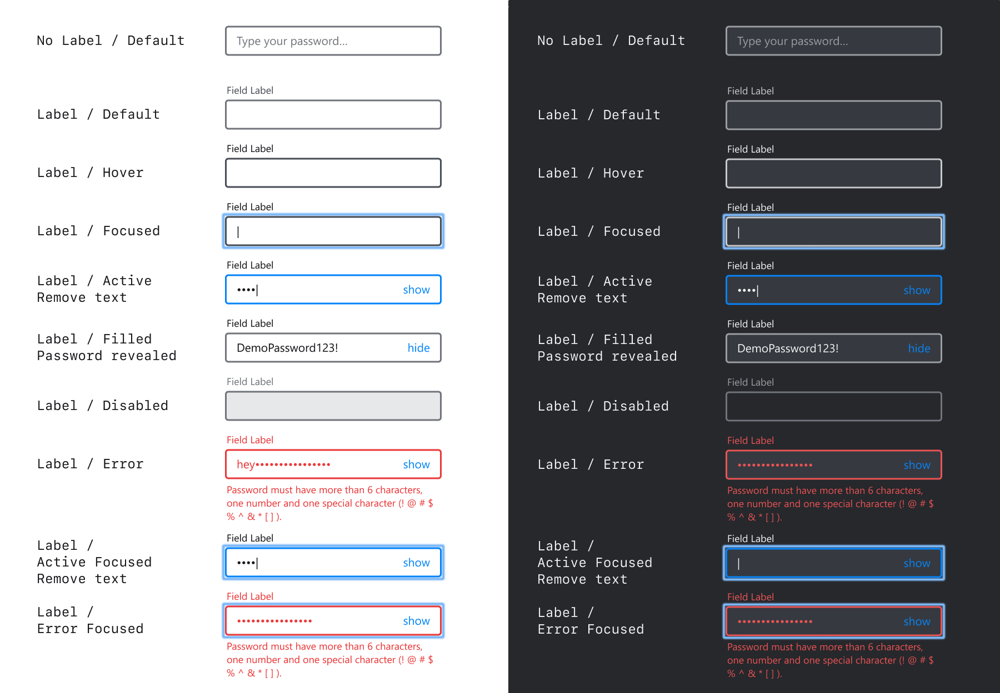
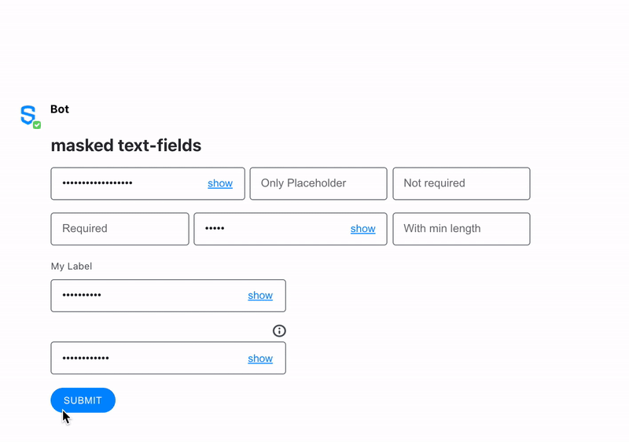

# Masked Text Field

The masked text input is a single-line plain text editor control in which the text is masked by replacing each character with a dot \(•\) symbol, providing a way for the user to enter data without people over their shoulder being able to see what they are entering.

Use the `maxlength` and `minlength` attributes to specify the maximum and minimum length of the value that can be entered.



## Attributes

| Attribute | Type | Required? | Description |
| :--- | :--- | :--- | :--- |
| `name` | String | Yes | Identifies the input content. |
| `placeholder` | String | No | Specifies a short hint that describes the expected value of the input field. |
| `required` | Boolean | No | If `true`, it specifies that the input field must be filled out before submitting the form. Accepted values; `true` and `false`. |
| `masked` | Boolean | Yes | In case you want to include a text field with masked characters \[hidden by asterisk \(\*\) symbols\] , you must set `masked`as true. If `true`, it creates a masked text field with hide/show options. |
| `maxlength` | Integer | No | The `maxlength` attribute allows you to specify a maximum number of characters that the user can input. |
| `minlength` | Integer | No | The `minlength` attribute allows you to specify a minimum number of characters that the user can input. |
| `pattern` | String | No | Regex String to match for input validation |
| `pattern-error-message` | String | No | Error message returned to user if `pattern` parameter matches user input |
| `title` | It accepts a simple text and `\n` for line breaks | No | The description that will be displayed when clicking the tooltip icon located on top of the Masked Text Field Element. Max length: 256 characters. Available from Symphony v20.8 and above. |
| `label` | String | Not required but it is recommended if `title` is defined | Definition of the label that will be displayed on top of the Masked Text Field Element. Available from Symphony v20.8 and above. |

## Using Input Validation

With Symphony v20.6, bot developers can use Regex to validate `text fields` and `text areas` using the `pattern` and `pattern-error-message` attributes.  
For more information and examples, refer to [Regular Expressions - Regex](../regular-expressions-regex.md).

## Rules and Limitations

* The masked text field has a max number of 128 characters.
* The masked text field must be a self-closing tag or have no children.
* The masked text field is a feature that only hides the content in the UI. Even though it is masked in the UI, the text will be submitted in clear and processed & encrypted the same way as any other text entered in Symphony.
* Compliance Officers have access to the content of the masked text field.

## Examples

The following examples show masked text-fields being used as follows:

* The first masked text-field \(_init_\) shows how to display a **default text** \("With initial value"\). Note that the default text would have been sent to the payload if it had not been deleted before submitting the form.
* The second masked text-field \(_placeholder_\) shows how a **placeholder text** \("Only Placeholder"\) is displayed in the UI. Please note the placeholder text is not masked nor sent in the payload if no text has been entered in the field by the enduser.
* The third masked text-field \(_noreq_\) shows how a user can interact with a **non-required** field. Even if the field is empty \(only a placeholder text is present but does not count as a value\), it does not prevent the enduser from submitting the form.
* The fourth masked text-field \(_req_\) shows the behaviour of the unique **required** field of the form, which cannot be submitted in case it is not filled; an error is displayed under the field in case the user submits the form with this empty field.
* The fifth masked text-field \(_regex_\) shows the behaviour of the field when a regex **pattern** is entered. You can note that the pattern-error-message is displayed under the field if the input does not follow the pattern required by the bot developer.
* The sixth masked text-field \(_min_\) shows how to force users to enter an input with a minimum number of characters, and how an error message is displayed under the field if the input does not respect the **minlength** required.
* The seventh masked text-field \(_label_\) shows how a **label text** \("My Label"\) is displayed.
* The eighth masked text-field \(_tooltip_\) shows how a **title text** \("My Tooltip/n With a second line"\) is inserted in the UI under the \(i\) icon, and how the text entered in the title parameter is displayed when the enduser clicks on the icon.





```markup
<messageML>
  <form id="form_id">
    <h2>masked text-fields</h2>
      <text-field masked="true" name="init">With initial value</text-field>
      <text-field masked="true" name="placeholder" placeholder="Only Placeholder"></text-field>
      <text-field masked="true" name="noreq" placeholder="Not required"></text-field>
      <text-field masked="true" name="req" required="true" placeholder="Required"></text-field>
      <text-field masked="true" name="regex" pattern="^[a-zA-Z]{3,3}$" pattern-error-message="My error message - must contain exactly 3 letters">Regex</text-field>
      <text-field masked="true" name="min" placeholder="With min length" minlength="3"></text-field>
      <text-field masked="true" name="label" label="My Label">With Label</text-field>
      <text-field masked="true" name="tooltip" title="My Tooltip\n With a second line">With Tooltip</text-field>
      <button name="maskedtext-field">Submit</button>
  </form>
</messageML>
```



```javascript
[
    {
        "id": "q6eUgG",
        "messageId": "NowSKCnJJBdPOXQyoPQg8X___pQDVWaBbQ",
        "timestamp": 1563312167294,
        "type": "SYMPHONYELEMENTSACTION",
        "initiator": {
            "user": {
                "userId": 7078106482890,
                "firstName": "User",
                "lastName": "Bot",
                "displayName": "User",
                "email": "user_bot@symphony.com",
                "username": "user_bot"
            }
        },
        "payload": {
            "symphonyElementsAction": {
                "actionStream": {
                    "streamId": "0YeiA-neZa1PrdHy1L82jX___pQjntU-dA"
                },
                "formStream": {
                    "streamId": "YuK1c2y2yuie6+UfQnjSPX///pQEn69idA=="
                },
                "formMessageId": "5iSJ+faXx/23Jkehx3lpSn///pQDVedXdA==5587",
                "formId": "form_id",
                "formValues": {
                    "action": "maskedtext-field",
                    "init": "",
                    "placeholder": "",
                    "noreq": "",
                    "req": "test",
                    "regex": "Reg",
                    "min6": "abc",
                    "label": "With Label",
                    "tooltip": "With Tooltip"
                }
            }
        }
    }
]
```



