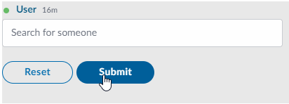

# Person Selector

The Person Selector is an element used for finding and selecting people. Person Selectors are used in many places within Symphony, so you should be familiar with how they work.

When a user types the person's name, a drop-down will be displayed with the results found for the data the user entered. The following example shows how three people with the same name \(Vincent\) have been found.


## Attributes

| Attribute | Type | Required? | Description |
| :--- | :--- | :--- | :--- |
| `name` | String | Yes | Identifies the person selector |
| `placeholder` | String | No | Specifies a short hint that describes the expected value of the input field. |
| `required` | Boolean | No | If `true`, it specifies that the person selector must be filled out before submitting the form, which means that at least one person must be "selected" Accepted values; `true` and `false`. |

## Rules and Limitations

The Person Selector element supports multi-user selection which means that you can search for more than one person using the same selector.

## Examples





```markup
<messageML> 
    <form id="form_id">
        <person-selector name="awesome-users" placeholder="Search for someone" required="true"/>
        <button type="reset">Reset</button>  
        <button name="example-button" type="action">Submit</button> 
    </form>    
</messageML>
```



```
{
    "id": "3dtVXF",
    "messageId": "amKuCXE9wjfEFX7qQPzanX___oyR5rbWbQ",
    "timestamp": 1595280017705,
    "type": "SYMPHONYELEMENTSACTION",
    "initiator": {
        "user": {
            "userId": 344147139494862,
            "firstName": "Reed",
            "lastName": "Feldman",
            "displayName": "Reed Feldman (SUP)",
            "email": "reed.feldman@symphony.com",
            "username": "reedUAT"
        }
    },
    "payload": {
        "symphonyElementsAction": {
            "stream": {
                "streamId": "IEj12WoWsfTkiqOBkATdUn___pFXhN9OdA",
                "streamType": "IM"
            },
            "formMessageId": "BFawdKkxmV0ZQmSuIzgfTX___oyR5yO2bQ",
            "formId": "form_id",
            "formValues": {
                    "action": "example-button",
                    "awesome-users": [
                        7078106482890
                    ]
                }
        }
    }
}
```



