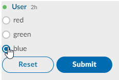

# Radio Button

Radio buttons are shown as small circles, which are filled or highlighted when selected. Only one radio button in a given group can be selected at the same time.

Frequently, a set of radio buttons represents a single question which the user can answer by selecting a possible answer.

Note: If you want the user to be able to select more than one option, use the [Checkbox](checkbox.md) element.


## Attributes

| Attribute | Type | Required? | Description |
| :--- | :--- | :--- | :--- |
| `name` | String | Yes | Identifies the radio button. |
| `value` | String | No | The `value` is the string that will be sent to the server. If the value is not specified, the string **on** will be sent by default. |
| `checked` | Boolean | No | If `true`, it specifies that the `<radio>` element should be pre-selected \(checked\) when the page loads. Accepted values: `true` and `false`. |

## Rules and Limitations

* The text node of the MessageML will be converted to the `<label>` tag. This will preserve the formatting tags `<i>` and `<b>`, if present.
* Radio buttons are presented in radio groups \(a collection of radio buttons describing a set of related options\). Only one radio button in a group can be selected at the same time. Note: The radio group must share the same name \(the value of the `name` attribute\) to be treated as a group. Once the radio group is created, selecting any radio button in that group automatically deselects any other selected radio button in the same group.
* A form can have a maximum of 50 radio buttons within it which means that you can have more than one radio group on a form but the total number of radios cannot be more than 50.
* Once the user has selected a radio option, it can be deselected only by clicking on another radio option. The only way to deselect all the radio options is by clicking the **reset** button.

## Examples





```markup
<messageML>
  <form id="form_id">
    <radio name="groupId" value="value01" checked="true">red</radio>
    <radio name="groupId" value="value02">green</radio>
    <radio name="groupId" value="value03">blue</radio>
    <button type="reset">Reset</button>
    <button name="example-button" type="action">Submit</button>    
  </form>
</messageML>
```



```javascript
{
    "id": "3dtVXF",
    "messageId": "amKuCXE9wjfEFX7qQPzanX___oyR5rbWbQ",
    "timestamp": 1595280017705,
    "type": "SYMPHONYELEMENTSACTION",
    "initiator": {
        "user": {
            "userId": 344147139494862,
            "firstName": "Reed",
            "lastName": "Feldman",
            "displayName": "Reed Feldman (SUP)",
            "email": "reed.feldman@symphony.com",
            "username": "reedUAT"
        }
    },
    "payload": {
        "symphonyElementsAction": {
            "stream": {
                "streamId": "IEj12WoWsfTkiqOBkATdUn___pFXhN9OdA",
                "streamType": "IM"
            },
            "formMessageId": "BFawdKkxmV0ZQmSuIzgfTX___oyR5yO2bQ",
            "formId": "form_id",
            "formValues": {
                    "action": "example-button",
                    "groupId": "value02"
                }
        }
    }
}
```



