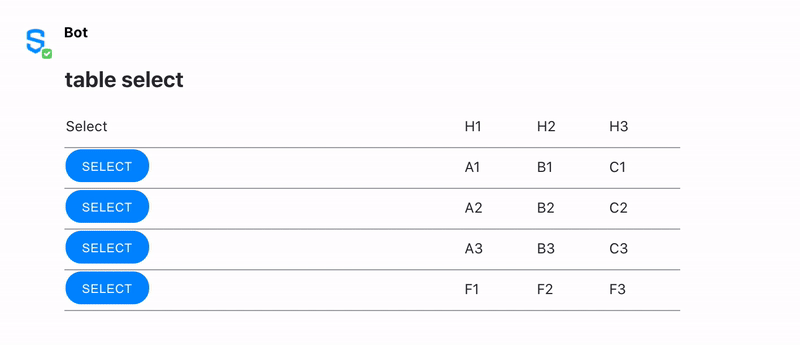

# Table Select

The Table Select is not an Element itself but an example of what can be achieved by using Elements with the [Apache FreeMarker](https://freemarker.apache.org/) templates. This way, it is possible to build tables which contain a special column that allows users to select one or more rows, either with the [Checkbox](checkbox.md) or the [Button](buttons.md) Element.

The following image shows three different tables. The first table shows the use of checkboxes to select rows, positioned to the right side of the table. The second example also shows checkboxes, but they are positioned to the left side. The last table shows buttons positioned to the right.


## Building a Table Select with Apache FreeMarker

The following example shows how to create a Table Select structure using the [FreeMarker](https://freemarker.apache.org/) template and a JSON file.

In the JSON data, you can configure the `type` of the Element that will be added to the Table Select and its `position`:

| Attribute | Type | Required? | Description |
| :--- | :--- | :--- | :--- |
| `type` | String | Yes | The `type`attribute determines if a table will display a special column with [Buttons](buttons.md) or [Checkboxes](checkbox.md) within it.  Note that a table can have only one of the two possible `types`, being **button** or **checkbox**. For more information, see the Example below. |
| `position` | String | Yes | This attribute indicates how the buttons and checkboxes must be aligned inside the column. Accepted values: `left` or `right`. For more information, refer to the JSON example below. |

In this example, the table `type` is set as `button` and the `position` is set as `left`.

Note that the [FreeMarker](https://freemarker.apache.org/) template is being used to create the messageML that is rendering the Table.





```markup
<#macro createSelectHeader>
    <#if data.select.type=='checkbox'>
        <td>
            <input type="checkbox" name="tablesel-header" />
        </td>
        <#elseif data.select.type='button'>
            <td>Select</td>
    </#if>
</#macro>
<#macro createSelectBody index>
    <#if data.select.type=='checkbox'>
        <td>
            <input type="checkbox" name="tablesel-row-${index}" />
        </td>
        <#elseif data.select.type='button'>
            <td>
                <button name="tablesel-row-${index}">SELECT</button>
            </td>
    </#if>
</#macro>
<#macro createSelectFooter>
    <#if data.select.type=='checkbox'>
        <td>
            <input type="checkbox" name="tablesel-footer" />
        </td>
        <#elseif data.select.type='button'>
            <td>
                <button name="tablesel-footer">SELECT</button>
            </td>
    </#if>
</#macro>
<messageML>
    <form id="example">
        <table>
            <#if data.header?has_content>
                <thead>
                    <tr>
                        <#if data.select.position=='left'>
                            <@createSelectHeader/>
                        </#if>
                        <#list data.header as row>
                            <#list row as cell>
                                <td>${cell}</td>
                            </#list>
                        </#list>
                        <#if data.select.position=='right'>
                            <@createSelectHeader/>
                        </#if>
                    </tr>
                </thead>
            </#if>
            <#list data.body>
                <tbody>
                    <#items as row>
                        <tr>
                            <#if data.select.position=='left'>
                                <@createSelectBody index="${row?counter}" />
                            </#if>
                            <#list row as cell>
                                <td>${cell}</td>
                            </#list>
                            <#if data.select.position=='right'>
                                <@createSelectBody index="${row?counter}" />
                            </#if>
                        </tr>
                    </#items>
                </tbody>
            </#list>
            <#if data.footer?has_content>
                <tfoot>
                    <tr>
                        <#if data.select.position=='left'>
                            <@createSelectFooter/>
                        </#if>
                        <#list data.footer as row>
                            <#list row as cell>
                                <td>${cell}</td>
                            </#list>
                        </#list>
                        <#if data.select.position=='right'>
                            <@createSelectFooter/>
                        </#if>
                    </tr>
                </tfoot>
            </#if>
        </table>
    </form>
</messageML>
```



```javascript
{
  "select": {
    "position": "left",
    "type": "button"
  },
  "header": [
    ["H1","H2","H3"]
  ],
  "body": [
    ["A1", "B1", "C1"],
    ["A2", "B2", "C2"],
    ["A3", "B3", "C3"]
  ],
  "footer": [
    ["F1","F2","F3"]
  ]
}
```



```markup
<messageML>
    <form id="example">
        <table>
            <thead>
                <tr>
                    <td>Select</td>
                    <td>H1</td>
                    <td>H2</td>
                    <td>H3</td>
                </tr>
            </thead>
            <tbody>
                <tr>
                    <td>
                        <button type="action" name="tablesel-row-1">SELECT</button>
                    </td>
                    <td>A1</td>
                    <td>B1</td>
                    <td>C1</td>
                </tr>
                <tr>
                    <td>
                        <button type="action" name="tablesel-row-2">SELECT</button>
                    </td>
                    <td>A2</td>
                    <td>B2</td>
                    <td>C2</td>
                </tr>
                <tr>
                    <td>
                        <button type="action" name="tablesel-row-3">SELECT</button>
                    </td>
                    <td>A3</td>
                    <td>B3</td>
                    <td>C3</td>
                </tr>
            </tbody>
            <tfoot>
                <tr>
                    <td>
                        <button type="action" name="tablesel-footer">SELECT</button>
                    </td>
                    <td>F1</td>
                    <td>F2</td>
                    <td>F3</td>
                </tr>
            </tfoot>
        </table>
    </form>
</messageML>
```



```javascript
{
    "id": "3dtVXF",
    "messageId": "amKuCXE9wjfEFX7qQPzanX___oyR5rbWbQ",
    "timestamp": 1595280017705,
    "type": "SYMPHONYELEMENTSACTION",
    "initiator": {
        "user": {
            "userId": 344147139494862,
            "firstName": "Reed",
            "lastName": "Feldman",
            "displayName": "Reed Feldman (SUP)",
            "email": "reed.feldman@symphony.com",
            "username": "reedUAT"
        }
    },
    "payload": {
        "symphonyElementsAction": {
            "stream": {
                "streamId": "IEj12WoWsfTkiqOBkATdUn___pFXhN9OdA",
                "streamType": "IM"
            },
            "formMessageId": "BFawdKkxmV0ZQmSuIzgfTX___oyR5yO2bQ",
            "formId": "form_id",
             "formValues": {
                    "action": "tablesel-row-1"
                }
        }
    }
}
```



## Rules and Limitations

* The table can be generated without header or footer.
* If the table `type` is equal to "checkbox", then checkboxes will be added to the rows of the table. 
* A checkbox can also be added in the header. Please note, clicking the checkbox in the header will not check all rows' checkboxes.
* If the table `type` is equal to "button", then buttons will be added to select a specific row of the table.
* When creating a MessageML using a [Freemarker](https://freemarker.apache.org/) template, you must send a JSON file with it.

