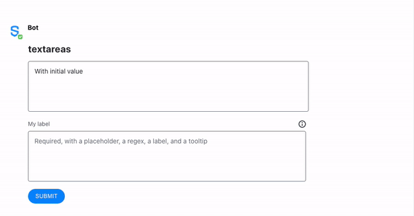

# Text Area

The `textarea` element is a field for multi-line text input, allowing users to edit multiple lines of plain text. Text areas are useful to collect or edit runs of text like messages, opinions, reviews, articles, etc.


## Attributes

| Attribute | Type | Required? | Description |
| :--- | :--- | :--- | :--- |
| `name` | String | Yes | Identifies the text area. |
| `placeholder` | String | No | Specifies a short hint that describes the expected value of the text area. |
| `required` | Boolean | No | If `true`, it specifies that the text area must be filled out before submitting the form. Accepted values; `true` and `false`. |
| `pattern` | String | No | Regex String to match for input validation |
| `pattern-error-message` | String | No | Error message returned to user if `pattern` parameter matches user input |
| `title` | It accepts a simple text and `\n` for line breaks | No | The description that will be displayed when clicking the tooltip icon located on top of the Masked Text Field Element. Max length: 256 characters. Available from Symphony v20.8 and above. |
| `label` | String | Not required but it is recommended if `title` is defined | Definition of the label that will be displayed on top of the Masked Text Field Element. Available from Symphony v20.8 and above. |

## Using Input Validation

With Symphony v20.6, bot developers can use Regex to validate `text fields` and `text areas` using the `pattern` and `pattern-error-message` attributes.  
For more information and examples, refer to Regular [Expressions - Regex](../regular-expressions-regex.md).

## Rules and Limitations

* The text field must be a self-closing tag or have no children.
* You can add a **default text** in your text area by including it between the `<textarea></textarea>` tags. Note that unlike the `placeholder` text, the **default text** will be sent with the form if not edited by the user. Refer to Examples for more information.

## Examples

The following example shows a text area being used.  
At the top of the Text Area, you can see a text and a tooltip icon, added using the `label` and the `title` attributes respectively.  
Then, we have a **placeholder text** \("Your opinion here"\) and a **default text** \("In my opinion"\) which was included between the `<textarea></textarea>` tags.  
Also, an input validation was added in order to prohibit the use of the word "badword".





```markup
<messageML>
  <form id="form_id">
    <h2>textareas</h2>
      <textarea name="id1" >With initial value</textarea>
      <textarea name="req" required="true" label="My label" title="My title\nWith second line" pattern="^[a-zA-Z]{3,3}$" pattern-error-message="My error message - must contain exactly 3 letters" placeholder="Required, with a placeholder, a regex, a label, and a tooltip"></textarea>
      <button name="textarea">Submit</button>
  </form>
</messageML>
```



```javascript
[
    {
        "id": "wPptaz",
        "messageId": "LI4WgwZSDcstpKjyeKvCH3___pQEQvHfbQ",
        "timestamp": 1563296599584,
        "type": "SYMPHONYELEMENTSACTION",
        "initiator": {
            "user": {
                "userId": 7078106482890,
                "firstName": "User",
                "lastName": "Bot",
                "displayName": "User",
                "email": "userbot@symphony.com",
                "username": "user_bot"
            }
        },
        "payload": {
            "symphonyElementsAction": {
                "actionStream": {
                    "streamId": "0YeiA-neZa1PrdHy1L82jX___pQjntU-dA"
                },
                "formStream": {
                    "streamId": "YuK1c2y2yuie6+UfQnjSPX///pQEn69idA=="
                },
                "formMessageId": "1P6z5kI6OzkxTKEoKOgWZ3///pQERpkYdA==5338",
                "formId": "form_id",
                "formValues": {
                    "action": "textarea",
                    "id1": "",
                    "req": "abc"
                }
            }
        }
    }
]
```



