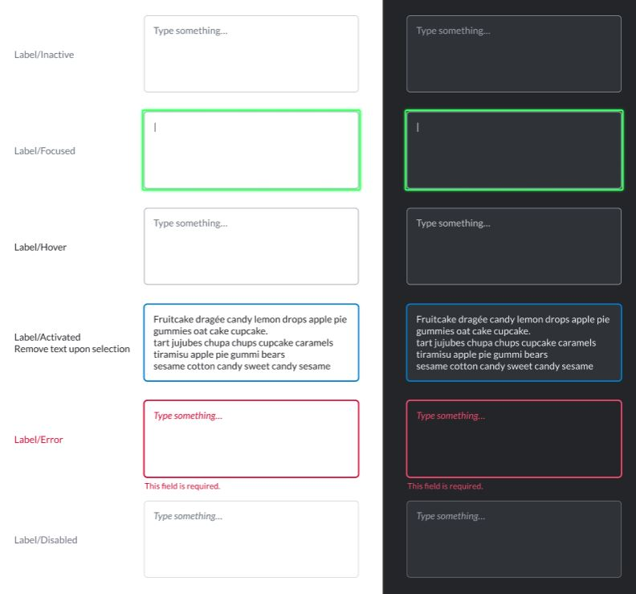
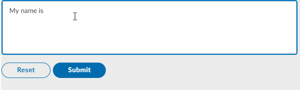

# Text Area

The `textarea` element is a field for multi-line text input, allowing users to edit multiple lines of plain text. Text areas are useful to collect or edit runs of text like messages, opinions, reviews, articles, etc.



## Attributes

| Attribute | Type | Required? | Description |
| :--- | :--- | :--- | :--- |
| `name` | String | Yes | Identifies the text area. |
| `placeholder` | String | No | Specifies a short hint that describes the expected value of the text area. |
| `required` | Boolean | No | If `true`, it specifies that the text area must be filled out before submitting the form. Accepted values; `true` and `false`. |

## Rules and Limitations

* The text field must be a self-closing tag or have no children.
* You can add a **default text** in your text area by including it between the `<textarea></textarea>` tags. Note that unlike the `placeholder` text, the **default text** will be sent with the form if not edited by the user. Refer to [Examples](https://developers.symphony.com/symphony-developer/docs/text-area#section-examples) for more information.

## Examples

The following example shows a text area being used. Note that we have a **placeholder text** \("Your name"\) and also a **default text** \("My name is"\) which was included between the `<textarea></textarea>` tags.





```markup
<messageML>
  <form id="form_id">
    <textarea name="id" placeholder="Your name" required="true">My name is</textarea>
    <button type="reset">Reset</button>  
    <button name="example-button" type="action">Submit</button>      
  </form>
</messageML>
```



```
{
    "id": "3dtVXF",
    "messageId": "amKuCXE9wjfEFX7qQPzanX___oyR5rbWbQ",
    "timestamp": 1595280017705,
    "type": "SYMPHONYELEMENTSACTION",
    "initiator": {
        "user": {
            "userId": 344147139494862,
            "firstName": "Reed",
            "lastName": "Feldman",
            "displayName": "Reed Feldman (SUP)",
            "email": "reed.feldman@symphony.com",
            "username": "reedUAT"
        }
    },
    "payload": {
        "symphonyElementsAction": {
            "stream": {
                "streamId": "IEj12WoWsfTkiqOBkATdUn___pFXhN9OdA",
                "streamType": "IM"
            },
            "formMessageId": "BFawdKkxmV0ZQmSuIzgfTX___oyR5yO2bQ",
            "formId": "form_id",
            "formValues": {
                    "action": "example-button",
                    "id": "my name is John Doe"
                }
        }
    }
}
```



