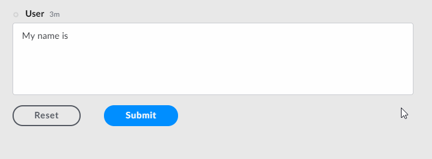

# Text Area

The `textarea` element is a field for multi-line text input, allowing users to edit multiple lines of plain text. Text areas are useful to collect or edit runs of text like messages, opinions, reviews, articles, etc.


## Attributes

| Attribute | Type | Required? | Description |
| :--- | :--- | :--- | :--- |
| `name` | String | Yes | Identifies the text area. |
| `placeholder` | String | No | Specifies a short hint that describes the expected value of the text area. |
| `required` | Boolean | No | If `true`, it specifies that the text area must be filled out before submitting the form. Accepted values; `true` and `false`. |
| `pattern` | String | No | Regex String to match for input validation |
| `pattern-error-message` | String | No | Error message returned to user if `pattern` parameter matches user input |


For more information of pattern matching and input validation, see our guide on [Regular Expressions](../regular-expressions-regex.md).  


## Using Input Validation

With Symphony v20.6, bot developers can use Regex to validate `text fields` and `text areas` using the `pattern` and `pattern-error-message` attributes.  
For more information and examples, refer to [Regular Expressions - Regex](../regular-expressions-regex.md).

## Rules and Limitations

* The text field must be a self-closing tag or have no children.
* You can add a **default text** in your text area by including it between the `<textarea></textarea>` tags. Note that unlike the `placeholder` text, the **default text** will be sent with the form if not edited by the user. Refer to Examples for more information.

## Examples

The following example shows a text area being used. Note that we have a **placeholder text** \("Your name"\) and a **default text** \("My name is"\) which was included between the `<textarea></textarea>` tags. Also, an input validation was added to the field in order to prohibit the use of the word "badword".





```markup
<messageML>
  <form id="form_id">
    <textarea name="id" placeholder="Your name" required="true" pattern="^((?!badword).)*$" pattern-error-message="forbbiden word: 'badword'">My name is</textarea>
    <button type="reset">Reset</button>  
    <button name="example-button" type="action">Submit</button>      
  </form>
</messageML>
```



```javascript
[
    {
        "id": "wPptaz",
        "messageId": "LI4WgwZSDcstpKjyeKvCH3___pQEQvHfbQ",
        "timestamp": 1563296599584,
        "type": "SYMPHONYELEMENTSACTION",
        "initiator": {
            "user": {
                "userId": 7078106482890,
                "firstName": "User",
                "lastName": "Bot",
                "displayName": "User",
                "email": "userbot@symphony.com",
                "username": "user_bot"
            }
        },
        "payload": {
            "symphonyElementsAction": {
                "actionStream": {
                    "streamId": "0YeiA-neZa1PrdHy1L82jX___pQjntU-dA"
                },
                "formStream": {
                    "streamId": "YuK1c2y2yuie6+UfQnjSPX///pQEn69idA=="
                },
                "formMessageId": "1P6z5kI6OzkxTKEoKOgWZ3///pQERpkYdA==5338",
                "formId": "form_id",
                "formValues": {
                    "action": "example-button",
                    "id": "my name is John"
                }
            }
        }
    }
]
```



