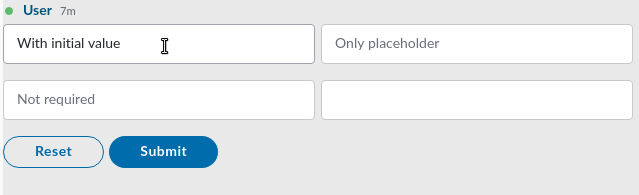

# Text Field

Text input fields are the most common factors of a form. Symphony provides two types of elements for text input fields: Text fields are for a single-line input; and Text area is for multi-line input.


## Attributes

| Attribute | Type | Required? | Description |
| :--- | :--- | :--- | :--- |
| `name` | String | Yes | Identifies the text field. |
| `placeholder` | String | No | Specifies a short hint that describes the expected value of the input field. |
| `required` | Boolean | No | If `true`, it specifies that the input field must be filled out before submitting the form. Accepted values; `true` and `false`. |
| `masked` | Boolean | No | If `true`, it creates a masked text field with hide/show options when its value is "true". For more information, refer to [Masked Text Field](https://developers.symphony.com/symphony-developer/docs/masked). |
| `maxlength` | Integer | No | The `maxlength` attribute allows you to specify a maximum number of characters that the user can input. |
| `minlength` | Integer | No | The `minlength` attribute allows you to specify a minimum number of characters that the user can input. |

## Rules and Limitations

* The text field has a max number of 128 characters. For larger texts, use [Text Area](text-area.md).
* The text field cannot have children tags but it can have a default text \(initial value\) between the `<text-field></text-field>` tags. See Examples below for more details.
* Text fields are grouped at a max of 4 per row, depending on the screen size. For more information, refer to [Alignment of input texts](alignment-of-input-texts.md).
* You can add a **default text** in your text field by including it between the `<text-field></text-field>` tags. Note that unlike the `placeholder` text, the **default text** will be sent with the form if not edited by the user.

## Examples

The following examples show text fields being used as follows:

* The first text field \(id1\) is required and has a **placeholder text** \("Input some text..."\). It has also a **default text** \("With initial value"\) which was included between the `<text-field></text-field>` tags. Note that the default text will be sent to the payload given that it was not deleted before submitting the form.
* The second text field \(id2\) is required. It contains a placeholder text and does not have a default text.
* The third text field \(id3\) is not required. It contains a placeholder text and does not have a default text.
* The fourth text field \(id4\) is required. It does not contain a placeholder or a default text.





```markup
<messageML>
  <form id="form_id">
    <text-field name="id1" placeholder="Input some text..." required="true">With initial value</text-field>
    <text-field name="id2" placeholder="Only placeholder" required="true"/>
    <text-field name="id3" placeholder="Not required"/>
    <text-field name="id4" required="true"/>        
         
    <button type="reset">Reset</button> 
    <button name="example-button" type="action">Submit</button> 
  </form>
</messageML>
```



```
{
    "id": "3dtVXF",
    "messageId": "amKuCXE9wjfEFX7qQPzanX___oyR5rbWbQ",
    "timestamp": 1595280017705,
    "type": "SYMPHONYELEMENTSACTION",
    "initiator": {
        "user": {
            "userId": 344147139494862,
            "firstName": "Reed",
            "lastName": "Feldman",
            "displayName": "Reed Feldman (SUP)",
            "email": "reed.feldman@symphony.com",
            "username": "reedUAT"
        }
    },
    "payload": {
        "symphonyElementsAction": {
            "stream": {
                "streamId": "IEj12WoWsfTkiqOBkATdUn___pFXhN9OdA",
                "streamType": "IM"
            },
            "formMessageId": "BFawdKkxmV0ZQmSuIzgfTX___oyR5yO2bQ",
            "formId": "form_id",
            "formValues": {
                "action": "example-button",
                "id1": "test",
                "id2": "test",
                "id3": "",
                "id4": "test"
            }
        }
    }
}
```



